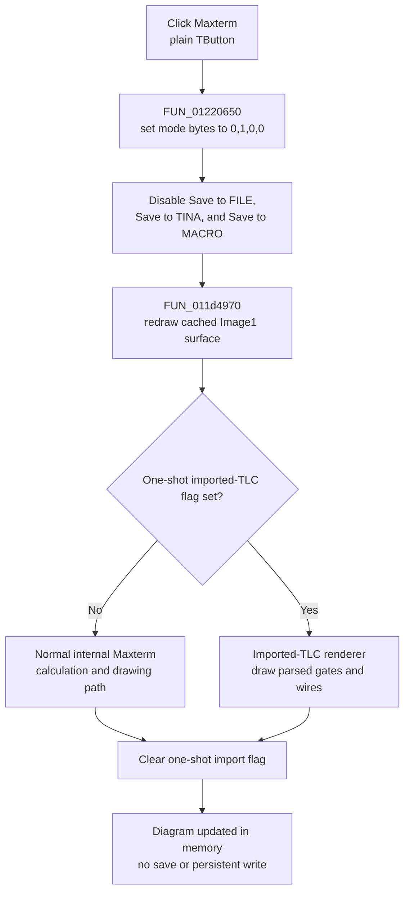

# Draw the non-PLA Maxterm diagram

> Analysis status: Complete. The DFM, Delphi published-field RTTI, four parallel mode handlers, cached image canvas, and shared redraw dispatcher support this explanation.

## Control

| Property | Recovered value |
| --- | --- |
| Form | Func_diagram_form |
| Component path | Func_diagram_form.GroupBox1.max_d |
| Control class | TButton |
| Caption | Maxterm |
| Hint | Not present in the recovered resource. |
| Handler name | max_dClick |
| Handler address | 01220650 |
| Graph node | `resource:dfm:Func_diagram_form/Func_diagram_form.GroupBox1.max_d` |
| Handler node | `function:01220650` |
| Graph layer | UI |

The control is a plain button in the `Drawing` group. It has no checked state, hint, glyph, picture, or image index. Its caption identifies the requested representation; the handler and three sibling mode handlers establish the exact state change.

## What happens when clicked

`FUN_01220650` selects the ordinary Maxterm drawing mode. It overwrites four process-global mode bytes with this one-hot state:

| Mode | Global byte | Value after this click |
| --- | --- | --- |
| Minterm | `DAT_01f2aaf0` | `0` |
| Maxterm | `DAT_01f2aaf1` | `1` |
| PLA Minterm | `DAT_01f2aaf2` | `0` |
| PLA Maxterm | `DAT_01f2aaf3` | `0` |

The parallel handlers confirm the mapping: `FUN_012205d0` selects `[1,0,0,0]` for Minterm, `FUN_012206d0` selects `[0,0,1,0]` for PLA Minterm, and `FUN_01220750` selects `[0,0,0,1]` for PLA Maxterm. Reassigning all four bytes prevents a stale second mode from remaining active.

This click does not visibly press or check `max_d`; `TButton` has no persistent selected state. The four global bytes are the durable in-process mode selection used by the redraw pipeline.

## Save-command availability

After selecting the mode, the handler disables three controls through their VCL enabled-state virtual method. Recovered `TFunc_diagram_form` published-field RTTI maps the fields exactly:

- form field `+0x710` is `GroupBox2.Saving`, captioned `Save to FILE`;
- form field `+0x718` is `GroupBox2.SaveTinaButton`, captioned `Save to TINA`; and
- form field `+0x720` is `GroupBox2.SaveMacroButton`, captioned `Save to MACRO`.

The ordinary Minterm handler disables the same three commands. Both PLA handlers enable all three. Therefore, this is a mode-dependent availability policy, not deletion of an existing file or saved diagram. The handler does not clear a file name, saved data, or the drawing canvas when it disables the controls.

## Immediate calculation and redraw

The final call is shared dispatcher `FUN_011d4970`. `Func_diagram_form.OnShow` previously obtains the drawing object for `Image1` at form field `+0x770` and caches it in `DAT_02107678`. The Maxterm handler passes the form and that cached drawing surface to the dispatcher, although Ghidra recovered the dispatcher declaration without its arguments.

The dispatcher tests one-shot import flag `DAT_02107680`:

- zero selects the normal internal calculation and drawing path `FUN_011e8ae0`;
- nonzero selects imported-TLC renderer `FUN_011e6f50`; and
- either path finishes by clearing the import flag.

The Open command is the recovered writer that sets the import flag immediately before it calls this dispatcher. The dispatcher clears it in that same call. `max_dClick` does not set the flag, so an ordinary Maxterm click uses the normal internal path. The normal renderer body is not present in the recovered per-function export. The call placement proves synchronous recalculation/redraw after the mode and enabled-state updates, but it does not expose the exact Boolean minimization algorithm, gate placement, or drawing dimensions.

The handler does not alter the input or output expression text directly. Those values and the current converter model are consumed below the shared redraw boundary.

## Repeated clicks, validation, and errors

- There is no guard for an already selected Maxterm mode. Each click writes the same one-hot state, disables the three save commands again, and requests another redraw.
- The handler reads no editor text, numeric input, list selection, or file. It therefore has no empty-input, range, parse, confirmation, or cancel branch.
- The redraw call has no recovered Boolean or status result, and this handler shows no validation message.
- There is no local exception handler or rollback. If a VCL enabled-state call or the renderer raises an exception, the mode bytes and some enabled states can already have changed while the redraw remains incomplete.
- The handler writes no project, TLC file, registry value, or INI setting. Its one-hot mode bytes and control enabled states are process-local. The separate save commands are disabled in this mode, so this click cannot persist the result.

## Click flow

## Source evidence

- [Maxterm handler `FUN_01220650`](../../../DecompiledSources/Tina16/functions/0000000001220650__FUN_01220650.c) writes the one-hot Maxterm state, disables fields `+0x710`, `+0x718`, and `+0x720`, and invokes the shared redraw dispatcher.
- [Minterm handler `FUN_012205d0`](../../../DecompiledSources/Tina16/functions/00000000012205D0__FUN_012205d0.c), [PLA Minterm handler `FUN_012206d0`](../../../DecompiledSources/Tina16/functions/00000000012206D0__FUN_012206d0.c), and [PLA Maxterm handler `FUN_01220750`](../../../DecompiledSources/Tina16/functions/0000000001220750__FUN_01220750.c) establish all four one-hot modes and the non-PLA-disabled versus PLA-enabled save-command policy.
- [Shared redraw dispatcher `FUN_011d4970`](../../../DecompiledSources/Tina16/functions/00000000011D4970__FUN_011d4970.c) selects the normal or imported-TLC rendering path and clears the one-shot import flag.
- [Imported-TLC renderer `FUN_011e6f50`](../../../DecompiledSources/Tina16/functions/00000000011E6F50__FUN_011e6f50.c) parses the loaded drawing commands and draws gates, output markers, and wires on the supplied drawing surface.
- [Open handler `FUN_01220be0`](../../../DecompiledSources/Tina16/functions/0000000001220BE0__FUN_01220be0.c) proves that loading a TLC file sets the one-shot import flag immediately before the shared redraw call.
- [Form-show handler `FUN_01221730`](../../../DecompiledSources/Tina16/functions/0000000001221730__FUN_01221730.c) gets the drawing object for form field `+0x770`; [the image drawing-object accessor](../../../DecompiledSources/Tina16/functions/0000000000741EA0__FUN_00741ea0.c) returns the bitmap-backed drawing surface cached in `DAT_02107678`.
- [Recovered Delphi resource evidence](../../../DecompiledSources/Tina16/resources/dfm/ui-evidence.json) supplies the `Drawing` group, four mode captions and handlers, the three save-command captions, `Image1`, and the Maxterm `OnClick` binding.

## Analysis limits and ownership

- This Bead annotates only unique Maxterm handler `FUN_01220650`. Beads `.585`, `.579`, and `.578` own the Minterm, PLA Minterm, and PLA Maxterm handlers respectively.
- Bead `.577` owns shared redraw dispatcher `FUN_011d4970`. This article cites it without redefining its graph annotation.
- The exact Delphi names of the four mode globals are not recovered. Their mode meanings are established by the DFM handler bindings and mutually exclusive assignments.
- The normal renderer `FUN_011e8ae0` is named at the recovered dispatcher call site but has no exported C file or graph node. Its detailed Maxterm calculation and layout algorithm remain unknown.
