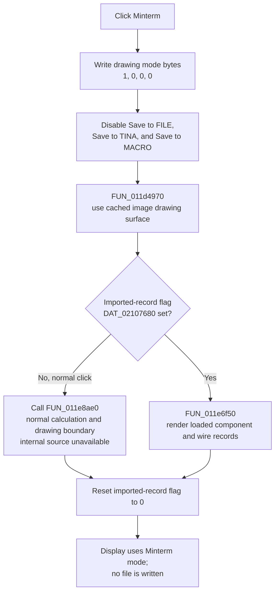

# Draw the Minterm schematic

> Analysis status: Complete for the control boundary. The handler, sibling mode selectors, form setup, shared redraw dispatcher, image-canvas setup, and save controls establish the behavior below. The normal calculation engine at `011e8ae0` did not decompile, so its internal Minterm calculation and layout rules remain unknown.

## Control

| Property | Recovered value |
| --- | --- |
| Form | Func_diagram_form |
| Form caption | Schematic diagram |
| Component path | Func_diagram_form.GroupBox1.min_d |
| Control class | TButton |
| Caption | Minterm |
| Hint | Not present |
| Handler name | min_dClick |
| Handler address | 012205d0 |
| Graph node | `resource:dfm:Func_diagram_form/Func_diagram_form.GroupBox1.min_d` |
| Handler node | `function:012205d0` |
| Graph layer | UI |

The control is a plain text button. It has no glyph, checked state, group index, action, or modal result. “Minterm” selects a schematic representation. The handler contains no numeric minimum, comparison, or editable value.

## What happens when clicked

`FUN_012205d0` selects ordinary Minterm drawing mode and requests an immediate schematic rebuild. It performs these operations in order:

1. Writes one to shared mode byte `DAT_01f2aaf0`.
2. Writes zero to `DAT_01f2aaf1`, `DAT_01f2aaf2`, and `DAT_01f2aaf3`.
3. Disables form controls at `+0x710`, `+0x718`, and `+0x720` through the VCL `SetEnabled` slot `+0x128`. The recovered form fields map this trio to **Save to FILE**, **Save to TINA**, and **Save to MACRO**.
4. Calls shared redraw dispatcher `FUN_011d4970` with the form and cached drawing surface `DAT_02107678`.

The four adjacent drawing handlers establish the one-hot mode mapping:

| Mode | `aaf0` | `aaf1` | `aaf2` | `aaf3` | Save commands |
| --- | ---: | ---: | ---: | ---: | --- |
| Minterm | 1 | 0 | 0 | 0 | Disabled |
| Maxterm | 0 | 1 | 0 | 0 | Disabled |
| PLA minterm | 0 | 0 | 1 | 0 | Enabled |
| PLA maxterm | 0 | 0 | 0 | 1 | Enabled |

Thus, the click replaces the previous drawing mode. It does not add Minterm to another mode.

## Diagram rebuild boundary

On form show, `FUN_01221730` gets the drawing surface from the form's image field at `+0x770` and stores it in `DAT_02107678`. `FUN_00741ea0` creates a bitmap when the image has no graphic and returns its drawing context. The mode handlers pass this cached surface to the redraw dispatcher.

`FUN_011d4970` selects one of two engines from byte `DAT_02107680`:

- When the byte is zero, it calls `FUN_011e8ae0`. Form creation initializes the byte to zero, and the dispatcher resets it to zero after each call. This is the normal calculation-and-drawing boundary used by this click.
- When the byte is nonzero, it calls `FUN_011e6f50`. The hidden file-test path sets the byte before it loads drawing records. This recovered renderer clears the surface, parses component and wire records, and draws the loaded schematic.

The function index records a decompiler timeout for `FUN_011e8ae0`, and no source file exists for it. Therefore, the exact Boolean calculation, Minterm gate construction, placement rules, input-size limits, and calculation error paths inside the normal branch are not recovered. The handler and dispatcher prove an immediate rebuild request, but they do not prove the internal drawing algorithm.

## Radio, simplified-mode, and form-state relationships

`RadioButton1`, also captioned **Minterm**, is a second UI path for the same mode. Its handler writes the same `1,0,0,0` bytes, disables the same three Save commands, and calls the same dispatcher. It also changes the shared help context to `5100`. The legacy `min_d` button does not change that help context.

`min_d` is not a radio control and does not set `RadioButton1.Checked`. Its source of truth is the four shared mode bytes. If both control sets are visible, clicking this button can change the drawing mode without changing the recovered radio checked state.

The **Simplified function** checkbox stores its own Boolean in adjacent byte `DAT_01f2aaf4` and requests another redraw. `min_d` does not read or change this Boolean. The missing normal engine prevents a source-backed description of how simplification changes the Minterm diagram.

The click does not change the underlying logic-function input, output, or expression fields. It selects how the current function is drawn.

## Click flow

## Validation, errors, and repeated clicks

- The handler accepts no user value and contains no empty-input, numeric range, function-size, confirmation, or mode-availability check.
- It has no conditional no-op branch. A repeated click writes the same mode bytes, disables the same commands, and calls the redraw dispatcher again.
- The handler has no local exception catch, message, or rollback. A control-state or redraw failure can leave the global mode changed and only part of the UI updated.
- Error handling inside `FUN_011e8ae0` is unknown because that function timed out during decompilation. This article does not claim that calculation failure is silent or handled.
- The alternate record renderer has no direct status result to this handler. Its exceptions can propagate through the dispatcher.
- Form show normally initializes the cached drawing surface. Behavior with a missing or invalid surface is not recovered.

## Persistence and outputs

- The click changes in-memory drawing-mode bytes, the Enabled state of three Save commands, and the displayed image through the redraw path.
- It does not write a file, save to TINA, create a macro, set a document-modified flag, or close the form.
- The disabled commands have separate persistence handlers. This click does not invoke them.
- Later mode clicks and form lifecycle code can replace the shared mode. No registry, INI, project setting, or durable preference write is present in this path.

## Source evidence

- [Minterm handler `FUN_012205d0`](../../../DecompiledSources/Tina16/functions/00000000012205D0__FUN_012205d0.c) writes the first one-hot mode, disables the three fields, and calls the shared dispatcher.
- [Maxterm handler `FUN_01220650`](../../../DecompiledSources/Tina16/functions/0000000001220650__FUN_01220650.c), [PLA minterm handler `FUN_012206d0`](../../../DecompiledSources/Tina16/functions/00000000012206D0__FUN_012206d0.c), and [PLA maxterm handler `FUN_01220750`](../../../DecompiledSources/Tina16/functions/0000000001220750__FUN_01220750.c) prove the mutually exclusive four-mode mapping and Save-command difference.
- [Minterm radio handler `FUN_012215a0`](../../../DecompiledSources/Tina16/functions/00000000012215A0__FUN_012215a0.c) mirrors this mode and adds only its help-context update.
- [Simplified-function handler `FUN_01221380`](../../../DecompiledSources/Tina16/functions/0000000001221380__FUN_01221380.c) stores the independent fifth mode byte and redraws.
- [Form creation `FUN_011d4840`](../../../DecompiledSources/Tina16/functions/00000000011D4840__FUN_011d4840.c) initializes the normal redraw branch and disables the three Save commands.
- [Form show `FUN_01221730`](../../../DecompiledSources/Tina16/functions/0000000001221730__FUN_01221730.c) caches the image drawing surface. [Image drawing-context getter `FUN_00741ea0`](../../../DecompiledSources/Tina16/functions/0000000000741EA0__FUN_00741ea0.c) creates a bitmap if needed and returns its context.
- [Shared redraw dispatcher `FUN_011d4970`](../../../DecompiledSources/Tina16/functions/00000000011D4970__FUN_011d4970.c) selects the normal or imported-record engine and resets the imported-record flag. Its canonical annotation belongs to `.577`.
- [Imported-record renderer `FUN_011e6f50`](../../../DecompiledSources/Tina16/functions/00000000011E6F50__FUN_011e6f50.c) proves the alternate canvas-rendering branch.
- [Function index](../../../DecompiledSources/Tina16/functions/function-index.csv) records `011e8ae0` as failed because decompilation timed out.
- [VCL Enabled setter `FUN_0064dc60`](../../../DecompiledSources/Tina16/functions/000000000064DC60__FUN_0064dc60.c) implements virtual slot `+0x128`.
- [Recovered Delphi resource evidence](../../../DecompiledSources/Tina16/resources/dfm/ui-evidence.json) supplies the form, Drawing and Save groups, button captions, classes, initial radio state, text-only control, and event bindings.

## Analysis limits and ownership

- `.585` owns only unique handler `FUN_012205d0`.
- `.577` owns shared redraw dispatcher `FUN_011d4970`. Sibling mode Beads `.578`, `.579`, and `.584` own their direct handlers. This article cites all shared and sibling code as evidence and does not redefine it.
- Broad VCL, image, imported-renderer, form-lifecycle, checkbox, radio, and Save functions remain evidence-only.
- The normal engine `FUN_011e8ae0` has no recovered C source. Its internal calculation and error paths remain explicit unknowns.
