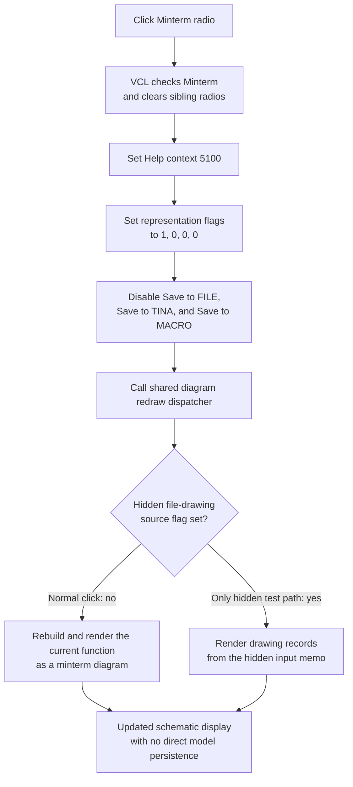

# Select non-PLA minterm drawing

## Control

| Property | Recovered value |
| --- | --- |
| Form | Func_diagram_form |
| Component path | Func_diagram_form.GroupBox1.RadioButton1 |
| Control class | TRadioButton |
| Parent | GroupBox1, caption **Drawing** |
| Caption | Minterm |
| Streamed Checked state | true |
| Hint or image | Not present in the recovered resource |
| Handler name | RadioButton1Click |
| Handler address | 012215a0 |
| Graph node | `resource:dfm:Func_diagram_form/Func_diagram_form.GroupBox1.RadioButton1` |
| Handler node | `function:012215a0` |
| Graph layer | UI |

## What happens when clicked

The radio button selects the ordinary minterm representation of the current logic function. It does not select the PLA minterm, maxterm, or PLA maxterm representations.

VCL first checks **Minterm** and clears the other radio buttons under the same parent. `FUN_012215a0` then performs these operations:

1. It stores Help context `5100` (`0x13ec`). The parallel handlers store `5200` for PLA minterm, `5300` for maxterm, and `5400` for PLA maxterm.
2. It writes the four representation flags as `[1, 0, 0, 0]`. The first flag is the ordinary minterm flag because only the Minterm radio and legacy Minterm button write this pattern.
3. It disables `Saving`, `SaveTinaButton`, and `SaveMacroButton`. The buttons stay visible, but the user cannot run them in an ordinary minterm mode. The handler does not clear or execute them.
4. It calls the shared function-diagram redraw dispatcher.

The click does not read `Sender` or the radio's Checked property. A direct or repeated call therefore applies the same minterm flags and redraw request.

## Representation state

The mode is process-wide one-hot state:

| Representation | Flags `+0` through `+3` | Save controls |
| --- | --- | --- |
| Minterm | `[1, 0, 0, 0]` | Disabled |
| Maxterm | `[0, 1, 0, 0]` | Disabled |
| PLA minterm | `[0, 0, 1, 0]` | Enabled |
| PLA maxterm | `[0, 0, 0, 1]` | Enabled |

The legacy **Minterm** and **PLA-Minterm** buttons write the same state as their radio-button counterparts. This repeated behavior proves that the flags select the diagram representation rather than only recording a visual radio state.

The handler preserves the **Simplified function** flag. That checkbox has its own handler, which copies Checked into a fifth global flag and calls the same redraw dispatcher. The selected minterm representation is therefore redrawn with the simplification setting that is already active.

## Redraw and calculation boundary

The shared dispatcher selects between two render sources:

- The normal path calls `FUN_011e8ae0`. Form creation and every completed dispatch clear the source flag, so this is the path used by a normal Minterm click.
- The alternate path calls `FUN_011e6f50` only after the hidden `File_rajzolas` test command sets the source flag. That routine parses drawing records from the hidden input memo and draws gates, output blocks, and wires.

The normal builder at `FUN_011e8ae0` exceeded the Ghidra decompiler timeout. Its neighboring recovered routines draw AND-style, OR-style, negation, connection, and input-label shapes on the form canvas. The radio handler and the parallel mode handlers prove that the builder receives the one-hot representation state, but they do not prove its exact Boolean reduction or gate-placement algorithm.

The control therefore selects the calculation and drawing representation and requests a fresh schematic. It does not directly change the logical function, edit a truth table, or write numeric parameters. No numeric input control is present in the recovered form resource.

## Initial and activation state

The DFM and FormCreate select **Minterm** initially. However, FormActivate then calls the PLA-minterm handler and explicitly checks `RadioButton2`. Thus, PLA minterm becomes the effective mode whenever this modeless form activates. A user click on **Minterm** remains effective until another representation is selected or the form activates again.

## Click flow

## UI, model, and persistence effects

- The VCL radio selection changes, Help context becomes `5100`, and the four representation flags become the minterm pattern.
- The three save command buttons become disabled but remain visible. Their parent Save group and their stored state are not changed.
- The redraw dispatcher updates the schematic representation. It also clears its temporary source-selection flag after dispatch.
- The click preserves the Simplified-function flag and all current logic-function data.
- It does not call a file dialog, serializer, registry function, project writer, or backend service. The mode is live process state only.
- Separate Save commands can persist or export data when they are available. This Minterm click does not run those commands.

## Repeated clicks and errors

- There is no unchanged-mode guard. A repeated click rewrites the same flags, disables the same buttons, and requests another redraw.
- There is no invalid-input branch because the handler reads no text, number, index, or external data.
- There is no local exception handler or error message.
- The mode flags and Help context are written before the three Enabled setters. If a control setter fails, the process-wide mode can already be Minterm while some save controls keep their old enabled state.
- The redraw runs after all state and Enabled writes. A redraw failure leaves Minterm selected with the new flags and disabled save controls, but the previous schematic can remain visible. The handler has no rollback.

## Evidence

- [Minterm handler `FUN_012215a0`](../../../DecompiledSources/Tina16/functions/00000000012215A0__FUN_012215a0.c) writes Help context `5100`, the `[1,0,0,0]` representation flags, disables form fields `+0x710`, `+0x718`, and `+0x720`, and calls the redraw dispatcher.
- [PLA-minterm handler `FUN_01221510`](../../../DecompiledSources/Tina16/functions/0000000001221510__FUN_01221510.c), [Maxterm handler `FUN_01221480`](../../../DecompiledSources/Tina16/functions/0000000001221480__FUN_01221480.c), and [PLA-maxterm handler `FUN_012213f0`](../../../DecompiledSources/Tina16/functions/00000000012213F0__FUN_012213f0.c) establish the four one-hot patterns, Help contexts, and PLA-only save-control enabled policy.
- [Legacy Minterm handler `FUN_012205d0`](../../../DecompiledSources/Tina16/functions/00000000012205D0__FUN_012205d0.c) writes the same mode and Enabled state as this radio handler.
- [Shared redraw dispatcher `FUN_011d4970`](../../../DecompiledSources/Tina16/functions/00000000011D4970__FUN_011d4970.c) selects the normal builder or hidden file-drawing renderer and clears the temporary source flag. Bead `.577` owns its canonical annotation.
- [File-drawing renderer `FUN_011e6f50`](../../../DecompiledSources/Tina16/functions/00000000011E6F50__FUN_011e6f50.c) proves the alternate memo-record rendering path. [The function index](../../../DecompiledSources/Tina16/functions/function-index.csv) records the timeout for normal builder `011e8ae0`.
- [FormCreate `FUN_011d4840`](../../../DecompiledSources/Tina16/functions/00000000011D4840__FUN_011d4840.c) selects RadioButton1 and clears the other radios. [FormActivate `FUN_012209c0`](../../../DecompiledSources/Tina16/functions/00000000012209C0__FUN_012209c0.c) switches to PLA minterm and checks RadioButton2.
- [Recovered Delphi resource evidence](../../../DecompiledSources/Tina16/resources/dfm/ui-evidence.json) provides the Drawing group, Minterm caption, streamed Checked state, three sibling representations, Simplified-function checkbox, and save controls.

## Annotation ownership and limits

- This Bead owns only unique handler `FUN_012215a0`. Bead `.577` owns shared dispatcher `FUN_011d4970`; the downstream rendering routines remain evidence-only.
- Patched Delphi RTTI maps `+0x710` to `Saving`, `+0x718` to `SaveTinaButton`, `+0x720` to `SaveMacroButton`, and `+0x748` through `+0x760` to RadioButton1 through RadioButton4.
- The original names of the four representation globals are not recovered. Their roles come from the four paired handlers, their resource captions, the matching legacy command handlers, and shared redraw use.
- The normal builder's decompilation timeout prevents a claim about its exact Boolean minimization, PLA packing, layout ordering, or complexity limits.
- The control has no hint, glyph, image, action, built-in button kind, modal result, list items, or same-parent label candidate.
