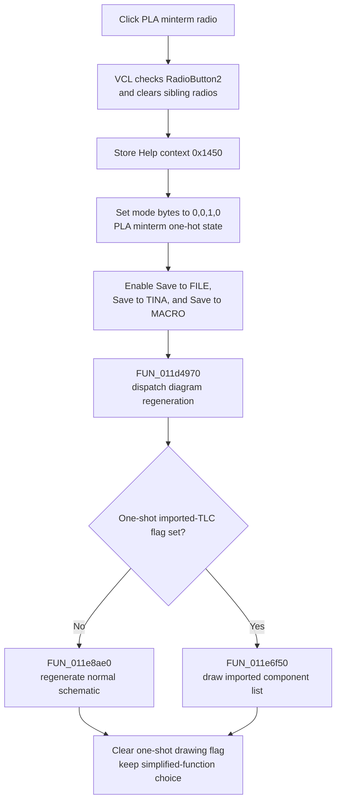

# Draw a PLA minterm schematic

> Analysis status: Complete. The DFM radio group, handler, paired mode handlers, legacy PLA command, form defaults, shared redraw dispatcher, and Help consumers support this explanation.

## Control

| Property | Recovered value |
| --- | --- |
| Form | Func_diagram_form |
| Component path | Func_diagram_form.GroupBox1.RadioButton2 |
| Control class | TRadioButton |
| Caption | PLA minterm |
| Initial DFM checked state | false |
| Handler name | RadioButton2Click |
| Handler address | 01221510 |
| Graph node | `resource:dfm:Func_diagram_form/Func_diagram_form.GroupBox1.RadioButton2` |
| Handler node | `function:01221510` |
| Graph layer | UI |

The control has no hint or glyph. Its caption agrees with the unique global mode pattern, the matching legacy `PLA-Minterm` button, and the form-activation default.

## What happens when clicked

The VCL checks `RadioButton2` and clears its sibling radio buttons before `RadioButton2Click` runs. The handler then selects the PLA minterm diagram mode in application state.

It writes the four recovered diagram-mode bytes as one-hot state:

| Global byte | Value | Mode established by sibling handlers |
| --- | ---: | --- |
| `DAT_01f2aaf0` | 0 | Minterm is not selected. |
| `DAT_01f2aaf1` | 0 | Maxterm is not selected. |
| `DAT_01f2aaf2` | 1 | PLA minterm is selected. |
| `DAT_01f2aaf3` | 0 | PLA maxterm is not selected. |

The four radio handlers and four legacy drawing-button handlers use the same four patterns. This repeated mapping proves that the third byte is PLA minterm mode. The handler does not inspect `Sender` or `RadioButton2.Checked`; a direct programmatic call would still select this global mode even if the radio UI had not changed.

The handler also stores Help context `0x1450`. This value is used only by the later Help button or form Help event. The click does not open Help.

## Save controls and defaults

`RadioButton2Click` enables the three command buttons in the Save group at form fields `+0x710`, `+0x718`, and `+0x720`: Save to FILE, Save to TINA, and Save to MACRO. The PLA maxterm handler enables the same controls. The plain Minterm and Maxterm radio handlers disable all three.

The handler changes `Enabled`; it does not show, hide, move, rename, or focus a control. The DFM leaves the Save buttons visible. Form creation disables them before a drawing mode is activated.

The DFM initially marks `RadioButton1` (Minterm) as checked. Form creation also initializes the four radio states with the first radio selected. Form activation then calls the legacy PLA-minterm handler, checks `RadioButton2`, and redraws. Therefore, PLA minterm becomes the active runtime default each time this form activates, even though the streamed design-time default is Minterm.

## Diagram regeneration

After it updates the Help context, one-hot mode, and Save buttons, the handler calls shared dispatcher `FUN_011d4970` immediately.

The dispatcher selects between two drawing routes:

- normal mode calls `FUN_011e8ae0`, the main interior schematic regeneration path; and
- a one-shot imported-TLC flag selects `FUN_011e6f50`, which draws a loaded list of named components and wires.

It clears the one-shot flag after either route. The PLA minterm radio does not set that flag, so a normal click uses the main regeneration path.

The export of `FUN_011e8ae0` timed out during Ghidra decompilation. The available source proves immediate regeneration after the mode change, but it does not recover the internal PLA gate-placement, term-reduction, or routing algorithm. The article therefore does not infer a specific minimization method from the caption alone.

The independent `Simplified function` check box uses global byte `DAT_01f2aaf4` and the same redraw dispatcher. `RadioButton2Click` does not read or write that byte. Selecting PLA minterm therefore retains the current simplified or unsimplified choice while it changes the minterm/PLA mode.

## Radio and legacy-command interaction

- The normal VCL radio group is one-hot: checking PLA minterm clears Minterm, Maxterm, and PLA maxterm.
- The legacy `PLA-Minterm` button calls `FUN_012206d0`. It writes the same global mode bytes, enables the same Save buttons, and invokes the same redraw dispatcher, but it does not set Help context `0x1450` or explicitly check `RadioButton2`.
- The radio handler does not change a legacy button state. The old and new controls share mode state and redraw behavior, not UI selection state.
- A repeated click writes the same Help and mode values, enables the same controls, and regenerates the diagram again. It does not toggle PLA minterm off.

## Errors and persistence

- The handler has no input validation, availability guard, error result, dialog, or expected no-op branch.
- The Help context and four mode writes occur before the three Enabled setters and redraw call. An exception can therefore leave PLA minterm selected in global state while only some Save controls or the diagram have updated.
- There is no local exception handler or rollback. Errors from a VCL setter or renderer propagate.
- The mode bytes, Help context, and enabled states are process memory only. The handler calls no file, INI, registry, project, or settings writer.
- Form activation selects PLA minterm again. A mode selection is therefore not a durable user preference, and another radio or legacy drawing command can replace it immediately.

## Click flow

## Source evidence

- [PLA minterm radio handler `FUN_01221510`](../../../DecompiledSources/Tina16/functions/0000000001221510__FUN_01221510.c) stores Help context `0x1450`, writes mode bytes `0,0,1,0`, enables form fields `+0x710/+0x718/+0x720`, and calls the shared redraw dispatcher.
- [Minterm radio handler `FUN_012215a0`](../../../DecompiledSources/Tina16/functions/00000000012215A0__FUN_012215a0.c), [Maxterm radio handler `FUN_01221480`](../../../DecompiledSources/Tina16/functions/0000000001221480__FUN_01221480.c), and [PLA maxterm radio handler `FUN_012213f0`](../../../DecompiledSources/Tina16/functions/00000000012213F0__FUN_012213f0.c) establish the other one-hot patterns, Save-button policies, and distinct Help contexts.
- [Legacy PLA-minterm handler `FUN_012206d0`](../../../DecompiledSources/Tina16/functions/00000000012206D0__FUN_012206d0.c) writes the same `0,0,1,0` mode, enables the same three controls, and redraws without storing the radio-specific Help context.
- [Shared redraw dispatcher `FUN_011d4970`](../../../DecompiledSources/Tina16/functions/00000000011D4970__FUN_011d4970.c) selects the normal or imported-TLC drawing path and clears the one-shot selector.
- [Imported-TLC renderer `FUN_011e6f50`](../../../DecompiledSources/Tina16/functions/00000000011E6F50__FUN_011e6f50.c) draws parsed component and wire records when the one-shot import route is active.
- [Form creation `FUN_011d4840`](../../../DecompiledSources/Tina16/functions/00000000011D4840__FUN_011d4840.c) initializes the first radio as checked and disables the three Save commands.
- [Form activation `FUN_012209c0`](../../../DecompiledSources/Tina16/functions/00000000012209C0__FUN_012209c0.c) calls the legacy PLA-minterm path, checks the second radio, and makes PLA minterm the active runtime default.
- [Simplified-function handler `FUN_01221380`](../../../DecompiledSources/Tina16/functions/0000000001221380__FUN_01221380.c) changes separate global byte `DAT_01f2aaf4` and redraws without replacing the four mode bytes.
- [Recovered Delphi resource evidence](../../../DecompiledSources/Tina16/resources/dfm/ui-evidence.json) supplies the four radio captions, design-time checked state, legacy buttons, three Save commands, and all event bindings.

## Analysis limits and ownership

- This Bead annotates only `FUN_01221510`.
- Bead `.577` owns redraw dispatcher `FUN_011d4970`, including its normal-versus-imported route. This article cites it without redefining its graph annotation.
- Beads `.580`, `.582`, and `.583` own the Minterm, Maxterm, and PLA maxterm radio handlers. Their handlers remain evidence only here.
- The main renderer `FUN_011e8ae0` has no recovered C file because Ghidra timed out. Its precise PLA synthesis and drawing algorithm remains unresolved.
- The recovered globals have no Delphi field names. The paired radio and legacy handlers establish their mode meanings by identical one-hot patterns.
