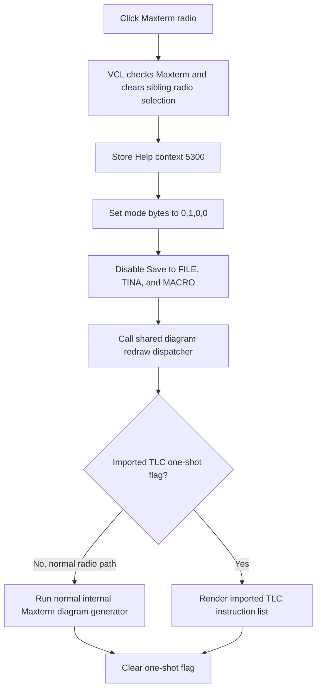

# Select the non-PLA Maxterm drawing mode

`RadioButton3` selects the standard Maxterm view for the Schematic Diagram. It writes a one-hot application mode, disables the three diagram-save actions, and immediately dispatches a redraw of the current Boolean function.

## Control

| Property | Recovered value |
| --- | --- |
| Form | Func_diagram_form |
| Component path | Func_diagram_form.GroupBox1.RadioButton3 |
| Parent | Func_diagram_form.GroupBox1, caption `Drawing` |
| Control class | TRadioButton |
| Caption | Maxterm |
| Hint | Not present in the recovered resource. |
| Initial checked state | False; sibling `RadioButton1` (`Minterm`) is initially checked. |
| Handler name | RadioButton3Click |
| Handler address | 01221480 |
| Graph node | `resource:dfm:Func_diagram_form/Func_diagram_form.GroupBox1.RadioButton3` |
| Handler node | `function:01221480` |
| Graph layer | UI |

The control has no recovered hint, action, image, glyph, modal result, or numeric value. Its caption is corroborated by the handler's distinct one-hot mode slot and by the parallel Maxterm drawing button, which writes the same slot pattern.

## What happens when clicked

`FUN_01221480` runs a fixed sequence:

1. It stores hexadecimal Help context `0x14B4`, decimal 5300, in the shared logic-converter Help field.
2. It writes the four recovered drawing-mode bytes as `0, 1, 0, 0`:
   - `DAT_01F2AAF0 = 0`: Minterm is not selected.
   - `DAT_01F2AAF1 = 1`: standard Maxterm is selected.
   - `DAT_01F2AAF2 = 0`: PLA minterm is not selected.
   - `DAT_01F2AAF3 = 0`: PLA maxterm is not selected.
3. It disables the three controls at form fields `+0x710`, `+0x718`, and `+0x720`. The DFM and the paired standard/PLA handlers identify these as `Saving` (`Save to FILE`), `SaveTinaButton` (`Save to TINA`), and `SaveMacroButton` (`Save to MACRO`). Standard Minterm and Maxterm disable all three; both PLA modes enable all three.
4. It calls shared dispatcher `FUN_011d4970` to rebuild the diagram for the new mode.

The mode is standard Maxterm, not `PLA maxterm`. The code does not select a minimization option by itself. The separate `Simplified function` check box owns its own state byte and calls the same redraw dispatcher, so simplified-versus-unsimplified remains an independent input.

## One-hot radio and parallel buttons

The four `TRadioButton` controls share the same parent. Normal VCL radio behavior gives them one checked item. `FUN_01221480` does not manually clear the Checked properties of its siblings; it maintains a second, explicit one-hot set of four global bytes for the drawing engine.

| Radio caption | Mode bytes set to 1 | Save actions |
| --- | --- | --- |
| Minterm | `DAT_01F2AAF0` | Disabled |
| PLA minterm | `DAT_01F2AAF2` | Enabled |
| Maxterm | `DAT_01F2AAF1` | Disabled |
| PLA maxterm | `DAT_01F2AAF3` | Enabled |

The `Drawing` group also contains four ordinary buttons with the same captions. Their handlers write the same respective mode bytes, apply the same save enablement, and call the same redraw dispatcher. They do not alter this radio button's Checked property in their recovered handlers, so button activation and radio selection are parallel entry points into the same engine state.

There is no numeric editor, range, count, or spin control in this handler. It does not read or change the function text, macro name, scroll position, or a selected diagram object.

## Redraw and algorithm boundary

The shared dispatcher reads a one-shot drawing-source flag. Its normal value is zero, so a radio click selects `FUN_011E8AE0`, the normal internal diagram-generation path. The alternative nonzero path invokes `FUN_011E6F50`, which renders an imported TLC instruction list. The dispatcher then clears the one-shot flag.

The recovered source set contains the dispatcher and the imported-TLC renderer, but it does not contain a standalone source file or graph node for `FUN_011E8AE0`. Therefore, the evidence proves selection of the normal Maxterm-generation path and an immediate redraw, but it does not expose enough code to describe the internal gate-placement or minimization algorithm. This article does not infer that algorithm from the `Maxterm` caption.

## Click flow

## Validation, errors, and persistence

- The handler does not validate function text or test whether a Boolean function exists before it changes mode.
- Clicking an already selected Maxterm radio repeats all stores, disables the save controls again, and requests another redraw. There is no early-return check.
- The Help context, mode bytes, and control enable states are written before the redraw call. The handler has no return-value check, exception handler, error message, or rollback if drawing fails.
- A partial failure can therefore leave Maxterm selected and the save actions disabled even when the drawing was not completed.
- No file, registry, project, undo, or settings writer is called. Only in-memory mode, Help, control, and rendered-view state changes. Later Save commands are disabled in this mode rather than invoked.

## Source evidence

- [Maxterm radio handler `FUN_01221480`](../../../DecompiledSources/Tina16/functions/0000000001221480__FUN_01221480.c) stores context 5300, writes the one-hot mode bytes, disables the three controls, and dispatches drawing.
- [Shared redraw dispatcher `FUN_011d4970`](../../../DecompiledSources/Tina16/functions/00000000011D4970__FUN_011d4970.c) selects normal generation or imported-TLC rendering and clears its one-shot flag.
- [Imported TLC renderer `FUN_011e6f50`](../../../DecompiledSources/Tina16/functions/00000000011E6F50__FUN_011e6f50.c) parses and draws the stored gate and wire instruction list used by the dispatcher's alternative branch.
- [Maxterm drawing-button handler `FUN_01220650`](../../../DecompiledSources/Tina16/functions/0000000001220650__FUN_01220650.c) writes the same mode bytes and save-control state without changing the Help context.
- [Minterm radio](../../../DecompiledSources/Tina16/functions/00000000012215A0__FUN_012215a0.c), [PLA minterm radio](../../../DecompiledSources/Tina16/functions/0000000001221510__FUN_01221510.c), and [PLA maxterm radio](../../../DecompiledSources/Tina16/functions/00000000012213F0__FUN_012213f0.c) establish the four one-hot alternatives and the standard-versus-PLA save behavior.
- [Simplified function handler `FUN_01221380`](../../../DecompiledSources/Tina16/functions/0000000001221380__FUN_01221380.c) maintains the independent simplified-state byte and calls the same redraw dispatcher.
- [Form creation `FUN_011d4840`](../../../DecompiledSources/Tina16/functions/00000000011D4840__FUN_011d4840.c) initializes standard Minterm mode, disables the same three save controls, and clears the imported-drawing flag.
- [Recovered Delphi resource evidence](../../../DecompiledSources/Tina16/resources/dfm/ui-evidence.json) supplies the four radio captions, initial Minterm selection, drawing and save group controls, and event bindings.

## Ownership and limits

This analysis owns only `FUN_01221480`. The shared redraw dispatcher is canonically documented by the `Simplified function` control analysis. The sibling radio handlers, duplicate drawing-button handlers, drawing engines, VCL property setters, and Help service remain evidence only.
