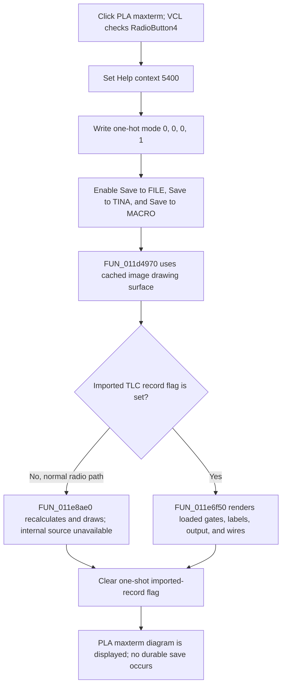

# PLA maxterm

> Analysis status: Complete for the control boundary. The DFM, four radio handlers, parallel drawing buttons, form lifecycle, Save controls, and redraw dispatcher establish the behavior below. The normal calculation engine at `011e8ae0` did not decompile, so its internal PLA algorithm and calculation errors remain unknown.

## Control

| Property | Recovered value |
| --- | --- |
| Form | Func_diagram_form |
| Form caption | Schematic diagram |
| Component path | Func_diagram_form.GroupBox1.RadioButton4 |
| Parent group | Drawing |
| Control class | TRadioButton |
| Caption | PLA maxterm |
| Initial checked state in DFM | false |
| Handler name | RadioButton4Click |
| Handler address | 012213f0 |
| Graph node | `resource:dfm:Func_diagram_form/Func_diagram_form.GroupBox1.RadioButton4` |
| Handler node | `function:012213f0` |
| Graph layer | UI |

The control has no hint, action, image, glyph, modal result, or numeric value. The DFM puts four `TRadioButton` controls under the same Drawing group. VCL makes their visible `Checked` state mutually exclusive before it calls the selected radio's `OnClick` handler.

## What happens when clicked

`FUN_012213f0` selects PLA maxterm drawing mode and requests an immediate schematic rebuild. It performs these operations in order:

1. Stores Help context `0x1518`, decimal `5400`, in the shared Help-context field. This prepares the PLA maxterm topic but does not open Help.
2. Writes zero to mode bytes `DAT_01f2aaf0`, `DAT_01f2aaf1`, and `DAT_01f2aaf2`.
3. Writes one to mode byte `DAT_01f2aaf3`.
4. Enables the **Save to FILE**, **Save to TINA**, and **Save to MACRO** commands at form fields `+0x710`, `+0x718`, and `+0x720` through VCL `SetEnabled` slot `+0x128`.
5. Calls shared redraw dispatcher `FUN_011d4970` with the form and cached image drawing surface `DAT_02107678`.

The four adjacent radio handlers prove this one-hot mode mapping:

| Selected radio | `aaf0` | `aaf1` | `aaf2` | `aaf3` | Save commands | Help context |
| --- | ---: | ---: | ---: | ---: | --- | ---: |
| Minterm | 1 | 0 | 0 | 0 | Disabled | 5100 |
| Maxterm | 0 | 1 | 0 | 0 | Disabled | 5300 |
| PLA minterm | 0 | 0 | 1 | 0 | Enabled | 5200 |
| PLA maxterm | 0 | 0 | 0 | 1 | Enabled | 5400 |

The global mode bytes are also one-hot after the handler returns. The click replaces the previous mode; it does not combine PLA maxterm with another drawing algorithm. The handler does not write the sibling radios' `Checked` properties because VCL already manages the visible radio group.

## Calculation and redraw boundary

On form show, `FUN_01221730` gets the drawing surface from image field `+0x770` and stores it in `DAT_02107678`. The mode handler passes this cached surface to `FUN_011d4970`.

The dispatcher reads one-shot imported-record flag `DAT_02107680`:

- A normal radio click uses the zero branch and calls `FUN_011e8ae0` to calculate and draw the current function.
- A nonzero flag calls `FUN_011e6f50`, which clears the surface, parses previously loaded TLC component and wire records, and draws gates, labels, the output, and connections.
- The dispatcher clears the flag after either branch.

The function index records a timeout for `FUN_011e8ae0`, and no recovered C file exists for it. The available source therefore does not establish the exact Boolean minimization, maxterm-to-PLA conversion, gate grouping, placement rules, size limits, numeric thresholds, or calculation error messages. The handler and dispatcher prove a synchronous rebuild request, not those internal details.

## Sibling controls, defaults, and later replacement

- The DFM initially marks **Minterm** as checked. Form creation also disables the three Save commands and selects the first visible radio state.
- On form activation, `FUN_012209c0` calls the PLA-minterm drawing handler and selects the second radio. A later form activation can therefore replace a previous PLA-maxterm selection with PLA minterm. This lifecycle refresh does not change the direct result of the current click.
- The parallel **PLA-Maxterm** text button calls `FUN_01220750`. It writes the same `0,0,0,1` mode and enables the same Save commands, but it does not set Help context 5400 or change this radio's recovered `Checked` state.
- The **Minterm** and **Maxterm** paths select their own one-hot modes and disable the three Save commands. The two PLA paths enable them.
- The **Simplified function** checkbox stores its independent Boolean in `DAT_01f2aaf4` and redraws. `FUN_012213f0` neither reads nor changes it. The missing normal engine prevents a source-backed claim about how simplification changes the PLA maxterm result.
- The handler reads no edit, spin, list, or numeric control and writes no default numeric parameter. It changes the drawing representation of the current function, not the function's input or output data.

## Repeated clicks, errors, and persistence

- A repeated click is not a no-op. It rewrites Help context 5400 and the same mode bytes, re-enables all three Save commands, and requests another rebuild.
- There is no input validation, unavailable-mode guard, confirmation, or conditional return in the handler.
- The handler has no local exception catch, status check, message, transaction, or rollback. A failure after the mode stores can leave PLA maxterm selected in global state with only part of the control or image update complete.
- Error behavior inside normal engine `FUN_011e8ae0` is unknown because that function did not decompile. This analysis does not claim that its errors are silent or handled.
- The click changes only in-memory Help, mode, Enabled, radio, and drawing state. It does not write a file, save to TINA, create a macro, mark a document modified, update a registry or INI setting, or close the form.
- The enabled Save commands have separate handlers. Durable output occurs only if the user later runs one of those commands.

## Click flow

## Source evidence

- [PLA maxterm radio handler `FUN_012213f0`](../../../DecompiledSources/Tina16/functions/00000000012213F0__FUN_012213f0.c) sets Help context 5400, writes the fourth one-hot mode, enables the three Save controls, and calls the redraw dispatcher.
- [Minterm radio `FUN_012215a0`](../../../DecompiledSources/Tina16/functions/00000000012215A0__FUN_012215a0.c), [PLA minterm radio `FUN_01221510`](../../../DecompiledSources/Tina16/functions/0000000001221510__FUN_01221510.c), and [Maxterm radio `FUN_01221480`](../../../DecompiledSources/Tina16/functions/0000000001221480__FUN_01221480.c) prove the other mode, Save, and Help-context combinations.
- [Parallel PLA-Maxterm handler `FUN_01220750`](../../../DecompiledSources/Tina16/functions/0000000001220750__FUN_01220750.c) proves that `0,0,0,1` and the enabled Save trio represent PLA maxterm independent of the radio caption.
- [Form creation `FUN_011d4840`](../../../DecompiledSources/Tina16/functions/00000000011D4840__FUN_011d4840.c) initializes the normal redraw branch, disables the Save trio, and sets the initial radio state. [Form activation `FUN_012209c0`](../../../DecompiledSources/Tina16/functions/00000000012209C0__FUN_012209c0.c) refreshes to PLA minterm and selects its radio.
- [Form show `FUN_01221730`](../../../DecompiledSources/Tina16/functions/0000000001221730__FUN_01221730.c) caches the image drawing surface.
- [Shared redraw dispatcher `FUN_011d4970`](../../../DecompiledSources/Tina16/functions/00000000011D4970__FUN_011d4970.c) selects normal engine `011e8ae0` or imported-record renderer `011e6f50` and clears the one-shot flag. Its canonical annotation belongs to `.577`.
- [Imported-record renderer `FUN_011e6f50`](../../../DecompiledSources/Tina16/functions/00000000011E6F50__FUN_011e6f50.c) proves the alternate rendering branch.
- [Simplified-function handler `FUN_01221380`](../../../DecompiledSources/Tina16/functions/0000000001221380__FUN_01221380.c) stores the independent simplified-function state and redraws.
- [Function index](../../../DecompiledSources/Tina16/functions/function-index.csv) records `011e8ae0` as failed because decompilation timed out.
- [Recovered Delphi resource evidence](../../../DecompiledSources/Tina16/resources/dfm/ui-evidence.json) supplies the four same-parent radio controls, captions, initial checked state, Save controls, and event bindings.

## Analysis limits and ownership

- This analysis annotates only unique handler `FUN_012213f0`.
- `.577` owns redraw dispatcher `FUN_011d4970`. `.580`, `.581`, and `.582` own the three sibling radio handlers. `.578` owns the parallel PLA-Maxterm text-button handler. This article cites them as evidence and does not redefine them.
- The form lifecycle, VCL, canvas, simplified-function, imported-renderer, Save, and failed normal-engine functions remain evidence-only here.
- The internal PLA maxterm calculation and its error paths cannot be recovered from the available source.
