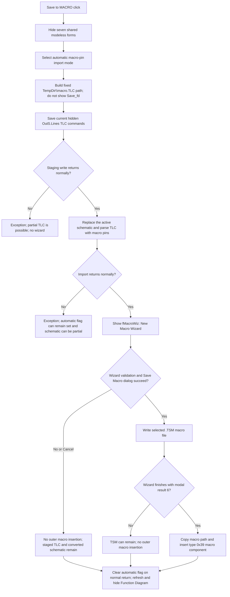

# Save the Function Diagram as a macro

> Analysis status: Complete source review.

## Control

| Property | Recovered value |
| --- | --- |
| Form | Func_diagram_form |
| Component path | Func_diagram_form.GroupBox2.SaveMacroButton |
| Control class | TButton |
| Caption | Save to MACRO |
| Hint | Not present in the recovered resource. |
| Text | Not present in the recovered resource. |
| Handler name | SaveMacroButtonClick |
| Handler address | 01221000 |
| Graph node | `resource:dfm:Func_diagram_form/Func_diagram_form.GroupBox2.SaveMacroButton` |
| Handler node | `function:01221000` |
| Graph layer | UI |

## What happens when clicked

This click converts the generated Function Diagram into a TINA schematic with
macro pins and then starts the **New Macro Wizard**. It is not a direct
one-step save to a user-selected macro file.

`FUN_01221000` first selects Help context `0x16A8` and hides seven shared
modeless forms. It sets the process-global TINA import mode to macro pins and
configures the form's `Save_fd` component with:

- filter `All files|*.*|Tina TLC files|*.TLC`;
- file name `macro.TLC`;
- initial directory from the configured TINA `TempDir`.

The handler does not execute `Save_fd`. It reads back the configured file name,
joins `TempDir`, `\`, and `macro.TLC`, and calls the `SaveToFile` virtual method
on the hidden `OutS.Lines` string list. The fixed staging target is therefore:

`TempDir\macro.TLC`

The filter does not give the user a choice in this path. It only configures a
dialog object that the handler uses as storage for the fixed name and initial
directory.

## Staged TLC data

`OutS` is a hidden `TMemo`. Function Diagram builders populate its line list
with the text that represents the generated logic drawing. Recovered producers
and consumers identify line-oriented records for inputs, outputs, wires,
coordinates, names, and gate variants such as `AND1` through `AND4`. The
handler saves the current `OutS.Lines` snapshot. It does not save the pixels in
`Image1`, rebuild the Boolean function, or validate the line list first.

The virtual call supplies a path but no explicit encoding object. The source
therefore proves a Delphi `TStrings`-style text save, but it does not establish
whether the runtime uses ANSI, UTF-8, or UTF-16 for this file.

## TLC conversion and macro-pin mode

After the staging write returns, the handler sets the automatic-import byte
`PTR_DAT_020028E0` and passes the same path to `FUN_01c830b0`. The automatic
flag suppresses the importer's question **Would you like Macro Pins instead of
test signals?**. Because the handler also set `PTR_DAT_02001A98` to `1`, the
importer selects macro-pin mode.

The importer replaces the main Schematic Editor model with a new schematic,
loads and parses the TLC records, creates the recovered input, output, gate,
and wire objects, and changes the working document extension to `.TSC`. In
macro-pin mode it keeps the generated macro-pin components and skips the
test-signal conversion used by **Save to TINA**. This is a live model change;
it is not only a temporary file export.

The click then calls `FUN_01c89c60`, the same launcher bound to the Schematic
Editor's **New Macro Wizard...** menu item. That function creates `fMacroWiz`
and shows it modally.

## Macro Wizard output

The wizard performs the macro-specific validation and persistent save. Its
recovered `SaveTSMDlg` is configured as follows:

| Setting | Recovered value |
| --- | --- |
| Title | `Save Macro` |
| Filter | `Schematics Macro (*.TSM)|*.TSM` |
| Initial folder | The settings-directory `MacroLib` folder |
| Folder shortcuts | User Macros and TINA Macros |
| Extra option | `Encrypt macro` |

The wizard checks the selected source, macro content, model, shape, pin list,
and output information before it reaches this dialog. Some failures use
application error dialogs and keep the wizard on the current page. Canceling
the `Save Macro` dialog returns failure from the wizard's save step and does
not write a `.TSM` through that branch.

On acceptance, the wizard builds a macro component of recovered type `0x39`
and writes it to the selected `.TSM` target. The outer launcher treats modal
result `6` as completion: it copies the selected macro path into the main
Schematic Editor and inserts the newly created macro component into the active
schematic. It always destroys the wizard afterward.

## Cancel, overwrite, and failure behavior

- There is no cancel path before `TempDir\macro.TLC` is written because the
  outer handler does not show its configured TLC dialog.
- The outer handler has no file-existence test or overwrite question for the
  fixed staging path. The `TStrings.SaveToFile`-style call replaces the same
  target on later clicks. No temporary target, backup, atomic rename, or
  partial-file cleanup is visible.
- The handler does not check a return value from the staging writer or the TLC
  importer. An exception stops the later steps. A write failure can leave a
  truncated staging file, and an import failure can leave the active schematic
  blank or partly populated.
- The automatic-import byte is cleared only after the importer and wizard
  launcher return normally. An exception in either call can leave it set. The
  macro-pin mode byte is set to `1` and is not cleared by this handler.
- Canceling `fMacroWiz` prevents the outer accepted-only macro insertion. It
  does not restore the schematic that the TLC importer already replaced, show
  the Function Diagram again, or delete `macro.TLC`.
- The wizard writes the `.TSM` before it reaches its completion page. If the
  user cancels after that successful write, the `.TSM` can remain even though
  the outer launcher does not insert the macro component.
- The outer handler has no rollback for a wizard error or cancellation. After
  the wizard closes normally, it refreshes the Function Diagram path and hides
  `Func_diagram_form` regardless of the wizard result.

## Relation to the sibling Save and Test controls

| Control | File direction and target | Later action |
| --- | --- | --- |
| Save to FILE | Saves `OutS.Lines` to a path chosen in `Save_fd` | Redraws the Function Diagram; no TINA import or wizard |
| Save to TINA | Saves `OutS.Lines` to fixed `TempDir\Noname.TLC` | Imports a new schematic with test-signal pins; no macro wizard |
| Save to MACRO | Saves `OutS.Lines` to fixed `TempDir\macro.TLC` | Imports with macro pins, runs the macro wizard, and can write a `.TSM` |
| Hidden File_rajzolas Test | Loads a selected TLC file into `InS.Lines` | Selects the imported-file redraw path; it does not save a macro |

These controls share the line-list file mechanism, but they do not call each
other. This click does not use the user-selected path from **Save to FILE**, and
the hidden Test control does not validate its staging output.

## Click flow

## Handler and call-path evidence

- Handler: [FUN_01221000](../../../DecompiledSources/Tina16/functions/0000000001221000__FUN_01221000.c)
- Save-dialog file-name reader: [FUN_00724270](../../../DecompiledSources/Tina16/functions/0000000000724270__FUN_00724270.c)
- Save-dialog file-name setter: [FUN_00724380](../../../DecompiledSources/Tina16/functions/0000000000724380__FUN_00724380.c)
- Save-dialog initial-directory setter: [FUN_00724420](../../../DecompiledSources/Tina16/functions/0000000000724420__FUN_00724420.c)
- `TempDir` configuration: [FUN_01d86bd0](../../../DecompiledSources/Tina16/functions/0000000001D86BD0__FUN_01d86bd0.c)
- TLC-to-schematic importer: [FUN_01c830b0](../../../DecompiledSources/Tina16/functions/0000000001C830B0__FUN_01c830b0.c)
- TLC parser and schematic-object builder: [FUN_01c821c0](../../../DecompiledSources/Tina16/functions/0000000001C821C0__FUN_01c821c0.c)
- Macro Wizard launcher: [FUN_01c89c60](../../../DecompiledSources/Tina16/functions/0000000001C89C60__FUN_01c89c60.c)
- Macro Wizard setup: [FUN_01c37190](../../../DecompiledSources/Tina16/functions/0000000001C37190__FUN_01c37190.c)
- Macro validation and `.TSM` writer: [FUN_01c41ab0](../../../DecompiledSources/Tina16/functions/0000000001C41AB0__FUN_01c41ab0.c)
- Function Diagram redraw dispatcher: [FUN_011d4970](../../../DecompiledSources/Tina16/functions/00000000011D4970__FUN_011d4970.c)
- **Save to FILE** sibling: [FUN_012207d0](../../../DecompiledSources/Tina16/functions/00000000012207D0__FUN_012207d0.c)
- **Save to TINA** sibling: [FUN_01220d20](../../../DecompiledSources/Tina16/functions/0000000001220D20__FUN_01220d20.c)
- Hidden TLC load-and-redraw Test: [FUN_01220be0](../../../DecompiledSources/Tina16/functions/0000000001220BE0__FUN_01220be0.c)
- Resource evidence: [ui-evidence.json](../../../DecompiledSources/Tina16/resources/dfm/ui-evidence.json)

## Resource evidence

- The parent group is captioned **Save**.
- This control is captioned **Save to MACRO**.
- The same form contains hidden `OutS` and `InS` `TMemo` controls,
  `Save_fd`, `OpenDialog1`, the sibling Save buttons, and the hidden
  **File_rajzolas** Test button.
- The control has no hint, glyph, image reference, modal result, checked state,
  default state, or cancel state.

## Analysis limits and annotation ownership

- The recovered virtual method and paired load path establish a `TStrings`
  save, but the concrete string-list class and its selected text encoding are
  not named in this call site.
- The TLC readers establish the record families and their use in rebuilding a
  schematic. This article does not claim a complete TLC grammar or field
  specification.
- The wizard implements several source types and macro formats. This article
  describes the path reached from the Function Diagram and does not generalize
  every wizard branch.
- Shared helpers remain evidence only. The broad TLC importer
  `FUN_01c830b0`, Macro Wizard launcher `FUN_01c89c60`, generic dialog and VCL
  helpers, and the redraw path owned by `TIARA-diz.6.7.577` are not annotated
  here. This control owns only `FUN_01221000`.
