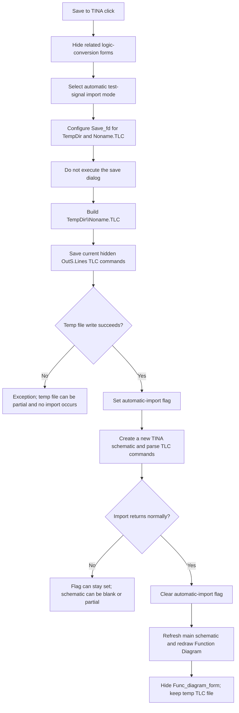

# Save to TINA

> Analysis status: Complete source review.

## Control

| Property | Recovered value |
| --- | --- |
| Form | Func_diagram_form |
| Component path | Func_diagram_form.GroupBox2.SaveTinaButton |
| Control class | TButton |
| Caption | Save to TINA |
| Hint | Not present in the recovered resource. |
| Text | Not present in the recovered resource. |
| Handler name | SaveTinaButtonClick |
| Handler address | 01220d20 |
| Graph node | `resource:dfm:Func_diagram_form/Func_diagram_form.GroupBox2.SaveTinaButton` |
| Handler node | `function:01220d20` |
| Graph layer | UI |

## What happens when clicked

The click transfers the current Function Diagram to the main TINA Schematic
Editor. It uses a temporary TLC text file as a bridge. It does not ask the user
for a target file.

The handler first sets Help context `0x1644` and hides seven related
logic-conversion forms. It selects the non-macro import mode by clearing global
byte `PTR_DAT_02001A98`. It then configures the form's `Save_fd` object with:

- filter `All files|*.*|Tina TLC files|*.TLC`;
- file name `Noname.TLC`;
- initial directory from the recovered TINA temporary-directory global.

The handler does not call `Save_fd.Execute`. It reads the configured file name,
joins `TempDir`, `\`, and `Noname.TLC`, and calls the `SaveToFile` virtual method
on the hidden `OutS.Lines` string list. The fixed target is therefore:

`TempDir\Noname.TLC`

## TLC data and TINA import

`OutS` is a hidden `TMemo`. Other Function Diagram routines build its lines as
a TLC command list. Recovered producers add text records such as
`WIRE(x1,y1,x2,y2,...)`. The paired parsers recognize `INPUT`, `OUTPUT`,
`WIRE`, OR and AND gate records, coordinates, names, and gate variants. This
button does not regenerate or validate those lines before it saves them. It
saves the current `OutS.Lines` snapshot.

After the file write, the handler sets global automatic-import byte
`PTR_DAT_020028E0` to `1` and calls the shared TLC-to-schematic importer. This
flag suppresses the importer's **Would you like Macro Pins instead of test
signals?** question. Because the handler cleared `PTR_DAT_02001A98`, the
importer uses test-signal input and output components instead of macro pins.

The importer switches the main Schematic Editor to a new blank schematic model,
loads `Noname.TLC`, and creates the recovered gate, input, output, and wire
objects at their recorded coordinates. It updates the current schematic change
state and calls the main editor refresh path. It does not save a `.TSC` document
to disk. On normal return, the handler clears the automatic-import byte, asks
the Function Diagram form to refresh, runs the normal Function Diagram redraw,
and hides the persistent `Func_diagram_form` instance.

The temporary TLC file is not deleted. A later click uses the same path.

## No dialog, validation, and failure behavior

- There is no cancel path because this handler never executes the save dialog.
  The sibling **Save to FILE** handler does execute the dialog and stops when
  the user cancels.
- The handler does not check whether `OutS.Lines` is empty, current, or valid.
  It does not check a serializer or importer result.
- There is no explicit overwrite test or prompt. Normal `TStrings.SaveToFile`
  behavior replaces the fixed `Noname.TLC` file. A write exception can leave a
  truncated or partial temp file.
- The handler has no local exception handler, `finally` block, or rollback. If
  import fails after `PTR_DAT_020028E0` becomes `1`, that byte can remain set.
  The main editor can also contain a new blank or partly populated schematic.
  Later redraw and hide operations do not run on that failure path.
- The filter accepts all files and TLC files, but it provides no validation in
  this path because the fixed `.TLC` name is used directly.
- The click changes the live TINA schematic model and leaves the temporary TLC
  file on disk. It does not write registry settings or save the resulting TINA
  schematic document.

## Click flow

## Handler evidence

- Handler: [FUN_01220d20](../../../DecompiledSources/Tina16/functions/0000000001220D20__FUN_01220d20.c)
- Save-dialog file-name getter: [FUN_00724270](../../../DecompiledSources/Tina16/functions/0000000000724270__FUN_00724270.c)
- Save-dialog file-name setter: [FUN_00724380](../../../DecompiledSources/Tina16/functions/0000000000724380__FUN_00724380.c)
- Save-dialog initial-directory setter: [FUN_00724420](../../../DecompiledSources/Tina16/functions/0000000000724420__FUN_00724420.c)
- Shared TLC-to-schematic importer: [FUN_01c830b0](../../../DecompiledSources/Tina16/functions/0000000001C830B0__FUN_01c830b0.c)
- TLC line parser and object builder: [FUN_01c821c0](../../../DecompiledSources/Tina16/functions/0000000001C821C0__FUN_01c821c0.c)
- New-schematic coordinator: [FUN_01c77470](../../../DecompiledSources/Tina16/functions/0000000001C77470__FUN_01c77470.c)
- Function Diagram redraw dispatcher: [FUN_011d4970](../../../DecompiledSources/Tina16/functions/00000000011D4970__FUN_011d4970.c)
- VCL hide wrapper: [FUN_00805990](../../../DecompiledSources/Tina16/functions/0000000000805990__FUN_00805990.c)
- **Save to FILE** sibling: [FUN_012207d0](../../../DecompiledSources/Tina16/functions/00000000012207D0__FUN_012207d0.c)
- **Save to MACRO** sibling: [FUN_01221000](../../../DecompiledSources/Tina16/functions/0000000001221000__FUN_01221000.c)
- Hidden TLC load-and-redraw test: [FUN_01220be0](../../../DecompiledSources/Tina16/functions/0000000001220BE0__FUN_01220be0.c)
- Resource evidence: [ui-evidence.json](../../../DecompiledSources/Tina16/resources/dfm/ui-evidence.json)
- `FUN_01220d20` is complex with nine recovered direct calls plus indirect
  `OutS.Lines.SaveToFile` and form-refresh calls.

The path separator at recovered data address `01220FFC` is `\`. The handler
combines it with the temporary-directory global and the configured file name
twice: once for `OutS.Lines.SaveToFile`, and once for the importer.

## Sibling behavior boundary

- **Save to FILE** executes `Save_fd`, writes `OutS.Lines` to the selected path,
  and redraws the Function Diagram. It does not import into the main editor.
- **Save to MACRO** uses the fixed `TempDir\macro.TLC` bridge, selects macro-pin
  mode, runs the same importer, and then opens the macro configuration dialog.
- The hidden **File_rajzolas** test loads a chosen TLC file into `InS.Lines` and
  redraws the Function Diagram. It does not create a TINA schematic.

## Resource evidence

- The parent group is captioned **Save**.
- This control is captioned **Save to TINA**.
- The control has no hint, glyph, image reference, modal result, default state,
  or cancel state.

## Analysis limits

- The recovered virtual call and paired load path identify the `TStrings`
  save operation. The exact text encoding selected by the `OutS.Lines`
  implementation is not recovered, so this article does not claim ANSI,
  UTF-8, or UTF-16.
- The normal Function Diagram renderer starts at recovered interior address
  `011E8AE0`, which has no separate exported source file. Its shared dispatcher
  and the TLC-imported renderer are recovered.
- The handler does not expose an import status. The source proves ordered model
  mutations, but not an atomic success boundary inside every component builder.
