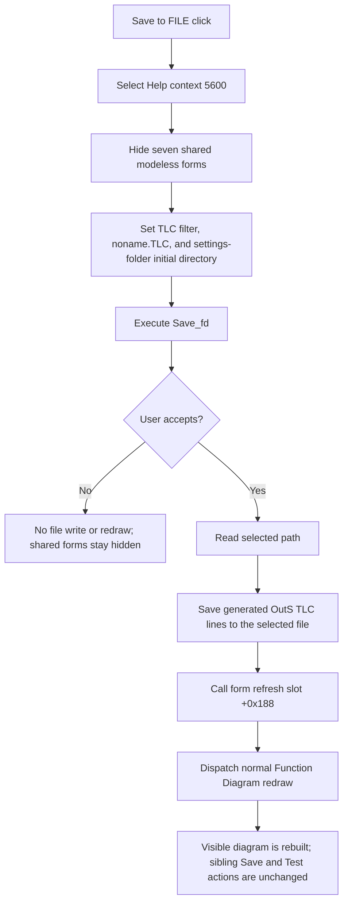

# Save generated diagram commands to a TLC file

> Analysis status: Complete source review.

## Control

| Property | Recovered value |
| --- | --- |
| Form | Func_diagram_form |
| Component path | Func_diagram_form.GroupBox2.Saving |
| Control class | TButton |
| Caption | Save to FILE |
| Hint | Not present in the recovered resource. |
| Text | Not present in the recovered resource. |
| Handler name | SavingClick |
| Handler address | 012207d0 |
| Graph node | `resource:dfm:Func_diagram_form/Func_diagram_form.GroupBox2.Saving` |
| Handler node | `function:012207d0` |
| Graph layer | UI |

## What happens when clicked

This button is a save action. It is not a toggle or a state selector.
`FUN_012207d0` selects shared Help context 5600 and hides seven process-global
VCL forms before it opens a dialog. These visibility changes happen on every
click. The handler does not restore the forms on either the accepted or the
canceled path.

The handler configures the form's `Save_fd` component as follows:

- Filter: **All files|*.*|Tina TLC files|*.TLC**.
- Initial file name: **noname.TLC**.
- Initial directory: the recovered application settings folder.

It then executes the save dialog. If the user accepts, it reads the selected
path and calls the line-list save method at virtual slot `+0x100` on the
hidden `OutS` memo. Other Function Diagram render functions add TLC commands,
such as `WIRE(...)`, to this same line list through slot `+0x78`. The output is
therefore the generated TLC diagram-command text. It is not a raster copy of
the visible `Image1` control.

After the file save returns, the handler calls form virtual slot `+0x188` and
the shared Function Diagram redraw dispatcher. The redraw flag remains clear,
so the dispatcher selects the normal renderer rather than the imported-file
renderer. The recovered source does not identify the exact VCL name of slot
`+0x188`; its position and repeated use support a form repaint or refresh
role. The redraw call proves that the normal diagram display is rebuilt after
an accepted save.

## Relation to the other Save and Test controls

**Save to TINA** and **Save to MACRO** also save the generated `OutS` line list,
but their handlers create paths in the recovered temporary folder and then
call current-document or macro import functions. Save to MACRO also passes its
click argument to a macro-specific function. **Save to FILE** does none of
those operations. It does not set the TINA-versus-macro mode flag, the
temporary-import flag, or the imported-file redraw flag, and it does not add
anything to the current TINA circuit or macro library.

The hidden **File_rajzolas** Test button uses `OpenDialog1`. On acceptance, it
loads a selected TLC file into the hidden `InS` memo, sets the imported-file
redraw flag, and invokes the same redraw dispatcher. Save to FILE is the
opposite file direction: it writes the current generated `OutS` list and then
requests a normal redraw. It does not run the Test handler or validate the
saved file by loading it again.

The handler does not enable, disable, press, or change the captions of Save to
TINA, Save to MACRO, or Test. It does not change the selected minterm, maxterm,
PLA mode, simplified-function option, or Boolean-function model.

## Cancel, validation, and failure behavior

- If the user cancels the save dialog, the handler does not read the selected
  path, write a file, repaint the form, or redraw the diagram. The Help context,
  dialog properties, and the seven hidden-form states have already changed.
- The handler does not test whether `OutS` is empty. It does not require a
  `.TLC` extension because **All files** is available and no explicit extension
  check appears in the recovered path.
- There is no explicit overwrite prompt, path validation, success test, or
  status message in the handler. Any behavior supplied internally by the VCL
  save dialog is not visible in this source.
- The file-save call has no local exception handler, rollback, or cleanup
  branch. An I/O exception skips the later form refresh and redraw. The source
  does not guarantee removal of a partial output file.
- The selected TLC file is persistent output. The handler does not write a
  registry value, INI value, recent-file entry, project-modified flag, or
  remembered directory in the recovered path.

## Click flow

## Handler and call-path evidence

- Handler: [FUN_012207d0](../../../DecompiledSources/Tina16/functions/00000000012207D0__FUN_012207d0.c)
- VCL form-hide wrapper: [FUN_00805990](../../../DecompiledSources/Tina16/functions/0000000000805990__FUN_00805990.c)
- Save-dialog file-name reader: [FUN_00724270](../../../DecompiledSources/Tina16/functions/0000000000724270__FUN_00724270.c)
- Save-dialog file-name setter: [FUN_00724380](../../../DecompiledSources/Tina16/functions/0000000000724380__FUN_00724380.c)
- Save-dialog initial-directory setter: [FUN_00724420](../../../DecompiledSources/Tina16/functions/0000000000724420__FUN_00724420.c)
- Generated TLC command producer: [FUN_011d49a0](../../../DecompiledSources/Tina16/functions/00000000011D49A0__FUN_011d49a0.c)
- Redraw dispatcher: [FUN_011d4970](../../../DecompiledSources/Tina16/functions/00000000011D4970__FUN_011d4970.c)
- Imported TLC renderer: [FUN_011e6f50](../../../DecompiledSources/Tina16/functions/00000000011E6F50__FUN_011e6f50.c)
- Save to TINA handler: [FUN_01220d20](../../../DecompiledSources/Tina16/functions/0000000001220D20__FUN_01220d20.c)
- Save to MACRO handler: [FUN_01221000](../../../DecompiledSources/Tina16/functions/0000000001221000__FUN_01221000.c)
- Test-file handler: [FUN_01220be0](../../../DecompiledSources/Tina16/functions/0000000001220BE0__FUN_01220be0.c)

The handler's seven static call targets are UnicodeString lifetime helpers,
the three dialog-property helpers, the VCL hide wrapper, and the redraw
dispatcher. The save itself and form refresh use virtual calls, so they are not
separate static call edges in the graph. The graph classifies this UI handler
as complex.

## Resource evidence

- The DFM places this `TButton` in the **Save** group and gives it caption
  **Save to FILE**.
- The same form contains hidden `TMemo` controls `OutS` and `InS`, the `TSaveDialog`
  named `Save_fd`, the hidden Test button, and sibling **Save to TINA** and
  **Save to MACRO** buttons.
- No hint, glyph, image-list reference, checked state, modal result, action,
  list item, or nearby same-parent label is present for this button.

## Analysis limits and annotation ownership

- The original Delphi field names are not in the recovered function source.
  The DFM field layout, line-list virtual methods, generated `WIRE(...)` text,
  paired `InS` load path, and `.TLC` dialog strings establish the `OutS` text
  save role.
- The normal renderer entry at `011e8ae0` timed out during decompilation. The
  recovered dispatcher still proves selection of the normal versus imported
  render path.
- `TIARA-diz.6.7.65` owns the shared VCL hide wrapper `FUN_00805990`.
  `TIARA-diz.6.7.577` owns the shared redraw dispatcher `FUN_011d4970`.
  The generic dialog and VCL line-list methods remain evidence only. This
  control owns only `FUN_012207d0`.
