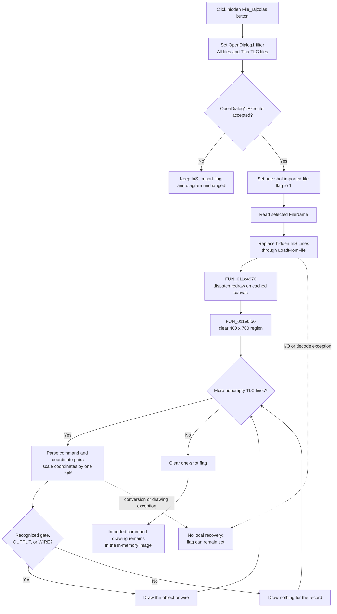

# Load and draw a TLC command file

> Analysis status: Complete for the recovered control boundary. The file-dialog branch, hidden input memo, text-loading path, one-shot redraw selector, and imported-TLC renderer are recovered. The handler does not validate a TLC document before it replaces the input lines and starts drawing.

## Control

| Property | Recovered value |
| --- | --- |
| Form | Func_diagram_form |
| Form caption | Schematic diagram |
| Component path | Func_diagram_form.Teszt_button |
| Control class | TButton |
| Caption | File_rajzolas |
| Initial visibility | Hidden (`Visible = false`) |
| Hint | Not present |
| Glyph | Not present |
| Handler name | Teszt_buttonClick |
| Handler address | 01220be0 |
| Graph node | `resource:dfm:Func_diagram_form/Func_diagram_form.Teszt_button` |
| Handler node | `function:01220be0` |
| Graph layer | UI |

The recovered resource starts this plain text button hidden. Its caption and component name are not used as behavior evidence. The handler source proves that this is a file-to-diagram test path.

## What happens when clicked

`FUN_01220be0` performs these operations in order:

1. Assigns the exact filter `All files|*.*|Tina TLC files|*.TLC` to `OpenDialog1`.
2. Executes the open dialog.
3. Returns after string cleanup when the dialog is canceled. It does not change the input memo, imported-file flag, or diagram in this branch.
4. On acceptance, writes one to `DAT_02107680`. This selects the imported-file branch for the next shared redraw.
5. Gets the selected `FileName` and calls `LoadFromFile` on the hidden `InS.Lines` collection. On normal completion, this replaces the previous input lines with the complete selected text file. The recovered TStrings path reads the whole file, detects a supported byte-order mark, uses the default encoding when no mark selects another encoding, and rebuilds the line list.
6. Calls `.577`-owned dispatcher `FUN_011d4970` with the form and cached image drawing surface. Because the handler just set the one-shot flag, the dispatcher calls imported-TLC renderer `FUN_011e6f50` instead of the normal Function Diagram builder.

The DFM supplies two hidden memos: `OutS` and `InS`. The Save handlers write the generated command list from `OutS` at form offset `+0x6b8`. This handler loads the distinct line list at `+0x6d0`, and `FUN_011e6f50` reads that same list. These data flows identify `+0x6d0` as `InS`.

## Dialog and path rules

- The first filter entry is **All files**, and the second is **Tina TLC files**. The handler does not set `FilterIndex`, so it does not force the TLC entry.
- It does not assign `DefaultExt`, `FileName`, `InitialDir`, title, or dialog options. The recovered DFM also supplies no non-default value for these properties.
- It has no accepted-path empty check, extension comparison, file-exists check, overwrite prompt, or TLC header/version check of its own. File access is delegated directly to the TStrings loader.
- Cancel is a no-import branch, but the assigned filter remains part of the form-owned dialog state. The handler does not clear a FileName retained internally by the dialog.

## Imported command renderer

`FUN_011e6f50` renders `InS.Lines` directly to the cached image drawing surface:

- It sets a white brush and black pen, then clears the rectangle from `(0,0)` to `(400,700)` before it reads the lines. An empty input list therefore produces a blank white drawing region.
- It skips null or empty line values. For each other line, it separates the command name from the parenthesized comma-separated values.
- It converts the first coordinate pair to integers and divides both values by two before drawing. Later coordinate pairs in a `WIRE` command are also divided by two.
- It draws the recovered named gate commands, including `AND1`, `AND2`, `AND3`, and `AND4`, as labeled gate boxes. Four additional gate labels remain stored as unresolved static strings in the decompiled source.
- It draws `OUTPUT` as the output symbol and label.
- It draws `WIRE` as a connected sequence from the first point through every later coordinate pair.
- A line with a valid coordinate prefix but an unrecognized command name does not draw an object. There is no diagnostic for that case.

After a normal renderer return, both the renderer and the shared dispatcher clear `DAT_02107680`. Thus this file-render route is one-shot. A later mode, radio, or simplified-function redraw returns to the normal builder unless another accepted click sets the flag again.

## State and model boundaries

- A successful click replaces the form-local `InS` text lines and replaces the visible canvas contents with the drawing described by those lines.
- It does not copy the loaded lines to generated-output memo `OutS`.
- It does not change the four drawing-mode bytes, the simplified-function byte, radio checked state, Save-control Enabled state, function expression, input/output variables, or caller-owned schematic model.
- Unlike **Save to TINA**, this handler does not call the TLC-to-main-editor importer and does not create a TINA schematic.
- It does not hide, close, or set a modal result on the Function Diagram form.

## Click flow

## Validation, errors, and repeated clicks

- The handler performs no syntax validation before loading. The renderer has no file-level success result, line-number report, or accumulated error list.
- Empty lines are skipped. An unrecognized command with parseable coordinates is ignored. Malformed delimiters or numeric fields can reach the recovered integer conversion and string-slice operations without a handler-level guard.
- The handler has no local exception catch, error message, retry, or rollback. File-open, read, decode, conversion, and canvas exceptions can propagate.
- The handler sets the imported-file flag before it obtains and loads the selected path. If loading fails before the dispatcher runs, the handler has no explicit restoration, so the flag can remain set. A later redraw can then enter the imported renderer and clear it.
- The renderer clears the drawing region before it parses the line list. A parse or drawing failure can therefore leave a blank or partly redrawn image. There is no canvas snapshot to restore.
- Repeating the click and accepting another file normally replaces `InS` again and redraws from the new commands. Repeating it and canceling keeps the previously loaded lines and current diagram.

## Persistence

- The selected file is read only. This path creates, overwrites, or deletes no file.
- Loaded lines, dialog state, the one-shot flag, and the image are in-memory form state. The handler does not store the accepted path as a project path, recent file, registry value, INI value, or document property.
- The imported drawing is not copied to `OutS` and is not saved automatically. The separate Save commands own file, TINA, and macro output.

## Source evidence

- [Test/load handler `FUN_01220be0`](../../../DecompiledSources/Tina16/functions/0000000001220BE0__FUN_01220be0.c) configures and executes `OpenDialog1`, sets the one-shot flag, loads the accepted path into the hidden line list, and dispatches the redraw.
- [Imported-TLC renderer `FUN_011e6f50`](../../../DecompiledSources/Tina16/functions/00000000011E6F50__FUN_011e6f50.c) reads the same hidden list, clears the canvas, parses command records, scales coordinates, draws supported gate/output/wire records, and clears the flag.
- [Shared redraw dispatcher `FUN_011d4970`](../../../DecompiledSources/Tina16/functions/00000000011D4970__FUN_011d4970.c) selects the imported renderer when the flag is set and clears the flag after a normal return. Its canonical annotation belongs to `.577`.
- [Open-dialog FileName getter `FUN_00724270`](../../../DecompiledSources/Tina16/functions/0000000000724270__FUN_00724270.c) supplies the accepted path.
- [TStrings file reader `FUN_004b43e0`](../../../DecompiledSources/Tina16/functions/00000000004B43E0__FUN_004b43e0.c), [stream decoder `FUN_004b4500`](../../../DecompiledSources/Tina16/functions/00000000004B4500__FUN_004b4500.c), [encoding detector `FUN_00458f20`](../../../DecompiledSources/Tina16/functions/0000000000458F20__FUN_00458f20.c), and [line replacement helper `FUN_004b4c80`](../../../DecompiledSources/Tina16/functions/00000000004B4C80__FUN_004b4c80.c) establish the whole-file, BOM-sensitive, replacement load path.
- [Save-to-file handler `FUN_012207d0`](../../../DecompiledSources/Tina16/functions/00000000012207D0__FUN_012207d0.c) writes the separate `OutS` line list and proves that this handler's `+0x6d0` list is the distinct `InS` import buffer.
- [Save-to-TINA handler `FUN_01220d20`](../../../DecompiledSources/Tina16/functions/0000000001220D20__FUN_01220d20.c) proves that main-editor schematic import is a separate command not called here.
- [Form creation `FUN_011d4840`](../../../DecompiledSources/Tina16/functions/00000000011D4840__FUN_011d4840.c) initializes the imported-file flag to zero. [Form show `FUN_01221730`](../../../DecompiledSources/Tina16/functions/0000000001221730__FUN_01221730.c) caches the image drawing surface used by the dispatcher.
- [Recovered Delphi resource evidence](../../../DecompiledSources/Tina16/resources/dfm/ui-evidence.json) supplies the hidden text button, caption, missing hint/glyph, open dialog, hidden `InS` and `OutS` memos, image, and event binding.

## Analysis ownership

- `.589` owns unique handler `FUN_01220be0` and imported-TLC renderer `FUN_011e6f50`.
- `.577` owns shared redraw dispatcher `FUN_011d4970`. Sibling Save Beads `.586` through `.588` own only their direct handlers.
- Generic VCL dialog, TStrings, UnicodeString, encoding, and drawing primitives remain evidence-only.
