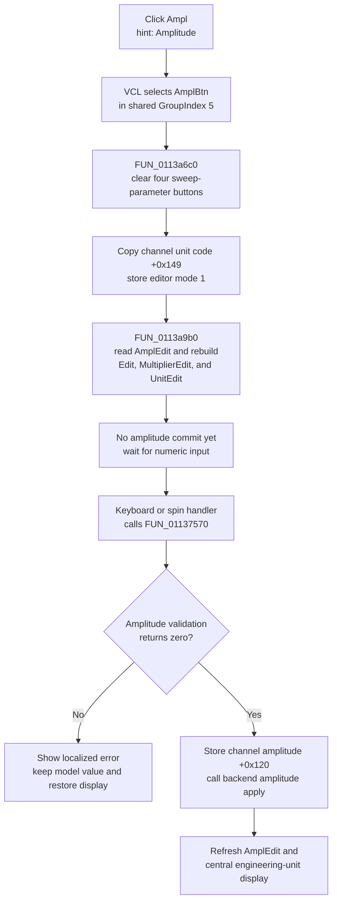

# Select amplitude editing

> Analysis status: Complete. The DFM group, handler, shared selector, numeric readout builder, and later editor commit path support this explanation.

## Control

| Property | Recovered value |
| --- | --- |
| Form | FuncGenWin |
| Component path | FuncGenWin.ParametersBox.AmplBtn |
| Control class | TSpeedButton |
| Caption | Ampl |
| Hint | Amplitude |
| Group index | 5 |
| Handler name | AmplBtnClick |
| Handler address | 0113b120 |
| Graph node | `resource:dfm:FuncGenWin/FuncGenWin.ParametersBox.AmplBtn` |
| Handler node | `function:0113b120` |
| Graph layer | UI |

`AmplBtn` has no glyph. Its caption, hint, position beside the read-only `AmplEdit` field, and mode-specific source branch agree that it selects amplitude.

## What happens when clicked

The button selects amplitude as the parameter controlled by the large numeric editor. It does not increase, decrease, validate, or apply an amplitude by itself.

`AmplBtn`, `FreqBtn`, `OffsetBtn`, `PhaseBtn`, and the four sweep-parameter buttons all use `GroupIndex = 5`. The VCL speed-button click selects `AmplBtn` before its `OnClick` handler runs. `FUN_0113b120` then calls `FUN_0113a6c0`, which changes the shared group from sweep-parameter selection to normal-parameter selection: it permits the sweep subgroup to have no selected button and clears the Down state of Sweep Start, Sweep Stop, Sweep Time, and Sweep Num. The handler also clears the recovered `AllowAllUp` state on `FreqBtn`, which keeps the normal parameter group in its non-empty selection policy.

Next, the handler copies the current generator channel's engineering-unit code from channel offset `+0x149` to editor state `+0xa78`, writes parameter mode `1` at `+0xa0c`, and calls the shared readout builder.

For mode `1`, `FUN_0113a9b0` reads the current text from the read-only `AmplEdit` field. It splits and formats that value into the central editable `Edit` control, `MultiplierEdit`, and `UnitEdit`. It repairs a digit index that is outside the new text and restores the active digit or unit selection. The value displayed in `AmplEdit` is synchronized elsewhere from the current channel's amplitude field at `+0x120`.

The handler does not inspect `Sender`. Repeated clicks run the same mode and display synchronization. They do not accumulate a numeric change.

## Later numeric commit and validation

Amplitude changes occur after selection, when the user edits the central number with the keyboard, arrow keys, or spin control. Those input handlers call the shared numeric commit dispatcher `FUN_01137570`; this click does not call it.

For amplitude mode `1`, the dispatcher:

1. Combines the central value, multiplier, and unit text and converts them with editor unit code `+0xa78`.
2. Calls the generator controller's amplitude validation method at virtual slot `+0xe8`.
3. If validation returns zero, stores the converted double in the current channel model at `+0x120`.
4. Calls the controller's amplitude apply method at virtual slot `+0xa0` with the accepted value.
5. Rebuilds `AmplEdit` and the central editor from the accepted model value.

If validation returns nonzero, the dispatcher does not write channel field `+0x120` and does not call the amplitude apply method. It formats the attempted value for localized error resource `0x132`, shows the error, and restores the editor from the current model value.

The controller is the live function-generator backend used by this form. The recovered virtual call proves a backend apply boundary, but it does not show whether a given installation routes that call to physical hardware, simulation, or another adapter.

## Click flow

## State, errors, and persistence

- The click changes speed-button group state, editor mode `+0xa0c`, unit code `+0xa78`, formatted editor text, and the active digit selection.
- It does not change channel amplitude `+0x120`, start or stop the generator, or call the generator controller's amplitude validator or apply method.
- The click path has no expected invalid-input branch because it only selects and formats the existing value. Numeric errors belong to the later commit path.
- The handler and readout builder have no local exception handler or null guard for the current channel and control fields. An unexpected missing object or formatting exception propagates beyond this path.
- A successful later commit updates the live channel model and calls the controller. Neither the click nor the later numeric dispatcher calls a file, registry, project serializer, or settings writer. A separate save or session path can consume the model later, but no persistence occurs in this control path.
- The button has no extracted image resource. Its direct text and its adjacency to `AmplEdit` provide the UI evidence.

## Source evidence

- [Amplitude handler `FUN_0113b120`](../../../DecompiledSources/Tina16/functions/000000000113B120__FUN_0113b120.c) selects the normal group, stores mode `1` and the channel unit code, and calls the readout builder without a model or backend setter.
- [Normal-parameter group selector `FUN_0113a6c0`](../../../DecompiledSources/Tina16/functions/000000000113A6C0__FUN_0113a6c0.c) clears the four sweep-parameter Down states after enabling their all-up policy.
- [Numeric readout builder `FUN_0113a9b0`](../../../DecompiledSources/Tina16/functions/000000000113A9B0__FUN_0113a9b0.c) maps mode `1` to `AmplEdit`, splits engineering-unit text, and restores the digit selection.
- [Numeric commit dispatcher `FUN_01137570`](../../../DecompiledSources/Tina16/functions/0000000001137570__FUN_01137570.c) owns later conversion, amplitude validation, channel-model store, backend application, error reporting, and readout recovery.
- [Amplitude readout synchronizer `FUN_0113a780`](../../../DecompiledSources/Tina16/functions/000000000113A780__FUN_0113a780.c) formats channel amplitude `+0x120` into `AmplEdit` when the amplitude button is selected.
- [Central edit key handlers](../../../DecompiledSources/Tina16/functions/000000000113D910__FUN_0113d910.c) and [spin-end handler](../../../DecompiledSources/Tina16/functions/000000000113D790__FUN_0113d790.c) show later routes into the numeric commit dispatcher.
- [Recovered Delphi resource evidence](../../../DecompiledSources/Tina16/resources/dfm/ui-evidence.json) supplies `Ampl`, `Amplitude`, `GroupIndex = 5`, the read-only `AmplEdit` sample text, the shared sweep group, and the `OnClick` binding.

## Analysis limits and ownership

- The exact Delphi field names for controller object `+0xa18`, channel object `+0xa10`, editor mode `+0xa0c`, and unit code `+0xa78` are not recovered. This article uses their source-proven responsibilities.
- `.555` owns `FUN_0113b120`, the shared normal-parameter selector `FUN_0113a6c0`, and the shared readout builder `FUN_0113a9b0`. Neighboring Frequency, Offset, and Phase articles must cite these shared annotations without redefining them.
- `.556` owns the central edit-mode control and is the intended owner of broad commit dispatcher `FUN_01137570` if its analysis confirms that role. This article cites that dispatcher only as later evidence.
