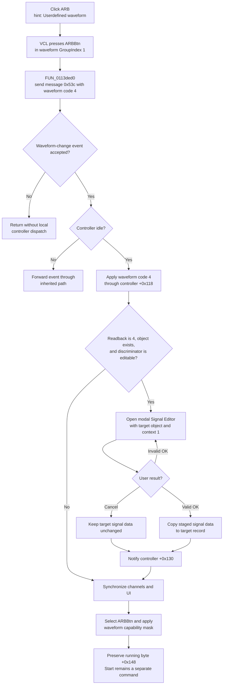

# Select and edit the arbitrary waveform

> Analysis status: Complete. The recovered DFM group, ARB wrapper, shared waveform dispatcher, Signal Editor dialog, channel synchronizer, capability renderer, and Start handler establish the selection, edit, and output boundaries.

## Control

| Property | Recovered value |
| --- | --- |
| Form | FuncGenWin (`Function Generator`) |
| Component path | FuncGenWin.WaveformBox.ARBBtn |
| Control class | TSpeedButton |
| Caption | ARB |
| Hint | Userdefined waveform |
| Group index | 1 |
| Handler name | ARBBtnClick |
| Handler address | 0113ded0 |
| Graph node | `resource:dfm:FuncGenWin/FuncGenWin.WaveformBox.ARBBtn` |
| Handler node | `function:0113ded0` |
| Graph layer | UI |

`ARBBtn` has no glyph. Its caption and hint agree with waveform code `4`, the Signal Editor path, and the shared waveform-to-button mapping.

## What happens when clicked

The VCL first presses `ARBBtn` in waveform `GroupIndex = 1`. `FUN_0113ded0` then creates recovered change message `0x53c` with payload `4` and passes it to `FUN_011399d0`. The four sibling wrappers use payloads `0` through `3` for DC, sinusoidal, triangle, and square waveforms. The shared renderer later maps current-channel waveform field `+0x110` value `4` back to `ARBBtn.Down`, which confirms the payload meaning.

When the message guard accepts the event and the function-generator controller is idle, the shared dispatcher:

1. sets the controller update guard;
2. makes the waveform group non-empty by clearing the recovered `AllowAllUp` state on the sinusoidal group member;
3. sends waveform code `4` to controller virtual slot `+0x118`;
4. reads the selected waveform back through controller slot `+0x120`;
5. conditionally opens the modal Signal Editor for the current channel's object at `+0x20`;
6. notifies controller slot `+0x130` after that editor returns;
7. synchronizes the channel collection and UI; and
8. clears the controller update guard.

The editor branch requires all of these conditions:

- the controller readback is still waveform code `4`;
- the current channel has a non-null object at `+0x20`; and
- virtual slot `+0xf8` on that object returns neither `100`, `62`, nor `102`.

The meaning of the three excluded discriminator values is not recovered. If any editor condition is false, waveform code `4` remains applied, but this click does not open the Signal Editor or call the ARB-data notification slot `+0x130`.

## Signal Editor staging and result

`FUN_01121e50` constructs `TSignalEditorDlg` with the current channel's waveform object and context value `1`. The dialog's `FormShow` handler obtains the target signal record through the supplied object and copies its standard, piecewise-linear, user-defined, WAV, and random-signal state into dialog-owned controls and buffers.

For signal records that reference an excitation, piecewise-linear, or WAV source, dialog initialization can inspect and load the existing external or default source. The recovered fallback names include `DEFAULT.EXC`, `UNITRAIN.EXC`, and `noname.pwl`. This is input initialization for the existing record, not an automatic Save operation.

The recovered Signal Editor offers standard waveform attributes, a user-defined script editor, piecewise-linear data, WAV input, and random-signal settings. Its OK handler validates the active mode and copies the accepted controls and buffers into the target signal record. For the normal attribute-grid modes, a failed grid validation sets the dialog's close-veto flag. `FormCloseQuery` then refuses that close and resets the flag so the user can correct the value.

`CancelBtn` is a built-in `bkCancel` button and does not call the OK commit handler. Cancel therefore leaves the staged signal-data changes out of the target record. It does not undo the earlier waveform selection: controller slot `+0x118` receives code `4` before the dialog opens. The shared dispatcher also calls controller slot `+0x130` after either accepted or cancelled modal return, without inspecting `ModalResult`. On OK, this propagates the accepted record. On Cancel, it reapplies the unchanged record.

## Channel, controller, and UI propagation

After the optional editor closes, `FUN_0113cec0` reconciles the controller channel list, selects the current channel record, and assigns it to form field `+0xa10`. When controller synchronization flag `+0x20` is set, it iterates all channel records and passes their frequency, offset, amplitude, waveform, engineering-unit, and sweep fields through the controller interface. It restores the selected channel, refreshes waveform and parameter controls, rebuilds readouts, and clears that flag.

`FUN_0113a180` selects `ARBBtn` when waveform field `+0x110` is `4`. It asks controller slot `+0x90` for the capability mask for that waveform. The mask enables the available Frequency, Amplitude, Offset or Bias A, and Phase, Duty, or Bias B controls. It also changes the alternate button captions, repairs the selected parameter if it is no longer available, and updates editor selector field `+0xa0c`.

The exact capability mask for ARB depends on the active controller implementation. The recovered source does not establish one fixed set of enabled parameters. ARB is not the DC waveform, so the renderer leaves the sweep-control group enabled. The path changes enabled and pressed states; it does not show or hide an ARB-only panel in `FuncGenWin`.

## Start interaction

ARB selection and editing do not start or stop output. The dispatcher does not call controller Start slot `+0x78` or Stop slot `+0x70`, and it does not change channel running byte `+0x148`. The capability renderer only restores the Start or Stop button state from that byte.

The separate Start handler runs only while the current channel is stopped. It then enters the shared Start path, calls controller slot `+0x78`, and sets running state. It does not reopen the Signal Editor or perform an ARB-specific data check. The ARB data has already been sent through the waveform and optional data-notification paths before Start is clicked.

The waveform dispatcher also does not require the output to be stopped. ARB can therefore be selected while the channel is already running. The device-side transition is inside the controller virtual methods and is not recovered.

## Errors, repeated clicks, and persistence

- If the recovered event guard rejects the message, the dispatcher returns without a controller call or refresh. The VCL can already have pressed `ARBBtn`; this path has no local button rollback.
- If the controller reports that another update is active, the dispatcher forwards the event through the inherited event path instead of applying it immediately.
- Controller slots `+0x118` and `+0x130` return no recovered status to this caller. The ARB path has no local controller-error message or retry branch.
- Invalid Signal Editor data can veto OK and keep the dialog open. Cancel closes it without the OK copy-back.
- The handler has no equality guard. A repeated ARB click sends code `4` again and can reopen the Signal Editor when the editor conditions remain true. It does not toggle ARB off.
- The ARB wrapper and waveform dispatcher do not show a file dialog or save a file. Signal Editor initialization can read an existing or default source for record modes that use one. The editor also has explicit Open, Save, Save As, and WAV-import commands. Cancelling the dialog does not undo a file that the user explicitly saved from inside it.
- The accepted target record and controller state are live in-memory state. This path does not write an INI value, registry value, project, or session file. Cross-session persistence is outside this click path.
- The recovered dispatcher has no local exception rollback. An exception during modal construction, controller calls, or channel refresh can interrupt the normal update-guard cleanup.

## Click flow

## Source evidence

- [ARB wrapper `FUN_0113ded0`](../../../DecompiledSources/Tina16/functions/000000000113DED0__FUN_0113ded0.c) creates message `0x53c`, stores payload `4`, and calls the shared waveform dispatcher.
- [Shared waveform dispatcher `FUN_011399d0`](../../../DecompiledSources/Tina16/functions/00000000011399D0__FUN_011399d0.c) gates the event, applies controller waveform code `4`, checks the current waveform object and its discriminator, opens the Signal Editor, notifies controller slot `+0x130`, and starts the channel/UI refresh.
- [Signal Editor constructor `FUN_01121e50`](../../../DecompiledSources/Tina16/functions/0000000001121E50__FUN_01121e50.c) stores the supplied target object and context before constructing the inherited dialog.
- [Signal Editor show handler `FUN_01121f20`](../../../DecompiledSources/Tina16/functions/0000000001121F20__FUN_01121f20.c) retrieves the target signal record and initializes the editor modes and staging buffers.
- [Signal Editor OK handler `FUN_011244a0`](../../../DecompiledSources/Tina16/functions/00000000011244A0__FUN_011244a0.c) validates the active mode and copies accepted attributes, data arrays, scripts, WAV settings, or random-signal settings into the target record.
- [Signal Editor close query `FUN_01126770`](../../../DecompiledSources/Tina16/functions/0000000001126770__FUN_01126770.c) converts the validation flag into a close veto and resets it for another attempt.
- [Signal Editor file command wrappers](../../../DecompiledSources/Tina16/functions/0000000001125460__FUN_01125460.c) prove that file Open is an explicit editor command; adjacent [Save As](../../../DecompiledSources/Tina16/functions/0000000001125470__FUN_01125470.c) and [Save](../../../DecompiledSources/Tina16/functions/0000000001125480__FUN_01125480.c) commands are also separate from ARB selection.
- [Channel and UI synchronizer `FUN_0113cec0`](../../../DecompiledSources/Tina16/functions/000000000113CEC0__FUN_0113cec0.c) reconciles the channel list, pushes channel fields when required, restores the current channel, and calls the UI refresh functions.
- [Waveform capability renderer `FUN_0113a180`](../../../DecompiledSources/Tina16/functions/000000000113A180__FUN_0113a180.c) maps waveform code `4` to `ARBBtn`, applies the controller capability mask, repairs parameter selection, and restores Start or Stop state.
- [Start handler `FUN_011393b0`](../../../DecompiledSources/Tina16/functions/00000000011393B0__FUN_011393b0.c) and [Start dispatcher `FUN_011393f0`](../../../DecompiledSources/Tina16/functions/00000000011393F0__FUN_011393f0.c) establish the separate output-start boundary.
- [Recovered Delphi resource evidence](../../../DecompiledSources/Tina16/resources/dfm/ui-evidence.json) supplies the `ARB` caption, `Userdefined waveform` hint, waveform `GroupIndex = 1`, Signal Editor controls, built-in OK and Cancel kinds, and resolved event bindings.

## Analysis limits and ownership

- The Delphi field names for controller `+0xa18`, current channel `+0xa10`, waveform `+0x110`, signal object `+0x20`, running state `+0x148`, and controller synchronization flag `+0x20` are not recovered.
- The roles of controller virtual slots are established by their values and repeated call sites. Their transport, device implementation, and device-side timing are not recovered.
- The three excluded Signal Editor discriminator values are exact recovered constants, but their product or device meanings are unknown.
- This Bead owns ARB wrapper `FUN_0113ded0`, shared waveform dispatcher `FUN_011399d0`, channel/UI synchronizer `FUN_0113cec0`, and waveform capability renderer `FUN_0113a180`. Sibling waveform articles cite the three shared functions without redefining them.
