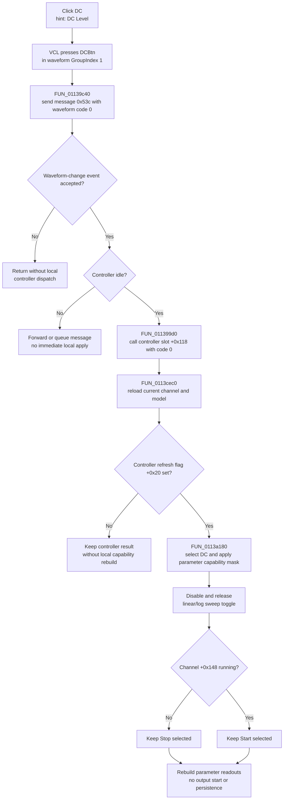

# Select the DC waveform

> Analysis status: Complete. The DFM waveform group, DC wrapper, shared waveform dispatcher, channel refresh, capability renderer, and Start/Stop handlers support this explanation.

## Control

| Property | Recovered value |
| --- | --- |
| Form | FuncGenWin |
| Component path | FuncGenWin.WaveformBox.DCBtn |
| Control class | TSpeedButton |
| Caption | DC |
| Hint | DC Level |
| Group index | 1 |
| Handler name | DCBtnClick |
| Handler address | 01139c40 |
| Graph node | `resource:dfm:FuncGenWin/FuncGenWin.WaveformBox.DCBtn` |
| Handler node | `function:01139c40` |
| Graph layer | UI |

`DCBtn` has no glyph. Its direct `DC` caption and `DC Level` hint agree with waveform code `0` in the handler and the shared waveform-to-button mapping.

## What happens when clicked

The VCL first presses `DCBtn` in waveform `GroupIndex = 1`. `FUN_01139c40` then creates the recovered waveform-change message `0x53c` with payload `0` and passes it to shared dispatcher `FUN_011399d0`. The four sibling wrappers use payloads `1`, `2`, `3`, and `4` for sinusoidal, triangle, square, and arbitrary waveforms. The shared refresh later maps model waveform code `0` back to `DCBtn.Down`, which confirms the meaning of the payload.

The shared dispatcher runs only when the recovered event guard accepts the message. If the function-generator controller is idle, it:

1. marks the controller update as active;
2. makes the waveform group non-empty by clearing the recovered `AllowAllUp` state on the sinusoidal group member;
3. calls controller virtual slot `+0x118` with waveform code `0`;
4. reloads the controller's channel collection and current channel into the form; and
5. clears the controller update flag after the refresh.

The DC wrapper does not write the current channel record directly. The controller call and refresh are the change boundary. The refreshed current channel stores its waveform at field `+0x110`; the UI renderer selects `DCBtn` when that field is `0`.

The arbitrary-waveform branch has additional waveform-object checks and can open an editor. Payload `0` does not enter that branch. DC selection opens no dialog and has no local confirmation step.

## Parameter and UI refresh

The refresh selects the controller's current channel and assigns that channel record to form field `+0xa10`. When controller refresh flag `+0x20` is set, it also synchronizes the channel values, calls `FUN_0113a180`, rebuilds the compact readouts and editor, and clears that flag. The renderer uses the refreshed waveform code to restore the pressed waveform button and asks controller slot `+0x90` for a parameter-capability mask.

The mask controls the enabled state of the shared parameter buttons:

- bit `1` controls Frequency;
- bit `2` controls Amplitude;
- bits `4` or `0x40` control Offset or Bias A; and
- bits `8`, `0x10`, or `0x80` control Phase, Duty, or Bias B.

The renderer also changes the last two button captions to match those alternate roles. If the previously selected parameter becomes unavailable, it moves the Down state to the next enabled parameter and updates selector field `+0xa0c`. The shared readout builder then rebuilds the central numeric, multiplier, and unit editors for the resulting selector.

The exact capability mask returned for DC depends on the active controller implementation and is not recovered as a static constant. Therefore, the source proves that DC selection recalculates parameter availability, but it does not prove one fixed set of enabled parameters for every controller.

When DC is selected, the renderer also clears and disables the linear/logarithmic sweep toggle at form field `+0x998`, then refreshes that control's caption. Other visibility changes are not present in this path.

## Start state and repeated clicks

DC selection is independent of the output lifecycle. The dispatcher does not test the channel running byte at `+0x148`, and it does not call the controller Start slot `+0x78` or Stop slot `+0x70`. It therefore sends waveform code `0` even when the current channel is already running.

After the channel refresh, `FUN_0113a180` reads running byte `+0x148` and restores the Start or Stop button Down state. It does not change that byte. The waveform change can therefore be applied to a running controller without an explicit stop/restart in this handler. The exact device-side transition is inside the controller virtual method and is not recovered.

The handler has no equality guard for an already selected DC waveform. A repeated click sends code `0` again and repeats the controller and UI refresh path. It does not increment a value or toggle DC off.

## Errors and persistence

- Controller slot `+0x118` has no recovered status result, so the DC path has no local validation-failure or error-message branch.
- If the recovered event guard rejects the message, the dispatcher returns without a controller call or channel refresh. The VCL can already have pressed `DCBtn`; this path has no local button rollback.
- If the controller reports that another update is active, the shared dispatcher forwards or queues the recovered message through the inherited event path instead of applying it immediately.
- The handler and dispatcher have no local exception handler or rollback. An exception during the controller call, channel rebuild, or UI refresh can leave the waveform button pressed or the controller update flag set while later UI fields remain stale.
- The click writes no file, INI value, registry value, project, or settings record. It changes the live controller/channel state and UI only. Cross-session persistence is outside this path.

## Click flow

## Source evidence

- [DC wrapper `FUN_01139c40`](../../../DecompiledSources/Tina16/functions/0000000001139C40__FUN_01139c40.c) creates message `0x53c`, stores payload `0`, and calls the shared waveform dispatcher.
- [Shared waveform dispatcher `FUN_011399d0`](../../../DecompiledSources/Tina16/functions/00000000011399D0__FUN_011399d0.c) gates the update, calls controller slot `+0x118` with the payload, handles the payload-`4` arbitrary-waveform special case only, and invokes the channel refresh.
- [Channel and UI refresh `FUN_0113cec0`](../../../DecompiledSources/Tina16/functions/000000000113CEC0__FUN_0113cec0.c) reloads the controller channel list, selects the current record, and invokes waveform, parameter, readout, and editor refresh functions.
- [Waveform and capability renderer `FUN_0113a180`](../../../DecompiledSources/Tina16/functions/000000000113A180__FUN_0113a180.c) maps model waveform code `0` to `DCBtn`, obtains the parameter mask, updates button enabled states and captions, repairs the selected parameter, disables the linear/log sweep toggle for DC, and restores Start/Stop button state from channel `+0x148`.
- [Start handler `FUN_011393b0`](../../../DecompiledSources/Tina16/functions/00000000011393B0__FUN_011393b0.c) and [Start dispatcher `FUN_011393f0`](../../../DecompiledSources/Tina16/functions/00000000011393F0__FUN_011393f0.c) show that Start uses controller slot `+0x78` and changes channel running byte `+0x148`; the DC path calls neither function.
- [Stop handler `FUN_01139900`](../../../DecompiledSources/Tina16/functions/0000000001139900__FUN_01139900.c) uses controller slot `+0x70` and clears running state after its stop path; the DC path does not call it.
- [Recovered Delphi resource evidence](../../../DecompiledSources/Tina16/resources/dfm/ui-evidence.json) supplies caption `DC`, hint `DC Level`, waveform `GroupIndex = 1`, sibling waveform bindings, and the `OnClick` address.

## Analysis limits and ownership

- This Bead annotates only DC wrapper `FUN_01139c40`.
- Bead `.569` owns shared waveform dispatcher `FUN_011399d0`, channel synchronizer and UI refresh `FUN_0113cec0`, and capability renderer `FUN_0113a180`. This article cites all three without redefining their graph annotations.
- The exact Delphi field names for controller `+0xa18`, current channel `+0xa10`, waveform `+0x110`, running state `+0x148`, and selector `+0xa0c` are not recovered. Their roles are established by repeated writers, readers, controller calls, and DFM state.
- Controller virtual slot `+0x90` proves dynamic capability selection, not a fixed DC mask. Controller slot `+0x118` proves the live waveform update boundary, but not its transport or device-side timing.
