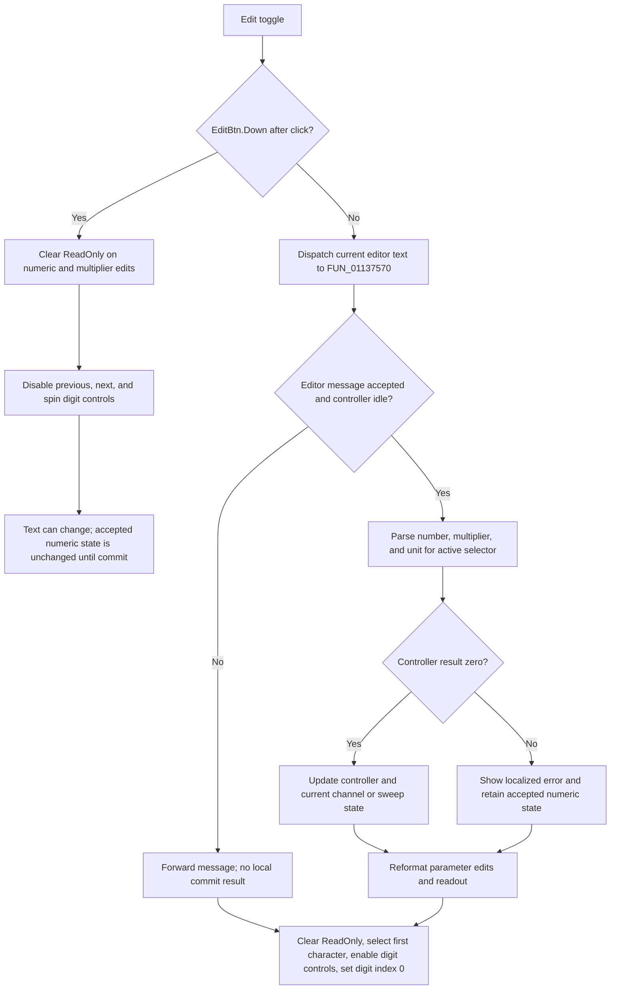

# Edit

> Analysis status: Source-reviewed. The toggle handler, edit-control messages, central parameter commit path, and sibling keyboard handlers establish the behavior below.

## Control

| Property | Recovered value |
| --- | --- |
| Form | FuncGenWin |
| Component path | FuncGenWin.ParametersBox.EditBtn |
| Control class | TSpeedButton |
| Caption | Edit |
| Hint | Edit mode |
| Group index | 4 |
| Allow all up | true |
| Handler name | EditBtnClick |
| Handler address | 0113a060 |
| Graph node | `resource:dfm:FuncGenWin/FuncGenWin.ParametersBox.EditBtn` |
| Handler node | `function:0113a060` |
| Graph layer | UI |

## What happens when clicked

Edit is an `AllowAllUp` speed-button toggle. The VCL changes its `Down` state, and `FUN_0113a060` then configures the parameter editor for that state. It does not open a dialog and does not show or hide a panel.

### Entering manual edit mode

When `EditBtn.Down` is true, the handler:

1. Clears the read-only flag on the main numeric `Edit` control and `MultiplierEdit`.
2. Disables the three digit-oriented controls: previous digit, next digit, and the up/down spin control.

It does not parse or commit the main numeric text in this branch. There is no working-copy object or Cancel button. The user edits the live text controls while the previously accepted numeric parameter remains in the current channel record until a commit event runs.

The main numeric edit commits on Enter through its `OnKeyPress` handler. Changing the multiplier character also dispatches the commit path. Ordinary main-text typing in manual mode is not committed by the recovered `OnKeyUp` handler because that handler returns while Edit is down.

### Leaving manual edit mode

When `EditBtn.Down` is false, the handler first calls `FUN_01137540(form, 1)`. This wrapper constructs the recovered FuncGen editor-update message and sends it to `FUN_01137570`, the central parameter parser and commit routine.

After that call returns, the handler:

1. Again clears the read-only flag on the numeric and multiplier edits.
2. selects the first character of the main numeric edit;
3. enables the previous-digit, next-digit, and spin controls; and
4. resets the selected-digit index at `FuncGenWin + 0xa6c` to zero.

Thus the non-down state is the digit-adjustment mode. Arrow and spin handlers operate on the selected digit and use the same commit wrapper. The edits remain writable because both click branches pass `false` to the recovered `EM_SETREADONLY` wrapper; the behavioral distinction is the toggle state, digit-control availability, selection, and keyboard routing.

## Parameter commit and validation

The commit routine combines the text of the main numeric edit, `MultiplierEdit`, and `UnitEdit`. It parses the resulting engineering-format value according to the active parameter selector at `+0xa0c`:

| Selector | Parameter |
| --- | --- |
| 0 | Frequency |
| 1 | Amplitude |
| 2 | DC offset |
| 3 | Phase |
| 4 | Sweep start |
| 5 | Sweep stop |
| 6 | Sweep time |
| 7 | Sweep step count |

`FUN_01137570` calls the relevant validation or setter method on the active function-generator controller at `+0xa18`. A zero result is accepted. It then writes the value to the matching field in the current channel record at `+0xa10` or to the corresponding sweep state, updates the compact readout where applicable, and reformats the main, multiplier, and unit edits.

A nonzero result does not replace the accepted numeric field. The routine formats the rejected or retained value for a localized error message, displays that error, and rebuilds the editor text from the accepted state. Exiting edit mode still continues after a normally returned validation error: the button remains up, the digit controls are enabled, and the first digit is selected.

The commit routine also has a controller-update gate. If the recovered message does not match the expected editor update or the controller reports that it is already updating, it forwards the message through the inherited handler instead of running the local parse-and-commit body. The Edit click has no separate retry or success result.

## State, outputs, and persistence

- Entering manual edit mode changes only UI editability and digit-control availability.
- A successful commit changes the active function-generator controller and the selected channel's in-memory parameter state immediately. It is not deferred to an OK button.
- Edit does not change the selected parameter, waveform, output channel, sweep mode, or generator Start/Stop state.
- The handler and commit path write no file, INI value, registry value, or other durable setting. The recovered code proves in-memory controller and channel-record updates only.
- Closing Edit mode is not a rollback boundary. There is no saved pre-edit text or Cancel path.

## No-op and failure boundaries

- Entering Edit mode with unchanged text performs no parameter commit.
- Leaving Edit mode with a valid unchanged value still runs parsing, controller validation, formatting, and the digit-mode UI reset.
- A normal validation failure preserves the previously accepted numeric state and shows an error, but it does not restore Edit mode.
- Exceptions from message dispatch, text reads, parsing, controller methods, formatting, error display, or VCL property changes propagate. The click handler has no local catch or rollback.
- Leaving-mode UI changes occur after the commit call. An exception in the commit path can therefore leave the Edit toggle up while the digit controls and selection still have their prior manual-mode state.
- A later exception can leave only part of the selection or enabled-state reset complete.

## Click flow

## Handler evidence

- [FUN_0113a060](../../../DecompiledSources/Tina16/functions/000000000113A060__FUN_0113a060.c) branches on `EditBtn.Down`, dispatches a commit only when the button is up, clears read-only state in both branches, changes the three digit controls, and resets the selection index.
- [FUN_006807e0](../../../DecompiledSources/Tina16/functions/00000000006807E0__FUN_006807e0.c) stores the edit read-only flag and sends Windows edit message `0xCF` (`EM_SETREADONLY`) when the control handle exists.
- [FUN_01137540](../../../DecompiledSources/Tina16/functions/0000000001137540__FUN_01137540.c) constructs editor-update message `0x53D` and passes the supplied update flag to the central handler.
- [FUN_01137570](../../../DecompiledSources/Tina16/functions/0000000001137570__FUN_01137570.c) reads all three editor strings, parses by selector, calls parameter-specific controller methods, commits successful values, reports failures, and rebuilds the formatted editor text.
- [FUN_0113d910](../../../DecompiledSources/Tina16/functions/000000000113D910__FUN_0113d910.c) commits the main numeric edit when Enter is pressed.
- [FUN_0113d940](../../../DecompiledSources/Tina16/functions/000000000113D940__FUN_0113d940.c) replaces the multiplier character and immediately calls the same commit wrapper.
- [FUN_0113dca0](../../../DecompiledSources/Tina16/functions/000000000113DCA0__FUN_0113dca0.c) skips its digit-mode key-up handling while Edit is down and otherwise routes digit motion or value changes through the shared controls and commit path.
- The parameter selector and editor formatter `FUN_0113a9b0` are owned by the direct parameter-button analyses and are evidence only here.

## Resource evidence

- The recovered DFM binds `EditBtn.OnClick` to `EditBtnClick` at `0113a060`.
- Caption `Edit`, hint `Edit mode`, `GroupIndex = 4`, and `AllowAllUp = true` establish a persistent toggle that can return to the up state.
- The control has no recovered action, image reference, embedded glyph, or modal result.
- The same Parameters group contains the numeric, multiplier, and unit edits; previous/next digit buttons; spin control; and parameter-selection buttons used by the recovered call path.

## Analysis limits and ownership

- `FUN_0113a060`, commit wrapper `FUN_01137540`, and central parameter commit routine `FUN_01137570` are annotated with this control.
- Parameter selector and readout rebuild helpers remain with the parameter-button owners. Start, Stop, waveform, sweep-mode, digit-navigation, and spin handlers remain with their direct control owners.
- The recovered controller virtual methods establish validation and update dispatch, but their exact hardware transport and device-side timing are outside this source path.
- No source evidence identifies durable persistence for the edited parameters. This article does not infer it from the live controller state.
