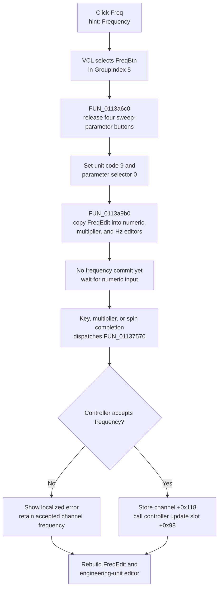

# Select frequency editing

> Analysis status: Complete. The DFM group, handler, shared parameter selector, readout builder, and later numeric commit path support this explanation.

## Control

| Property | Recovered value |
| --- | --- |
| Form | FuncGenWin |
| Component path | FuncGenWin.ParametersBox.FreqBtn |
| Control class | TSpeedButton |
| Caption | Freq |
| Hint | Frequency |
| Group index | 5 |
| Handler name | FreqBtnClick |
| Handler address | 0113b0e0 |
| Graph node | `resource:dfm:FuncGenWin/FuncGenWin.ParametersBox.FreqBtn` |
| Handler node | `function:0113b0e0` |
| Graph layer | UI |

`FreqBtn` has no glyph. Its caption and hint agree with the handler mode, the fixed frequency unit, and the adjacent read-only `FreqEdit` field.

## What happens when clicked

The button selects frequency as the parameter controlled by the large numeric editor. It does not change, validate, or apply a frequency by itself.

`FreqBtn`, the other three normal parameter buttons, and the four sweep-parameter buttons use recovered `GroupIndex = 5`. The normal VCL speed-button click selects `FreqBtn` before `FreqBtnClick` runs. The handler then calls `FUN_0113a6c0`. This shared helper lets the sweep subgroup have no selected button and clears the Down state of Sweep Start, Sweep Stop, Sweep Time, and Sweep Num. The handler sets `FreqBtn.AllowAllUp` to false, so the normal parameter group cannot be left without a selected button through a normal click.

The handler next stores:

- unit code `9` at form field `+0xa78`; and
- parameter selector `0` at form field `+0xa0c`.

The mode-to-field mapping in the readout and commit functions proves that selector `0` is frequency. The fixed unit code is also used when the form formats model field `+0x118` into `FreqEdit`; the DFM identifies its visible unit as `Hz`.

Finally, `FUN_0113a9b0` reads the current text from the read-only `FreqEdit` control. It splits that engineering value into the central numeric `Edit`, `MultiplierEdit`, and `UnitEdit`. It repairs an invalid digit index and selects either the active numeric digit or the multiplier character. The click does not show, hide, enable, or disable an editor control. Its visible changes are the pressed parameter button, the released sweep buttons, the editor text, and the active character selection.

The handler does not inspect `Sender`. A repeated click selects and formats the same current value again. It does not add an increment or create a second state change.

## Later numeric commit and backend update

Frequency changes occur only after selection. The central edit and spin handlers call the shared commit wrapper on Enter, ordinary digit-mode key completion, multiplier input, or spin completion. `FreqBtnClick` does not call that wrapper.

For selector `0`, the shared commit routine:

1. joins the numeric, multiplier, and unit edit text;
2. parses the result with frequency unit code `9`;
3. calls the active function-generator controller method at virtual slot `+0xe0` with the parsed double;
4. if the method returns zero, stores the accepted double in current channel field `+0x118` and calls controller slot `+0x98` with that value; and
5. formats the accepted channel value back into `FreqEdit` and the shared numeric editor.

The recovered virtual calls prove a live controller validation and update boundary. They do not prove whether the selected controller uses physical hardware, simulation, or another adapter.

If the controller method returns nonzero, the routine does not replace channel field `+0x118` and does not call slot `+0x98`. It formats localized resource `0x132`, shows an error, and rebuilds the editor from the accepted channel value. The controller-update guard also prevents the local commit body while the controller reports that an update is in progress; the recovered message is then forwarded through the inherited path.

## Click flow

## State, errors, and persistence

- The click changes button-group state, selector `+0xa0c`, unit code `+0xa78`, editor text, and the active character selection.
- It does not change channel frequency `+0x118`, call a controller frequency method, start or stop output, or change waveform and sweep settings.
- It has no invalid-input branch because it formats the current accepted text. Numeric parsing and controller rejection belong to the later commit path.
- The handler and readout builder have no local exception handler or null guard for their form, controls, and current channel. An unexpected object or formatting failure propagates and can leave some UI fields updated.
- A successful later commit updates the live channel model and controller immediately. Neither the click nor that commit path writes a file, INI value, registry value, project, or settings record. Cross-session persistence is not part of this path.

## Source evidence

- [Frequency handler `FUN_0113b0e0`](../../../DecompiledSources/Tina16/functions/000000000113B0E0__FUN_0113b0e0.c) clears sweep selection, locks the normal group, stores unit code `9` and selector `0`, and calls the readout builder without a model or controller setter.
- [Normal-parameter selector `FUN_0113a6c0`](../../../DecompiledSources/Tina16/functions/000000000113A6C0__FUN_0113a6c0.c) permits the sweep subgroup to be all up and clears all four sweep-parameter Down states.
- [Numeric readout builder `FUN_0113a9b0`](../../../DecompiledSources/Tina16/functions/000000000113A9B0__FUN_0113a9b0.c) maps selector `0` to `FreqEdit`, sets unit code `9`, rebuilds the three-part editor, and restores its character selection.
- [Numeric commit wrapper `FUN_01137540`](../../../DecompiledSources/Tina16/functions/0000000001137540__FUN_01137540.c) constructs the recovered editor-update message for the central dispatcher.
- [Numeric commit routine `FUN_01137570`](../../../DecompiledSources/Tina16/functions/0000000001137570__FUN_01137570.c) parses selector `0`, validates it through controller slot `+0xe0`, stores accepted frequency at channel `+0x118`, calls controller slot `+0x98`, reports rejection, and rebuilds the displays.
- [Frequency readout synchronizer `FUN_0113a780`](../../../DecompiledSources/Tina16/functions/000000000113A780__FUN_0113a780.c) formats channel field `+0x118` with unit code `9` into `FreqEdit` while `FreqBtn` is selected.
- [Central edit Enter handler](../../../DecompiledSources/Tina16/functions/000000000113D910__FUN_0113d910.c), [key-up handler](../../../DecompiledSources/Tina16/functions/000000000113DCA0__FUN_0113dca0.c), [multiplier input handler](../../../DecompiledSources/Tina16/functions/000000000113D940__FUN_0113d940.c), and [spin-end handler](../../../DecompiledSources/Tina16/functions/000000000113D790__FUN_0113d790.c) prove the later commit routes.
- [Recovered Delphi resource evidence](../../../DecompiledSources/Tina16/resources/dfm/ui-evidence.json) supplies caption `Freq`, hint `Frequency`, `GroupIndex = 5`, the read-only `FreqEdit` sample `100.0kHz`, the central editor events, and the `OnClick` binding.

## Analysis limits and ownership

- The exact Delphi field names for controller object `+0xa18`, channel object `+0xa10`, selector `+0xa0c`, and unit code `+0xa78` are not recovered. This article uses their source-proven roles.
- This Bead annotates only `FUN_0113b0e0`.
- Bead `.555` owns shared normal-parameter selector `FUN_0113a6c0` and readout builder `FUN_0113a9b0`. Bead `.556` owns commit wrapper `FUN_01137540` and commit routine `FUN_01137570`. This article cites these functions without redefining their graph annotations.
- Generic VCL speed-button, text, formatting, and selection helpers remain evidence only. The exact transport and device-side timing behind the controller virtual methods are outside this source path.
