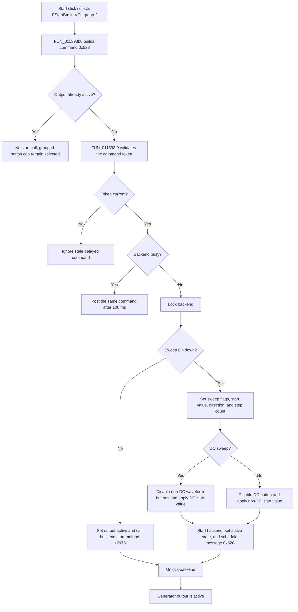

# Start

> Analysis status: Complete source review.

## Control

| Property | Recovered value |
| --- | --- |
| Form | FuncGenWin |
| Component path | FuncGenWin.ControlBox.FStartBtn |
| Control class | TSpeedButton |
| Caption | Start |
| Hint | Start Function Generator |
| Text | Not present in the recovered resource. |
| Handler name | StartBtnClick |
| Handler address | 011393b0 |
| Graph node | `resource:dfm:FuncGenWin/FuncGenWin.ControlBox.FStartBtn` |
| Handler node | `function:011393b0` |
| Graph layer | UI |

## What happens when clicked

The click requests that the Function Generator start. `FStartBtn` and
`FStopBtn` are `TSpeedButton` controls in VCL group 2. VCL therefore changes
the selected button before it calls the handler. The handler does not use the
`Sender` argument. It creates an internal command record with message code
`0x538` and calls the shared start coordinator only when the current output
controller's active byte is clear.

The coordinator rejects a stale delayed command and checks whether the backend
is busy. If the backend is busy, it posts the same command again after 100 ms.
This branch does not change generator state. If the backend is available, the
coordinator locks it and selects one of two paths:

- If **Sweep On** is not down, it sets the output-controller active byte, calls
  backend virtual method `+0x78`, and unlocks the backend. The paired Stop path
  calls virtual method `+0x70`, which supports the interpretation that `+0x78`
  starts or applies the current generator output.
- If **Sweep On** is down, it marks a sweep as active and incomplete. It starts
  at the configured start value, uses at least two steps when the stored step
  count is less than one, and starts with an increasing direction. For a DC
  sweep it disables Sine, Triangle, Square, and ARB. For a non-DC sweep it
  disables DC. It applies the start value through the mode-specific backend
  methods, updates the related value edit, calls backend method `+0x78`, sets
  the output active byte, and schedules message `0x52C`. The interval is the
  configured sweep time in milliseconds divided by the step count, rounded and
  limited to at least 1 ms.

The scheduled sweep handler calculates later linear or logarithmic points,
updates the backend and the visible value, and advances the step index. At an
endpoint it reverses direction for a continuous sweep. For a single sweep it
marks completion, and the next scheduled pass selects Stop and invokes the
Stop handler. The Stop path owns cancellation and cleanup: it stops the
backend, cancels the pending sweep message, re-enables the waveform controls,
and clears or completes the sweep state. If an external measurement owner has
registered for sweep values, cleanup also sends that owner the completion
message.

## No-op, retry, and failure behavior

- If the output-controller active byte is already set, the click does not call
  the start coordinator. The grouped Start button can still be selected by VCL.
- A stale delayed command does no work. A busy backend causes a 100 ms retry;
  it does not report an error or change the active state.
- The recovered start path has no local exception handler, rollback, or user
  error dialog. It changes flags and control-enabled states before all backend
  and scheduler calls finish. An exception can therefore leave partial live
  state, disabled waveform controls, or the backend lock set.
- The click does not close the form and does not write a file, registry value,
  project-modified flag, or persistent setting. Generator and sweep changes are
  live session state. During application exit, the form's close-query handler
  blocks exit while its sweep-active byte remains set and asks the user to
  close all measurement instruments.

## Click flow

## Handler evidence

- Source: [FUN_011393b0](../../../DecompiledSources/Tina16/functions/00000000011393B0__FUN_011393b0.c)
- Start coordinator: [FUN_011393f0](../../../DecompiledSources/Tina16/functions/00000000011393F0__FUN_011393f0.c)
- Scheduled sweep handler: [FUN_01138520](../../../DecompiledSources/Tina16/functions/0000000001138520__FUN_01138520.c)
- Stop handler: [FUN_01139900](../../../DecompiledSources/Tina16/functions/0000000001139900__FUN_01139900.c)
- Stop cleanup: [FUN_01139800](../../../DecompiledSources/Tina16/functions/0000000001139800__FUN_01139800.c)
- Exit guard: [FUN_0113d7c0](../../../DecompiledSources/Tina16/functions/000000000113D7C0__FUN_0113d7c0.c)
- Resource evidence: [ui-evidence.json](../../../DecompiledSources/Tina16/resources/dfm/ui-evidence.json)
- Complexity: `FUN_011393b0` is simple with one distinct outgoing call.
  `FUN_011393f0` is complex with 11 recovered direct calls plus backend virtual
  calls.

`FUN_011393b0` initializes the command record, tests the active byte at backend
state offset `+0x148`, and calls `FUN_011393f0`. The coordinator repeats that
test, uses `FUN_00f83630` for command-token validation, uses `FUN_00f83670` for
the busy retry, writes the sweep and active-state fields, calls the backend
virtual methods, and schedules message `0x52C` through `FUN_00f832e0`.

## Resource evidence

- The DFM supplies caption **Start** and hint **Start Function Generator**.
- `FStartBtn` and `FStopBtn` both have `GroupIndex = 2`.
- No button kind, modal result, list item, image reference, or extracted glyph
  is present.

## Analysis limits

- Recovered field and backend method names are unavailable. This article uses
  offsets and roles proved by paired Start, Stop, sweep-update, and UI-refresh
  paths.
- The backend implementation behind virtual methods `+0x78` and `+0x70` is not
  recovered here. Their exact hardware or simulator protocol is unknown.
- A 100 ms retry and a scheduled sweep message are application scheduler
  operations. The source does not prove that they are direct Win32 timer calls.
