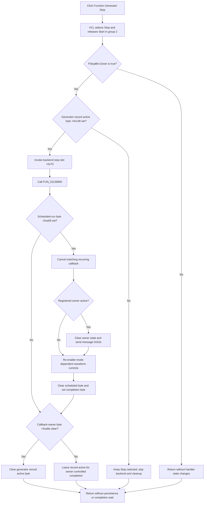

# Stop Function Generator output and scheduled sweeps

> Analysis status: Source-reviewed. The button group, Stop handler, paired Start coordinator, backend virtual calls, scheduled-callback cleanup, external-owner notification, and downstream stop dispatcher establish the behavior below.

## Control

| Property | Recovered value |
| --- | --- |
| Form | FuncGenWin |
| Component path | FuncGenWin.ControlBox.FStopBtn |
| Control class | TSpeedButton |
| Caption | Stop |
| Hint | Stop Function Generator |
| Group index | `2`, shared with `FStartBtn` |
| Handler name | StopBtnClick |
| Handler address | 01139900 |
| Graph node | `resource:dfm:FuncGenWin/FuncGenWin.ControlBox.FStopBtn` |
| Handler node | `function:01139900` |
| Graph layer | UI |

The resource has no action, image reference, or embedded glyph. Its caption and hint identify the command, while the handler and paired Start path prove the stop behavior.

## What happens when clicked

The VCL speed-button path selects `FStopBtn` before it dispatches `OnClick`. Because `FStartBtn` and `FStopBtn` share `GroupIndex = 2`, selecting Stop releases Start. The handler confirms that the Stop button at form field `+0x7c0` is down and that the current Function Generator record at `+0xa10` has its active byte `+0x148` set. If either test fails, it performs no backend or cleanup call.

For an active generator, `FUN_01139900` performs three ordered steps:

1. It invokes virtual slot `+0x70` on the Function Generator backend at form field `+0xa18`.
2. It calls Stop-specific cleanup `FUN_01139800` to cancel scheduled sweep work, notify an external owner when present, and restore controls.
3. If callback-owner byte `+0xa8a` is zero after cleanup, it clears the current generator record's active byte at `+0x148`.

The `.553` Start coordinator invokes slot `+0x78` on the same backend and sets record active byte `+0x148`. The adjacent virtual slots, opposite button bindings, and shared active-state gate establish `+0x70` as the backend stop operation and `+0x78` as the start operation. The form can create either of two backend implementations. Stop uses their common virtual interface and does not choose the implementation itself.

The handler does not read `Sender`. Its apparent second argument to `FUN_01139800` is extra; that function recovers one form parameter and reads no sender state. A direct button click and an application caller that selects `FStopBtn.Down` before dispatch therefore use the same stop path.

## Scheduled sweep cleanup

`FUN_01139800` acts only when scheduled-run byte `+0xa09` is set. The Start coordinator sets this byte for its timed sweep path and registers a recurring callback through `FUN_00f832e0`. The registration is keyed by the form window handle, custom message `0x52c`, zero `wParam`, and `0x7e0` as the final message value.

Stop cleanup passes the same tuple to `FUN_00f833a0`. Its downstream scheduler code finds the matching entry, cancels its timer, removes the entry, and releases the record. This prevents another scheduled Function Generator update after Stop.

When callback-owner byte `+0xa8a` is `1`, cleanup:

- clears scheduled-run byte `+0xa09` and callback-owner byte `+0xa8a`;
- sends custom message `0x52e` with zero arguments to the registered owner window at `+0xa80`; and
- continues with the same UI restoration.

The message proves notification of the registered owner, but its original symbolic name is not recovered. A DC measurement path can detach itself first through `FUN_011390a0`; in that case the Function Generator Stop path has no registered owner to notify.

The Start coordinator disables mode-dependent waveform controls during a scheduled sweep. Cleanup re-enables the same controls through VCL `SetEnabled` slot `+0x128`: four waveform controls when mode byte `+0xa20` is zero, or the alternate waveform control when it is nonzero. When callback-owner byte `+0xa8a` is zero, cleanup also clears scheduled-run byte `+0xa09` and sets completion byte `+0xa08` to `1`.

For direct output without an armed schedule, `+0xa09` is zero. The helper then makes no timer, owner, completion-byte, or control-enabled change. The handler still invokes the backend stop slot and can clear the record's active byte.

## Start interaction and later use

`FStartBtn` uses `FUN_011393b0`. It starts only when the same record active byte `+0x148` is zero. Its coordinator configures the backend and output, invokes backend start slot `+0x78`, sets the record active byte, and arms the recurring callback only for the scheduled path. A successful Stop that clears `+0x148` therefore reopens the Start gate.

`FUN_0113dfb0` is the recovered application stop dispatcher. It checks the same active byte, selects `FStopBtn.Down`, and invokes this form's Stop handler through its virtual event slot. The DC parameter acquisition path uses this dispatcher after it removes its completion-owner relationship. This confirms that the same Stop path is used by both the visible button and an owning measurement workflow.

Form close uses `FUN_01139800` when scheduled-run byte `+0xa09` remains set and vetoes that close attempt while it performs cleanup. It does not replace the button handler's earlier backend stop call.

## Button state and repeated clicks

`FStopBtn` has no recovered `AllowAllUp` property, so the VCL default prevents the selected member of this nonzero group from being released by a normal repeated click. Stop remains down and Start remains released after the first click.

- An inactive click still selects Stop through normal VCL group behavior, but the handler skips backend and cleanup work.
- A direct programmatic handler call while `FStopBtn.Down` is false is a complete handler no-op, even if the record active byte is set.
- After a normal stop clears the record active byte, a repeated click follows the inactive path.
- If callback-owner byte `+0xa8a` remains nonzero after cleanup, the handler deliberately leaves record active byte `+0x148` set. A later click can call the backend stop operation again. The recovered handler has no separate one-shot request flag.

The handler does not directly set either speed button's `Down`, `Enabled`, `Visible`, caption, or hint. The visible Start-to-Stop selection occurs in the VCL before `OnClick`; the enabled-state restoration affects the waveform controls that Start disabled.

## Persistence, ownership, and failures

Stop changes live backend, scheduler, form, generator-record, and control state. It does not change waveform parameters, save the generator setup, mark a document modified, or call a file, INI, registry, database, or serializer function. No stop state or partial sweep result is persisted by this path.

The current generator record at `+0xa10`, backend object at `+0xa18`, scheduler, and registered owner remain owned by their existing form or application owners. Stop does not destroy or replace them. Scheduler cleanup removes only its matching scheduled entry.

- The handler assumes non-null Stop button, current generator record, and backend pointers. It has no initialization guard for them.
- The backend stop operation has no checked return value and no completion or hardware-idle wait. The source proves invocation and local cleanup, not the exact device command or stop latency.
- An exception from the backend stop slot occurs before scheduler cancellation, owner notification, control restoration, and active-byte clearing. Stop can remain selected while the generator record still reports active.
- Cleanup operations are ordered and have no rollback. A timer-cancel, owner-message, or control-update failure can leave a partial combination of stopped backend, scheduled state, enabled controls, and active flags.
- The scheduler cancellation and owner notification have no checked success result in this path.
- There is no local exception handler, retry, confirmation dialog, or error message.

## Stop flow

## Source evidence

- [Stop handler](../../../DecompiledSources/Tina16/functions/0000000001139900__FUN_01139900.c) contains the Stop-button and active-record gates, backend slot `+0x70` call, cleanup call, and conditional active-byte clear.
- [Stop cleanup](../../../DecompiledSources/Tina16/functions/0000000001139800__FUN_01139800.c) cancels the scheduled callback, handles the registered owner, restores controls, and updates scheduled and completion bytes.
- [Start wrapper](../../../DecompiledSources/Tina16/functions/00000000011393B0__FUN_011393b0.c) uses the same record active byte as its start guard.
- [Start coordinator](../../../DecompiledSources/Tina16/functions/00000000011393F0__FUN_011393f0.c) disables the mode-dependent controls, invokes backend start slot `+0x78`, sets the active and scheduled-run bytes, and registers the recurring callback.
- [Scheduler registration wrapper](../../../DecompiledSources/Tina16/functions/0000000000F832E0__FUN_00f832e0.c), [cancellation wrapper](../../../DecompiledSources/Tina16/functions/0000000000F833A0__FUN_00f833a0.c), and [matching cancellation implementation](../../../DecompiledSources/Tina16/functions/0000000000F83010__FUN_00f83010.c) establish timer registration, tuple matching, cancellation, and entry removal.
- [VCL speed-button click path](../../../DecompiledSources/Tina16/functions/000000000082A320__FUN_0082a320.c), [Down setter](../../../DecompiledSources/Tina16/functions/000000000082A6C0__FUN_0082a6c0.c), and [group notifier](../../../DecompiledSources/Tina16/functions/000000000082A670__FUN_0082a670.c) establish pre-handler group selection and sibling release.
- [VCL enabled-state implementation](../../../DecompiledSources/Tina16/functions/000000000064DC60__FUN_0064dc60.c) implements the virtual slot `+0x128` used to restore the waveform controls.
- [Owner registration](../../../DecompiledSources/Tina16/functions/0000000001139080__FUN_01139080.c) and [owner detachment](../../../DecompiledSources/Tina16/functions/00000000011390A0__FUN_011390a0.c) establish the meaning of callback fields `+0xa80` and `+0xa8a`.
- [Application stop dispatcher](../../../DecompiledSources/Tina16/functions/000000000113DFB0__FUN_0113dfb0.c) checks the active record, selects Stop, and dispatches this handler.
- [Form-close path](../../../DecompiledSources/Tina16/functions/0000000001139FF0__FUN_01139ff0.c) reuses scheduled cleanup and vetoes the close attempt while cleanup runs.

## Analysis limits and ownership

- The original Delphi names for state bytes `+0xa08`, `+0xa09`, `+0xa8a`, custom messages `0x52c` and `0x52e`, and the two backend classes are not recovered. This article uses field offsets and observed behavior.
- The backend stop target is virtual. The paired Start and Stop slots prove its role, but the lower device command and final output level are not visible here.
- This Bead owns the canonical annotations for Stop handler `FUN_01139900` and Stop-specific cleanup `FUN_01139800`.
- Bead `.553` owns Start wrapper `FUN_011393b0` and Start coordinator `FUN_011393f0`. This article cites them and does not redefine them.
- Shared VCL button, scheduler, window-message, and enabled-state functions remain evidence only.
