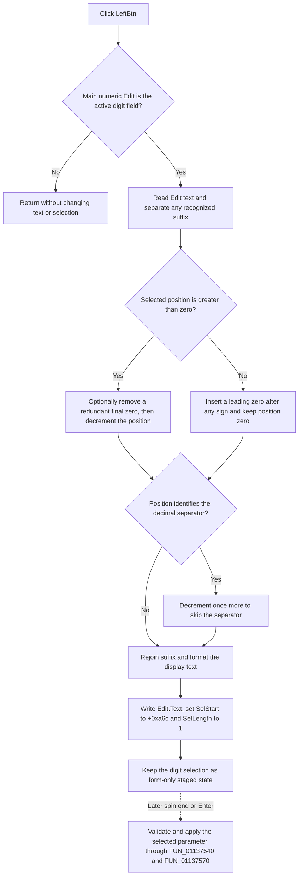

# Select the previous function-generator digit

> Analysis status: Complete. The recovered handler, edit-selection handlers, parameter selectors, paired Right handler, spin control, commit dispatcher, resource hint, and glyph establish this behavior.

## Control

| Property | Recovered value |
| --- | --- |
| Form | FuncGenWin |
| Component path | FuncGenWin.ParametersBox.LeftBtn |
| Control class | TSpeedButton |
| Caption | Not present in the recovered resource. |
| Hint | Selects the previous digit |
| Position and size | Left `12`, top `53`, width `57`, height `17` |
| Handler name | LeftBtnClick |
| Handler address | 0113bdc0 |
| Graph node | `resource:dfm:FuncGenWin/FuncGenWin.ParametersBox.LeftBtn` |
| Handler node | `function:0113bdc0` |
| Graph layer | UI |

## What the button selects

This button does not select a coordinate, change the current parameter, or scroll a view. It moves the one-character selection in `ParametersBox.Edit`, the main numeric editor for the parameter that is already selected.

The selected parameter is identified by form byte `+0xa0c`. The recovered parameter buttons set this byte as follows:

| Value | Parameter |
| --- | --- |
| 0 | Frequency |
| 1 | Amplitude |
| 2 | DC offset |
| 3 | Phase |
| 4 | Sweep start frequency |
| 5 | Sweep stop frequency |
| 6 | Sweep time |
| 7 | Number of sweep steps |

`FUN_0113bdc0` does not change this byte. Thus the Left button works on the current parameter only.

## Main-editor guard

The handler first tests form byte `+0xa70`. `EditMouseUp` sets this byte to `1` after it selects one character in the main numeric editor. `MultiplierEditMouseUp` sets it to `0` after it selects the separate multiplier editor. Therefore:

- if the main numeric editor is the active digit field, the handler continues; and
- if the multiplier editor is active, the click has no effect.

The handler does not change focus to the main editor and does not show an error for the no-op branch.

## Previous-digit movement

The form stores the zero-based selected-character position at `+0xa6c`. On the active branch, `FUN_0113bdc0` performs these operations:

1. It reads the current main-editor text.
2. It temporarily separates a recognized unit code or final non-digit suffix from the numeric part. This prevents the digit selector from treating the suffix as a digit.
3. If the stored position is greater than zero, it moves the position left by one. At the final numeric position, it first removes a redundant final `0` when that zero is not the only character and does not directly follow the decimal separator.
4. If the position is already zero, it inserts a leading `0` at the start of the numeric part, or immediately after an optional leading sign. It does not decrement the stored position below zero.
5. If the new position identifies the decimal separator, it decrements the position again. The decimal separator is never the selected edit digit.
6. It joins the preserved suffix to the numeric part. Number-of-steps mode writes the assembled integer text directly. The other parameter modes use the shared fixed numeric display formatter.
7. It writes the resulting text, sets the edit selection start to `+0xa6c`, and sets the selection length to one character.

The generic VCL text setter avoids a text-change notification when the formatted text is unchanged. The selection calls still apply the calculated position and one-character length.

## Relationship to the keyboard and Right button

`EditKeyUp` routes the Left Arrow key to `FUN_0113bdc0` when the free-text Edit mode is not active. It routes the Right Arrow key to the paired `FUN_0113c0e0`. This gives the hardware key and the speed button the same previous-digit behavior.

The Right handler uses the same text separation, formatting, and one-character selection pattern, but it advances the stored position and handles the right boundary. This article owns only the Left handler annotation.

## Staged state and later application

The Left click does not parse the numeric value, validate it with the function-generator backend, or update the runtime function-generator model. It only prepares the displayed text and selected digit for later editing.

The adjacent `EditSpBtn` changes the selected digit. Its `OnEndClick` handler calls the shared commit wrapper. Pressing Enter in the main editor calls the same wrapper. The later commit dispatcher then:

- parses the main text, multiplier text, and unit text;
- selects the frequency, amplitude, offset, phase, sweep-start, sweep-stop, sweep-time, or step-count validator from `+0xa0c`;
- writes the accepted value to the matching runtime model and backend only when validation succeeds; and
- uses the application error path when validation fails.

No file, registry, INI, or other cross-session store is written by the Left click or by its selection state. The selected position and any display-only zero insertion remain form-instance state.

## Bounds and errors

- Form creation initializes `+0xa6c` to zero. The parameter-display refresh and mouse-selection handlers keep it within the normal main-editor text and avoid the decimal separator.
- The Left handler supplies its own lower-bound behavior by inserting a leading zero instead of moving below zero.
- It has no matching skip rule for a leading sign. In signed text, moving left from the first numeric digit can leave the one-character selection on the sign at position zero. A further boundary click inserts the new zero after that sign.
- It assumes that the main editor contains the formatted numeric text produced by the form. It has no local malformed-text validation or independent upper-bound repair.
- It has no confirmation, application error message, exception handler, or rollback. Exceptions from the VCL text access, string processing, formatter, or selection methods propagate through the normal Delphi exception path.
- The click does not change button `Down`, `Enabled`, or glyph state.

## Click flow

## Source evidence

- Left click and previous-digit logic: [FUN_0113bdc0](../../../DecompiledSources/Tina16/functions/000000000113BDC0__FUN_0113bdc0.c)
- Paired next-digit handler: [FUN_0113c0e0](../../../DecompiledSources/Tina16/functions/000000000113C0E0__FUN_0113c0e0.c)
- Main-editor mouse selection: [FUN_0113da00](../../../DecompiledSources/Tina16/functions/000000000113DA00__FUN_0113da00.c)
- Multiplier-editor selection: [FUN_0113dbc0](../../../DecompiledSources/Tina16/functions/000000000113DBC0__FUN_0113dbc0.c)
- Main-editor keyboard routing: [FUN_0113dca0](../../../DecompiledSources/Tina16/functions/000000000113DCA0__FUN_0113dca0.c)
- Manual-edit and digit-mode toggle: [FUN_0113a060](../../../DecompiledSources/Tina16/functions/000000000113A060__FUN_0113a060.c)
- Spin-end commit route: [FUN_0113d790](../../../DecompiledSources/Tina16/functions/000000000113D790__FUN_0113d790.c)
- Commit wrapper: [FUN_01137540](../../../DecompiledSources/Tina16/functions/0000000001137540__FUN_01137540.c)
- Parameter validation and runtime-model dispatcher: [FUN_01137570](../../../DecompiledSources/Tina16/functions/0000000001137570__FUN_01137570.c)
- Unit or suffix separator: [FUN_010c0090](../../../DecompiledSources/Tina16/functions/00000000010C0090__FUN_010c0090.c)
- Fixed numeric display formatter: [FUN_010c15a0](../../../DecompiledSources/Tina16/functions/00000000010C15A0__FUN_010c15a0.c)
- Extracted left-arrow glyph: [`0213_FuncGenWin_FuncGenWin_ParametersBox_LeftBtn_Glyph_Data.png`](../../../glyph/0213_FuncGenWin_FuncGenWin_ParametersBox_LeftBtn_Glyph_Data.png)

## Resource and glyph evidence

- `LeftBtn` is a `TSpeedButton` under `ParametersBox`, below the main `Edit` control.
- Its hint says `Selects the previous digit`.
- Its 6 by 9 extracted bitmap contains a left-pointing triangle. The glyph and hint support the direction, while the handler and edit-selection calls prove the target and effect.
- The button has no caption, action, checked state, or nearby same-parent label.
- `EditSpBtn` has the hint `Increse/decrease digit` and recovered Up, Down, and End event handlers. This supports the separate roles of selecting a digit and changing its value.

## Annotation ownership

- This article annotates only `FUN_0113bdc0`.
- `TIARA-diz.6.7.561` owns the paired Right handler `FUN_0113c0e0`.
- `TIARA-diz.6.7.556` owns the Edit-mode handler and shared parameter commit wrapper and dispatcher.
- Shared numeric, VCL, spin, commit, and backend helpers remain evidence-only here or belong to their direct controls.
