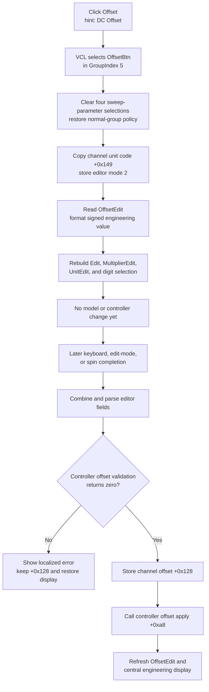

# Select DC-offset editing

> Analysis status: Complete. The recovered DFM group, Offset handler, shared parameter selector, numeric readout builder, later commit dispatcher, and channel/controller data flow establish the selection and apply boundaries.

## Control

| Property | Recovered value |
| --- | --- |
| Form | FuncGenWin (`Function Generator`) |
| Component path | FuncGenWin.ParametersBox.OffsetBtn |
| Control class | TSpeedButton |
| Caption | Offset |
| Hint | DC Offset |
| Group index | 5 |
| Handler name | OffsetBtnClick |
| Handler address | 0113b170 |
| Graph node | `resource:dfm:FuncGenWin/FuncGenWin.ParametersBox.OffsetBtn` |
| Handler node | `function:0113b170` |
| Graph layer | UI |

`OffsetBtn` has no glyph. Its caption, `DC Offset` hint, position beside the read-only `OffsetEdit`, handler mode, model field, and later controller call all agree that it selects the generator's DC-offset parameter.

## What happens when clicked

The click selects DC offset as the parameter controlled by the large numeric editor. It does not change the current offset or call the generator controller by itself.

`OffsetBtn`, the other three normal parameter buttons, and the four sweep-parameter buttons use `GroupIndex = 5`. The VCL speed-button path selects `OffsetBtn` before dispatching `OnClick`. `FUN_0113b170` then:

1. Calls `FUN_0113a6c0` to let the sweep subgroup have no selected item and clear Sweep Start, Stop, Time, and Num.
2. Clears `FreqBtn.AllowAllUp`, which restores the normal parameter subgroup's non-empty selection policy.
3. Copies the current generator channel's engineering-unit code from channel offset `+0x149` to editor state `+0xa78`.
4. Stores selector value `2` at form `+0xa0c`. The shared editor and commit dispatcher consistently use mode `2` for DC offset.
5. Calls `FUN_0113a9b0` to rebuild the central numeric editor.

For mode `2`, the readout builder reads `OffsetEdit` at form `+0x920`. That read-only display is synchronized from the current channel's offset double at `+0x128`. The builder applies the channel's engineering-unit code, prepares an explicit plus prefix for a nonnegative offset, and splits the formatted value across the central `Edit`, `MultiplierEdit`, and `UnitEdit` controls. It also clamps an out-of-range digit index and restores the active digit or unit selection.

The handler ignores `Sender`. Repeated Offset clicks repeat the group and display synchronization; they do not accumulate a numeric change.

## Editor staging and later commit

After selection, typed text is staged in the central numeric, multiplier, and unit controls. Offset changes occur when later input handlers call the shared dispatcher `FUN_01137570` through `FUN_01137540`. Proven triggers include ordinary central-edit key release, Enter, multiplier input, edit-mode exit, and spin completion.

For selected mode `2`, the dispatcher:

1. Combines the three editor fields and parses an engineering-scaled double using unit code `+0xa78`.
2. Calls the current function-generator controller's offset validator at virtual slot `+0xf0`.
3. If the validator returns zero, writes the double to current-channel field `+0x128`.
4. Calls the controller's offset apply method at virtual slot `+0xa8` with that accepted value.
5. Rebuilds `OffsetEdit` and the central engineering-value display from the accepted model value.

This is an immediate live-model commit. There is no OK button, modal copy-back step, or control-specific Cancel action. The controller call proves propagation beyond the form, but the recovered virtual call does not establish whether the active controller represents physical hardware, simulation, or another adapter.

## Validation and errors

If the offset validator returns nonzero, the dispatcher does not write channel field `+0x128` and does not call controller slot `+0xa8`. It formats the attempted value into localized error resource `0x132`, shows the error, and rebuilds the editor from the unchanged accepted model value.

The shared dispatcher also checks its update message and the controller busy state. An unmatched or busy-state message is forwarded to the inherited handler instead of entering this parameter-commit branch.

The Offset click itself has no invalid-input branch because it only selects and formats the already accepted value. It has no local null guard or exception handler for the current channel, controls, formatter, or controller. An unexpected missing object or raised formatting error propagates beyond the handler. The later commit dispatcher sets a controller-update guard on entry and clears it on normal completion; its recovered code has no local rollback for an exception between those operations.

## Click and later-edit flow

## State and persistence boundaries

- The click changes parameter-group selection, selector byte `+0xa0c`, engineering-unit byte `+0xa78`, the three central editor displays, and the active digit selection.
- It does not change channel offset `+0x128`, validate text, start or stop output, select a channel, alter amplitude/frequency/phase, or call the controller's offset apply method.
- A successful later commit updates the current channel record and immediately calls the controller. Selection of another channel can later reload that channel's `+0x128` value and controller state.
- Neither the click nor the shared numeric dispatcher opens a file or writes an INI, registry, or project setting. The channel record can be consumed by broader generator save/session code, but no durable persistence occurs in this control path.
- Repeated selection is not a strict no-op because it reformats the display and repairs the current digit index, even though the model value remains unchanged.

## Source evidence

- [Offset selector `FUN_0113b170`](../../../DecompiledSources/Tina16/functions/000000000113B170__FUN_0113b170.c) switches to normal parameter selection, copies channel unit state, stores mode `2`, and rebuilds the editor without a model write or controller call.
- [Normal-parameter group selector `FUN_0113a6c0`](../../../DecompiledSources/Tina16/functions/000000000113A6C0__FUN_0113a6c0.c) clears the four sweep-parameter Down states after enabling their all-up policy. Its canonical annotation is owned by `TIARA-diz.6.7.555`.
- [Numeric readout builder `FUN_0113a9b0`](../../../DecompiledSources/Tina16/functions/000000000113A9B0__FUN_0113a9b0.c) maps mode `2` to `OffsetEdit`, uses channel offset `+0x128` for sign state, formats the three editor controls, and restores digit selection. Its canonical annotation is owned by `TIARA-diz.6.7.555`.
- [Parameter commit wrapper `FUN_01137540`](../../../DecompiledSources/Tina16/functions/0000000001137540__FUN_01137540.c) is the common entry used by editor and spin events. Its canonical annotation is owned by `TIARA-diz.6.7.556`.
- [Parameter commit dispatcher `FUN_01137570`](../../../DecompiledSources/Tina16/functions/0000000001137570__FUN_01137570.c) proves mode-2 parsing, offset validation, accepted-only model write, controller application, localized error handling, and display restoration. Its canonical annotation is owned by `TIARA-diz.6.7.556`.
- [Channel readout synchronizer `FUN_0113a780`](../../../DecompiledSources/Tina16/functions/000000000113A780__FUN_0113a780.c) formats current channel field `+0x128` with unit code `+0x149` into `OffsetEdit`.
- [Central edit key-up handler `FUN_0113dca0`](../../../DecompiledSources/Tina16/functions/000000000113DCA0__FUN_0113dca0.c) dispatches ordinary numeric changes and preserves special digit-navigation keys.
- [Spin-end handler `FUN_0113d790`](../../../DecompiledSources/Tina16/functions/000000000113D790__FUN_0113d790.c) proves that spin completion enters the same commit path.
- [Channel/controller synchronizer `FUN_0113cec0`](../../../DecompiledSources/Tina16/functions/000000000113CEC0__FUN_0113cec0.c) iterates generator channels and passes each channel's offset field `+0x128` to controller slot `+0xc8`, confirming the record/controller relationship.
- [Recovered Delphi resource evidence](../../../DecompiledSources/Tina16/resources/dfm/ui-evidence.json) supplies the form caption, `Offset` caption, `DC Offset` hint, GroupIndex `5`, read-only `OffsetEdit`, shared editor controls, and `OnClick` binding.

## Analysis limits and ownership

- The original Delphi names for channel object `+0xa10`, controller object `+0xa18`, selector `+0xa0c`, unit code `+0xa78`, and channel fields `+0x128` and `+0x149` are not recovered.
- The controller validator's numeric limits are implemented behind a virtual method and are not recovered at this call site. The source proves accepted versus rejected behavior, not a universal voltage range.
- `TIARA-diz.6.7.559` owns only `FUN_0113b170`. Shared selector/readout functions remain canonical in `.555`, and shared commit functions remain canonical in `.556`.
