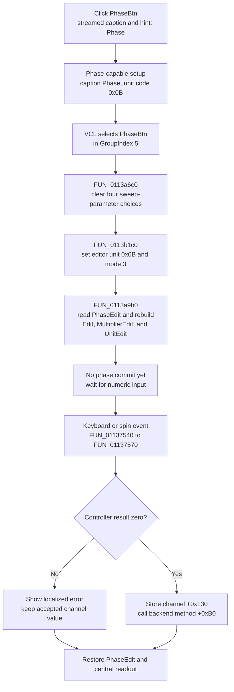

# Select phase-family parameter editing

> Analysis status: Complete. The DFM group, handler, runtime capability setup, shared readout builder, and later numeric commit path support this explanation.

## Control

| Property | Recovered value |
| --- | --- |
| Form | FuncGenWin |
| Component path | FuncGenWin.ParametersBox.PhaseBtn |
| Control class | TSpeedButton |
| Streamed caption | Phase |
| Streamed hint | Phase |
| Group index | 5 |
| Handler name | PhaseBtnClick |
| Handler address | 0113b1c0 |
| Graph node | `resource:dfm:FuncGenWin/FuncGenWin.ParametersBox.PhaseBtn` |
| Handler node | `function:0113b1c0` |
| Graph layer | UI |

`PhaseBtn` has no glyph. The DFM places it beside the read-only `PhaseEdit` field. The source confirms the parameter selection; the caption and position are supporting UI evidence only.

The streamed name and caption say Phase, but the same fourth parameter slot is capability-dependent. During form setup, `FUN_0113a180` obtains a controller capability mask. It enables this button for mask bit `0x08`, `0x10`, or `0x80` and labels it `Phase`, `Duty`, or `BiasB`, respectively. It stores engineering-unit code `0x0b`, `0x11`, or `1` in the current channel at `+0x14a`. If none of these capabilities is present, the setup clears the caption and does not enable this slot. The rest of this article describes the Phase state, for which bit `0x08` selects caption `Phase` and unit code `0x0b`.

## What happens when clicked

The button selects phase as the parameter controlled by the central numeric editor. It does not change, validate, or apply a phase value by itself.

`PhaseBtn`, the other three normal parameter buttons, and the four sweep-parameter buttons use `GroupIndex = 5`. The VCL speed-button action selects `PhaseBtn` in that group. `FUN_0113b1c0` then:

1. Calls shared normal-parameter selector `FUN_0113a6c0`. This allows the sweep subgroup to have no selected button and clears Sweep Start, Sweep Stop, Sweep Time, and Sweep Num.
2. Clears the recovered `AllowAllUp` state on `FreqBtn`. This restores the normal parameter group's non-empty selection policy.
3. Writes initial editor unit code `0x0b` at form offset `+0xa78`.
4. Writes parameter mode `3` at form offset `+0xa0c`.
5. Calls shared readout builder `FUN_0113a9b0`.

For mode `3`, the readout builder reads the compact text from `PhaseEdit` at form field `+0x930`. It replaces the initial unit code with the current channel's code at `+0x14a`, splits the compact value into the central `Edit`, `MultiplierEdit`, and `UnitEdit` controls, repairs an invalid selected-digit index, and restores the active digit or unit selection. In the Phase state, channel code `+0x14a` is `0x0b`.

The handler does not inspect `Sender`. A repeated click performs the same selection and readout rebuild. It does not accumulate a phase change.

## Later phase commit and backend update

The phase value changes only after the user changes the central editor with the keyboard, digit controls, or spin control. These paths call shared commit wrapper `FUN_01137540`, which dispatches to `FUN_01137570`. The Phase click does not call either function.

For mode `3`, the central dispatcher:

1. Combines the main value, multiplier, and unit text and converts it with editor unit code `+0xa78`.
2. Calls controller virtual method `+0xf8` to validate or accept the converted value.
3. If the result is zero, stores the accepted double in the current channel at `+0x130`.
4. Calls controller virtual method `+0xb0` with that accepted value. This is the recovered live backend update boundary.
5. Formats the accepted channel value into `PhaseEdit` and rebuilds the central editor and its selection.

If the controller result is nonzero, the dispatcher does not write channel field `+0x130` and does not call virtual method `+0xb0`. It formats localized error resource `0x132`, shows the error, and rebuilds the display from the previously accepted channel value.

The virtual calls prove validation and live backend propagation. They do not identify whether the active controller uses physical hardware, simulation, or another adapter.

## Click flow

## State, errors, and persistence

- The click changes the speed-button group state, editor mode `+0xa0c`, engineering-unit state `+0xa78`, central editor text, and the selected digit or unit.
- It does not change current-channel phase field `+0x130`, start or stop the generator, or call the controller's phase validator or apply method.
- The direct click has no expected invalid-input branch because it only selects and formats an accepted value. Validation errors occur only on a later editor commit.
- A successful later commit updates the in-memory current-channel field and calls the active controller immediately. It is not deferred to an OK button.
- Neither the click nor the later commit writes a file, registry value, project document, or settings record. The recovered path proves no durable persistence. A separate save or session path can consume the model later.
- The handler and readout builder have no local exception handler or null guard for required form, channel, and control fields. An unexpected object or formatting failure propagates beyond this path. A later commit also has no rollback for an exception after a partial external call.
- The control is text-only. No image reference or embedded glyph was recovered.

## Source evidence

- [Phase selector `FUN_0113b1c0`](../../../DecompiledSources/Tina16/functions/000000000113B1C0__FUN_0113b1c0.c) selects the normal group, sets unit code `0x0b` and mode `3`, and calls the readout builder without a channel-value store or backend call.
- [Normal-parameter selector `FUN_0113a6c0`](../../../DecompiledSources/Tina16/functions/000000000113A6C0__FUN_0113a6c0.c) clears all four sweep-parameter Down states.
- [Numeric readout builder `FUN_0113a9b0`](../../../DecompiledSources/Tina16/functions/000000000113A9B0__FUN_0113a9b0.c) maps mode `3` to `PhaseEdit`, current-channel field `+0x130`, and unit code `+0x14a`, then rebuilds the central editor.
- [Capability and parameter setup `FUN_0113a180`](../../../DecompiledSources/Tina16/functions/000000000113A180__FUN_0113a180.c) maps mask bit `0x08` to caption `Phase` and current-channel unit code `0x0b`; it also proves the Duty and BiasB alternatives.
- [Compact readout synchronizer `FUN_0113a780`](../../../DecompiledSources/Tina16/functions/000000000113A780__FUN_0113a780.c) formats channel field `+0x130` with unit code `+0x14a` into `PhaseEdit` when the fourth parameter is available.
- [Commit wrapper `FUN_01137540`](../../../DecompiledSources/Tina16/functions/0000000001137540__FUN_01137540.c) constructs the editor-update message used by later input events.
- [Central commit dispatcher `FUN_01137570`](../../../DecompiledSources/Tina16/functions/0000000001137570__FUN_01137570.c) parses mode `3`, calls controller methods `+0xf8` and `+0xb0`, conditionally stores channel field `+0x130`, reports a failure, and restores the readout.
- [Central edit key handler](../../../DecompiledSources/Tina16/functions/000000000113D910__FUN_0113d910.c) and [spin-end handler](../../../DecompiledSources/Tina16/functions/000000000113D790__FUN_0113d790.c) prove later routes to the shared commit wrapper.
- [Recovered Delphi resource evidence](../../../DecompiledSources/Tina16/resources/dfm/ui-evidence.json) supplies the streamed caption and hint, `GroupIndex = 5`, the read-only `PhaseEdit`, and the `OnClick` binding.

## Analysis limits and ownership

- The exact Delphi field names for the controller at `+0xa18`, current channel at `+0xa10`, editor mode at `+0xa0c`, and unit code at `+0xa78` are not recovered. The article uses only source-proven responsibilities.
- `.560` owns only Phase-specific handler `FUN_0113b1c0`.
- `.555` owns shared selector `FUN_0113a6c0` and shared readout builder `FUN_0113a9b0`. `.556` owns commit wrapper `FUN_01137540` and central dispatcher `FUN_01137570`. This article cites these functions as evidence and does not redefine their annotations.
- `FUN_0113a180` and `FUN_0113a780` are shared capability and readout helpers. They remain evidence-only here.
