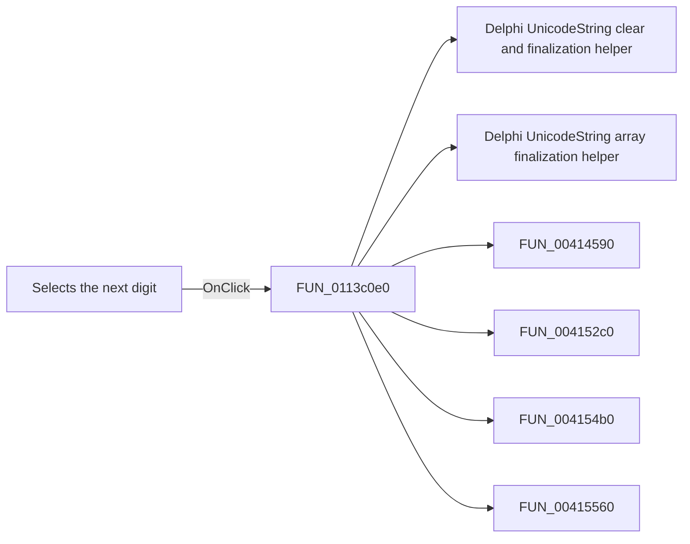

# Selects the next digit

> Analysis status: Pending individual source review.

## Control

| Property | Recovered value |
| --- | --- |
| Form | FuncGenWin |
| Component path | FuncGenWin.ParametersBox.RightBtn |
| Control class | TSpeedButton |
| Caption | Not present in the recovered resource. |
| Hint | Selects the next digit |
| Text | Not present in the recovered resource. |
| Handler name | RightBtnClick |
| Handler address | 0113c0e0 |
| Graph node | `resource:dfm:FuncGenWin/FuncGenWin.ParametersBox.RightBtn` |
| Handler node | `function:0113c0e0` |
| Graph layer | UI |

## What happens when clicked

Pending individual analysis. An agent must read the recovered handler source and its relevant callees before it replaces this text.

## Click flow

## Handler evidence

- Source: [DecompiledSources/Tina16/functions/000000000113C0E0__FUN_0113c0e0.c](../../../DecompiledSources/Tina16/functions/000000000113C0E0__FUN_0113c0e0.c)
- Recovered role: Not present in the recovered resource.
- Current graph summary: Handles 1 Delphi UI event: FuncGenWin.ParametersBox.RightBtn.OnClick.
- Current graph behavior: Not present in the recovered resource.
- Current graph evidence: Not present in the recovered resource.
- Complexity: complex
- Distinct outgoing calls: 16

## Direct calls

- `function:00414480` — Delphi UnicodeString clear and finalization helper
- `function:00414560` — Delphi UnicodeString array finalization helper
- `function:00414590` — FUN_00414590
- `function:004152c0` — FUN_004152c0
- `function:004154b0` — FUN_004154b0
- `function:00415560` — FUN_00415560
- `function:004155b0` — FUN_004155b0
- `function:00416780` — FUN_00416780
- `function:00416910` — FUN_00416910
- `function:004169a0` — FUN_004169a0
- `function:004170c0` — FUN_004170c0
- `function:0064dd90` — VCL control Unicode text reader
- `function:0064de00` — VCL control text setter with change suppression
- `function:010bfed0` — FUN_010bfed0
- `function:010c0090` — FUN_010c0090
- `function:010c15a0` — FUN_010c15a0

## Resource evidence

- Kind: Not present in the recovered resource.
- Modal result: Not present in the recovered resource.
- Checked state: Not present in the recovered resource.
- List items: Not present in the recovered resource.
- Image reference: Not present in the recovered resource.
- Extracted glyph: [`0214_FuncGenWin_FuncGenWin_ParametersBox_RightBtn_Glyph_Data.png`](../../../glyph/0214_FuncGenWin_FuncGenWin_ParametersBox_RightBtn_Glyph_Data.png)

## Nearby label candidates

Nearby labels are layout candidates only. They are not proof of behavior.

- No same-parent label candidate is available.

## Analysis limits

- Do not infer behavior from the control class, caption, hint, glyph, or nearby label alone.
- Do not replace the pending status until the handler source and relevant call path provide enough evidence.
