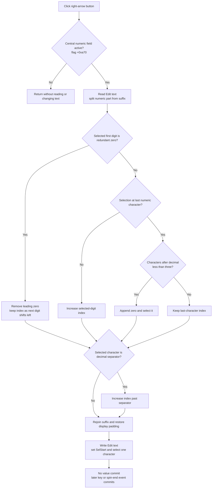

# Select the next numeric digit

> Analysis status: Complete. The DFM hint and glyph, handler body, numeric-text helpers, keyboard route, and later parameter commit path support this explanation.

## Control

| Property | Recovered value |
| --- | --- |
| Form | FuncGenWin |
| Component path | FuncGenWin.ParametersBox.RightBtn |
| Control class | TSpeedButton |
| Caption | Not present in the recovered resource. |
| Hint | Selects the next digit |
| Handler name | RightBtnClick |
| Handler address | 0113c0e0 |
| Graph node | `resource:dfm:FuncGenWin/FuncGenWin.ParametersBox.RightBtn` |
| Handler node | `function:0113c0e0` |
| Graph layer | UI |

The embedded 6 by 9 pixel glyph is a right-pointing arrow. The hint and the source agree that this button selects the next editable digit. The glyph alone does not establish the text rules described below.

## What happens when clicked

`FUN_0113c0e0` operates on the central numeric `Edit` control only while the form's numeric-field selection flag at `+0xa70` is set. `EditMouseUp` sets this flag, while `MultiplierEditMouseUp` clears it. If the flag is clear, the handler returns without reading or changing either edit.

On the active path, the handler reads the central edit text and separates its numeric part from the engineering multiplier or unit suffix. It uses the zero-based selected-digit index at `+0xa6c` and applies these rules:

1. If the index selects the first digit after an optional `+` or `-`, and that digit is `0` followed by a non-decimal character, it removes this redundant leading zero. The next digit shifts into the same selection index.
2. Otherwise, if another numeric character exists, it increases the index by one.
3. If the selected character is the locale decimal separator, it increases the index once more. The separator is never the final selection.
4. If the index was at the last numeric character, it can append one `0` and move onto it. The recovered guard compares the number of characters after the decimal separator with `+0xa74 - 1`. Form creation initializes `+0xa74` to `4`, so the normal limit is three characters after the separator. If that guard fails, a repeated click keeps the last character selected.

The handler then rejoins the numeric text and its suffix. Parameter modes other than selector `7` pass the numeric text through `FUN_010c15a0(..., 9, 4, ...)`, which restores the fixed-width decimal display and zero fill. Selector `7`, used by the sweep step count, bypasses that padding. Finally, the handler writes the rebuilt text, sets `Edit.SelStart` to the updated index, and sets `Edit.SelLength` to one. It does not move focus to another control.

## Value, backend, and persistence boundary

This click does not parse the displayed number, call a parameter validator, change a function-generator channel field, or call the generator backend. A text rewrite can remove a display-only leading zero or add a display-only trailing zero, but the represented number stays the same.

The central edit's later input handlers own the commit boundary:

- Enter in `EditKeyPress` calls `FUN_01137540(form, 1)`.
- A non-arrow key handled by `EditKeyUp` calls the same wrapper after the key operation.
- The spin control's end event calls the wrapper with its recovered direction state.

`FUN_01137540` dispatches to `FUN_01137570`. That central routine parses the numeric, multiplier, and unit edits for the active parameter selector. It calls the matching controller validation method and, on success, updates the selected channel or sweep field and calls the matching controller apply method. A normal validation failure keeps the accepted value, shows a localized error, and rebuilds the edit text from that value. None of these commit operations occurs in `RightBtnClick` itself.

Neither the click nor the later central commit routine writes a file, registry value, INI value, or project serializer. The recovered path proves only UI changes on the click and in-memory controller or model changes after a successful later commit.

## No-op and failure boundaries

- If the numeric-field selection flag at `+0xa70` is clear, the handler is a no-op.
- At the last digit, when the fractional-extension guard fails, repeated clicks keep that digit selected. The handler can still normalize and rewrite the same display text.
- The handler does not validate malformed text. It assumes the central editor has the numeric format that the shared FuncGen formatter produces.
- The source has no local exception handler or rollback. An exception after the index changes but before the final VCL selection calls can leave the form's selected-digit index and the visible edit selection out of sync. An exception after the text setter can leave rebuilt text with the previous selection.
- A later validation error belongs to `FUN_01137570`; it is not an error result from this click.

## Click flow

## Source evidence

- [Right-button handler `FUN_0113c0e0`](../../../DecompiledSources/Tina16/functions/000000000113C0E0__FUN_0113c0e0.c) tests `+0xa70`, reads and splits the edit text, changes index `+0xa6c`, handles the decimal separator and extension bound, rebuilds the text, and selects one character.
- [Leading-zero normalizer `FUN_010bfed0`](../../../DecompiledSources/Tina16/functions/00000000010BFED0__FUN_010bfed0.c) removes one leading zero after an optional sign only when another non-decimal character follows.
- [Numeric and suffix splitter `FUN_010c0090`](../../../DecompiledSources/Tina16/functions/00000000010C0090__FUN_010c0090.c) removes the engineering/unit portion from the short numeric string and returns it separately for later rejoining.
- [Numeric display padder `FUN_010c15a0`](../../../DecompiledSources/Tina16/functions/00000000010C15A0__FUN_010c15a0.c) adds the decimal separator when needed and zero-fills the short display under the recovered `(9, 4)` bounds.
- [Form creation `FUN_01139c70`](../../../DecompiledSources/Tina16/functions/0000000001139C70__FUN_01139c70.c) initializes selected index `+0xa6c` to zero and the recovered extension field `+0xa74` to four.
- [Edit mouse-up handler `FUN_0113da00`](../../../DecompiledSources/Tina16/functions/000000000113DA00__FUN_0113da00.c) marks the numeric edit active, clamps the selection index to its text, skips the decimal separator, and selects one character.
- [Multiplier mouse-up handler `FUN_0113dbc0`](../../../DecompiledSources/Tina16/functions/000000000113DBC0__FUN_0113dbc0.c) activates the multiplier edit and clears the numeric-field selection flag.
- [Edit key-up handler `FUN_0113dca0`](../../../DecompiledSources/Tina16/functions/000000000113DCA0__FUN_0113dca0.c) routes virtual-key `0x27` to this same handler and routes later non-arrow input to the central commit wrapper.
- [Commit wrapper `FUN_01137540`](../../../DecompiledSources/Tina16/functions/0000000001137540__FUN_01137540.c) dispatches the recovered editor-update message to [central parser and commit routine `FUN_01137570`](../../../DecompiledSources/Tina16/functions/0000000001137570__FUN_01137570.c).
- [Recovered Delphi resource evidence](../../../DecompiledSources/Tina16/resources/dfm/ui-evidence.json) binds `RightBtn.OnClick` to `RightBtnClick` at `0113c0e0` and supplies the hint and embedded glyph metadata.

## Resource evidence

- Hint: `Selects the next digit`.
- Extracted glyph: [`0214_FuncGenWin_FuncGenWin_ParametersBox_RightBtn_Glyph_Data.png`](../../../glyph/0214_FuncGenWin_FuncGenWin_ParametersBox_RightBtn_Glyph_Data.png), a 6 by 9 pixel right arrow recovered from Delphi BMP data.
- The control has no recovered caption, action, modal result, checked state, or image-list reference.
- The sibling Left button has the opposite hint and glyph. Its handler implements the separate previous-digit rules; those rules are not inferred for this control.

## Analysis limits and ownership

- `FUN_0113c0e0` is the only function annotated by this control analysis.
- `FUN_010bfed0`, numeric formatting helpers, VCL text helpers, and central commit functions are evidence only. They remain unowned here because they are shared or broad infrastructure.
- The source identifies the selector numbers and controller virtual-call boundaries. It does not identify whether a later successful apply call reaches physical hardware, simulation, or another adapter in a specific installation.
- The exact Delphi field names for `+0xa6c`, `+0xa70`, `+0xa74`, `+0xa78`, and `+0xa0c` are not recovered. This article uses their source-proven responsibilities.
