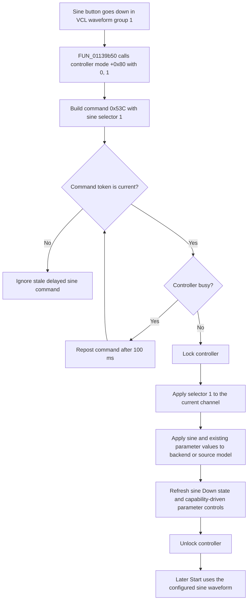

# Select a sine waveform

> Analysis status: Complete source review.

## Control

| Property | Recovered value |
| --- | --- |
| Form | FuncGenWin |
| Component path | FuncGenWin.WaveformBox.SinusBtn |
| Control class | TSpeedButton |
| Caption | Not present in the recovered resource. |
| Hint | Sinusodial |
| Text | Not present in the recovered resource. |
| Handler name | SinusBtnClick |
| Handler address | 01139b50 |
| Graph node | `resource:dfm:FuncGenWin/FuncGenWin.WaveformBox.SinusBtn` |
| Handler node | `function:01139b50` |
| Graph layer | UI |

## What happens when clicked

The click selects a sine waveform for the current Function Generator channel.
The DFM puts Sine, Triangle, Square, DC, and ARB in `TSpeedButton` group 1.
VCL therefore puts the Sine button down before it calls the handler and keeps
one waveform button selected.

`FUN_01139b50` does not use `Sender`. It first calls controller virtual method
`+0x80` with arguments `(0, 1)`. A recovered implementation stores mode 0 and
calls the optional Function Generator module export `SetFGMode(0, 1)`. The
handler then builds command `0x53C` with waveform selector 1 and gives it to
the shared waveform dispatcher.

The dispatcher validates the command sequence and tests whether the controller
is busy. When the controller is available, it locks the controller and applies
selector 1 through virtual method `+0x118`. Recovered controller
implementations store the selector in the current channel record at offset
`+0x110`. They mark controller state as changed when the previous selector was
different. They also call the optional `SetFGWaveform(1)` module export and
apply the current amplitude, frequency, phase, and offset values to the
recovered device or source model. The selector therefore changes the waveform
for the active channel. It does not select another channel and does not change
those four parameter values.

## Parameter controls and Start

After an accepted selector command, the shared refresh path reads the current
channel again. It puts the Sine button down for selector 1 and queries the
controller's capability bits for that waveform. The capability bits control
whether Frequency, Amplitude, Offset or Bias A, and Phase, Duty, or Bias B are
enabled. The refresh also repairs the selected parameter when the previous
parameter is not available. A non-DC waveform can enable **Sweep On** when the
controller supports that option. The source does not prove one fixed set of
parameter capabilities for every sine-capable backend.

This click does not start or stop output. It does not change the current
channel's active byte. If output is stopped, the later **Start** command uses
the stored sine selector and current parameter values. If output is already
active, the recovered controller setter can apply the new selector at once.
The separate Start path owns output activation, backend start, and sweep
initialization.

## Retry, repeated click, and failure behavior

- A busy controller causes the shared dispatcher to repost command `0x53C`
  after 100 ms. It does not show an error. The initial mode call occurs before
  this busy test, so mode 0 can be set before the selector is applied.
- A newer waveform command invalidates an older delayed command. The older
  command then fails the sequence test and does no work. This prevents a late
  sine retry from replacing a newer waveform choice.
- A repeated direct Sine click is not a local no-op. It repeats the mode call
  and sends a new selector command. A recovered controller can apply selector
  1 again, but it does not set its changed flag when the stored selector is
  already 1. The deeper UI refresh can therefore be skipped.
- Selector 1 never enters the ARB-only editor branch in the shared dispatcher.
  The click opens no dialog and needs no confirmation.
- The recovered handler and dispatcher have no local exception handler or
  rollback. The dispatcher locks the controller before it applies the selector
  and unlocks it after the UI refresh. A failure can leave partial controller,
  backend, or button state, and can leave the controller locked.
- The click changes live Function Generator session state only. It does not
  write a file, registry value, INI value, project-modified flag, or other
  persistent setting in the recovered path.

## Click flow

## Handler and call-path evidence

- Handler: [FUN_01139b50](../../../DecompiledSources/Tina16/functions/0000000001139B50__FUN_01139b50.c)
- Shared waveform dispatcher: [FUN_011399d0](../../../DecompiledSources/Tina16/functions/00000000011399D0__FUN_011399d0.c)
- Command sequence gate: [FUN_00f83630](../../../DecompiledSources/Tina16/functions/0000000000F83630__FUN_00f83630.c)
- Delayed repost helper: [FUN_00f83670](../../../DecompiledSources/Tina16/functions/0000000000F83670__FUN_00f83670.c)
- Recovered mode setter: [FUN_0110c6c0](../../../DecompiledSources/Tina16/functions/000000000110C6C0__FUN_0110c6c0.c)
- Optional mode export resolver: [FUN_00e184b0](../../../DecompiledSources/Tina16/functions/0000000000E184B0__FUN_00e184b0.c)
- Recovered waveform setter: [FUN_0110cef0](../../../DecompiledSources/Tina16/functions/000000000110CEF0__FUN_0110cef0.c)
- Alternate waveform setter: [FUN_0110eab0](../../../DecompiledSources/Tina16/functions/000000000110EAB0__FUN_0110eab0.c)
- Optional waveform export resolver: [FUN_00e191e0](../../../DecompiledSources/Tina16/functions/0000000000E191E0__FUN_00e191e0.c)
- Device or source model apply path: [FUN_01539230](../../../DecompiledSources/Tina16/functions/0000000001539230__FUN_01539230.c)
- Channel and UI refresh: [FUN_0113cec0](../../../DecompiledSources/Tina16/functions/000000000113CEC0__FUN_0113cec0.c)
- Capability renderer: [FUN_0113a180](../../../DecompiledSources/Tina16/functions/000000000113A180__FUN_0113a180.c)
- Start handler: [FUN_011393b0](../../../DecompiledSources/Tina16/functions/00000000011393B0__FUN_011393b0.c)

`FUN_01139b50` sets message code `0x53C`, leaves its token field at zero, puts
selector 1 in the field at `+0x10`, calls controller slot `+0x80`, and calls
the shared dispatcher. The graph records one direct static call from this
simple UI handler to `FUN_011399d0`. Virtual dispatch explains why the
controller and backend implementations are not direct static edges from the
handler.

## Resource evidence

- The DFM hint is **Sinusodial**, including the original spelling.
- The extracted 30 by 30 pixel glyph shows a black sine curve on a white
  background: [`0211_FuncGenWin_FuncGenWin_WaveformBox_SinusBtn_Glyph_Data.png`](../../../glyph/0211_FuncGenWin_FuncGenWin_WaveformBox_SinusBtn_Glyph_Data.png).
- `GroupIndex = 1` matches the Triangle, Square, DC, and ARB waveform buttons.
- The glyph and hint identify the intended shape. Selector 1 in the handler,
  selector-to-button mapping in the refresh path, and the controller setter
  prove the actual sine-waveform behavior.
- No caption, modal result, list item, action, image-list reference, or nearby
  same-parent label is present.

## Analysis limits and annotation ownership

- Recovered class and field names are unavailable. This article uses offsets
  only where the call sites and repeated controller implementations agree.
- The controller calls are virtual. The matching implementations prove the
  recovered mode, channel, and waveform contracts, but the static source does
  not identify which implementation is active for every Function Generator
  backend.
- The optional module exports can be absent. Their resolvers call the export
  only when the Function Generator module and symbol are available.
- `TIARA-diz.6.7.569` owns the shared waveform dispatcher `FUN_011399d0`, the
  channel refresh `FUN_0113cec0`, and the capability renderer `FUN_0113a180`.
  This control owns only the sine-specific handler `FUN_01139b50`.
