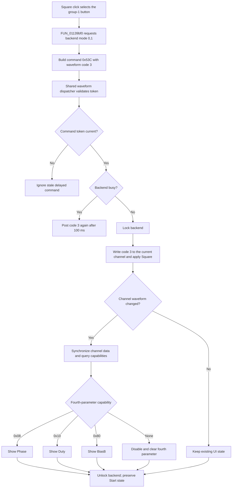

# Square

> Analysis status: Complete source review.

## Control

| Property | Recovered value |
| --- | --- |
| Form | FuncGenWin |
| Component path | FuncGenWin.WaveformBox.SquareBtn |
| Control class | TSpeedButton |
| Caption | Not present in the recovered resource. |
| Hint | Square |
| Text | Not present in the recovered resource. |
| Handler name | SquareBtnClick |
| Handler address | 01139bf0 |
| Graph node | `resource:dfm:FuncGenWin/FuncGenWin.WaveformBox.SquareBtn` |
| Handler node | `function:01139bf0` |
| Graph layer | UI |

## What happens when clicked

The click selects square waveform code `3` for the current Function Generator
channel. `SquareBtn` is in VCL speed-button group 1 with Sinus, Triangle, DC,
and ARB. VCL selects Square before it calls `SquareBtnClick`.

The handler does two operations:

1. It calls backend virtual method `+0x80` with `(0, 1)`. One recovered backend
   stores mode byte `0`. The other resolves and calls the external
   `SetFGMode(0, 1)` function.
2. It builds command `0x53C` with waveform value `3` and calls the shared
   waveform dispatcher.

The shared dispatcher validates the command token and checks the backend busy
state. A busy backend causes the same command to be posted again after 100 ms.
When the backend is available, the dispatcher locks it and applies waveform
code `3` through virtual method `+0x118`. The recovered implementations update
waveform byte `+0x110` in the current channel record. One implementation also
calls external `SetFGWaveform(3)`. Another reconfigures the attached source with
the waveform, amplitude, frequency, fourth-parameter, and offset values.

The handler does not change `ChannelBox`. The backend uses its current channel
index. The shared synchronizer then aligns that index with the selected
`ChannelBox` item. If the waveform changed, it copies updated channel data back
to the channel records and refreshes the waveform and parameter controls.

## Duty, phase, and parameter availability

Square does not directly enable a fixed Duty control. The shared refresh asks
the selected backend for a capability mask for waveform code `3`. It then uses
the mask to configure the fourth parameter selector, whose DFM name is
`PhaseBtn`, and its `PhaseEdit` value:

- Mask bit `0x08` enables the control as **Phase** and sets unit code `0x0B`.
- Otherwise, mask bit `0x10` enables it as **Duty** and sets unit code `0x11`.
- Otherwise, mask bit `0x80` enables it as **BiasB** and sets unit code `1`.
- If none of these bits is present, the selector is disabled and the related
  edit is cleared.

The backend supplies this mask. For one controller type, the code calls the
external `GetFGParams(3)` function. Other attached-source types calculate the
mask from source capabilities. Square can therefore show Duty, Phase, BiasB,
or no fourth parameter. The recovered source does not prove one result for all
controller types.

## Interaction with Start and sweep

Waveform selection does not call Stop or Start. If output is inactive, the new
waveform stays in the current channel record until Start uses that record. If
output is active, the dispatcher still applies code `3` to the backend and
keeps active byte `+0x148` unchanged. The UI refresh keeps `FStartBtn` selected
while that byte is set. This is a live waveform change, not an output restart.

Square is a non-DC waveform. During a non-DC sweep, the Start path disables DC
but leaves Square available. During a DC sweep, it disables Square with the
other non-DC waveform buttons, so a normal user click cannot reach this handler.
The handler itself does not test `Enabled` or sweep state.

## No-op, retry, and failure behavior

- The handler has no equality guard. A repeated Square click requests backend
  mode `(0, 1)` and waveform `3` again. The backend does not mark the channel
  record dirty when its waveform byte already equals `3`, so the full UI refresh
  can be skipped. The external/backend calls can still run.
- A stale delayed waveform command is ignored by the shared token gate. A busy
  backend delays waveform application by 100 ms. The initial mode request occurs
  before this busy check.
- If the optional external Function Generator module or one of its exports is
  unavailable, its recovered wrappers return without an error dialog. The
  channel-record update can still occur through the controller path.
- The handler and dispatcher have no local exception handler or rollback. An
  exception after the backend lock or a partial external call can leave a lock
  or a partly updated live state.
- The click does not write a file, registry value, project-modified flag, or
  persistent setting. It updates the live controller and current channel record.

## Click flow

## Handler evidence

- Handler: [FUN_01139bf0](../../../DecompiledSources/Tina16/functions/0000000001139BF0__FUN_01139bf0.c)
- Shared waveform dispatcher: [FUN_011399d0](../../../DecompiledSources/Tina16/functions/00000000011399D0__FUN_011399d0.c)
- Channel synchronizer: [FUN_0113cec0](../../../DecompiledSources/Tina16/functions/000000000113CEC0__FUN_0113cec0.c)
- Capability renderer: [FUN_0113a180](../../../DecompiledSources/Tina16/functions/000000000113A180__FUN_0113a180.c)
- External mode wrapper: [FUN_00e184b0](../../../DecompiledSources/Tina16/functions/0000000000E184B0__FUN_00e184b0.c)
- External waveform wrapper: [FUN_00e191e0](../../../DecompiledSources/Tina16/functions/0000000000E191E0__FUN_00e191e0.c)
- Current-channel waveform setters: [FUN_0110eab0](../../../DecompiledSources/Tina16/functions/000000000110EAB0__FUN_0110eab0.c) and [FUN_0110cef0](../../../DecompiledSources/Tina16/functions/000000000110CEF0__FUN_0110cef0.c)
- Attached-source configuration: [FUN_01539230](../../../DecompiledSources/Tina16/functions/0000000001539230__FUN_01539230.c)
- Start coordinator: [FUN_011393f0](../../../DecompiledSources/Tina16/functions/00000000011393F0__FUN_011393f0.c)
- Resource evidence: [ui-evidence.json](../../../DecompiledSources/Tina16/resources/dfm/ui-evidence.json)
- `FUN_01139bf0` is simple. Its only recovered direct call edge is to
  `FUN_011399d0`; the backend mode request is an indirect virtual call.

## Resource and glyph evidence

- The DFM supplies hint **Square** and `GroupIndex = 1`.
- The extracted 30-by-30 glyph shows a two-level square waveform:
  [Square glyph](../../../glyph/0212_FuncGenWin_FuncGenWin_WaveformBox_SquareBtn_Glyph_Data.png).
- The control has no caption, modal result, list items, action, or image-list
  reference.

## Analysis limits

- The DLL wrappers prove the external names `SetFGMode`, `SetFGWaveform`, and
  `GetFGParams`. The source does not identify the hardware protocol behind the
  attached-source path.
- Capability masks depend on the selected backend and source. The Square hint
  and glyph prove control intent, but they do not prove that Duty is available
  on every controller.
- The 100 ms retry is an application scheduler operation. The source does not
  prove that Square directly calls a Win32 timer API.
