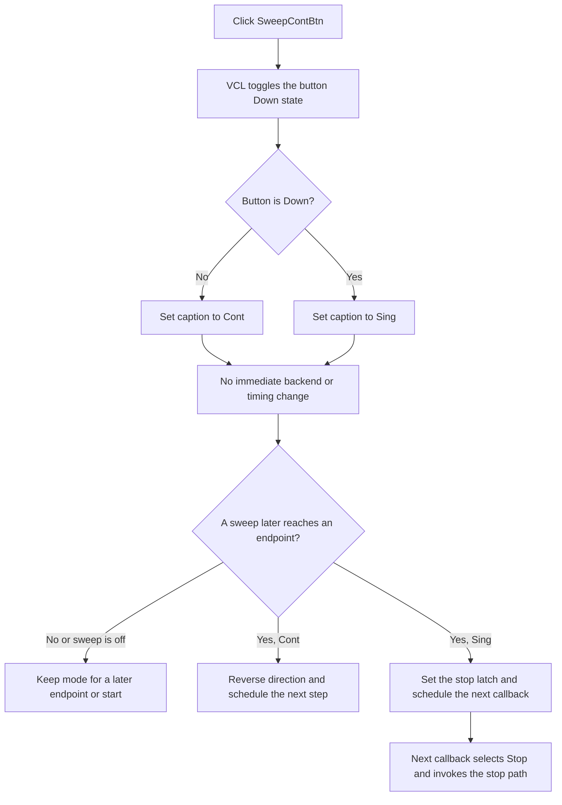

# Select continuous or single frequency-sweep completion

> Analysis status: Source-reviewed. The VCL speed-button toggle, shared sweep-state accessors, Function Generator Start and Stop paths, and timed sweep callback establish the behavior below.

## Control

| Property | Recovered value |
| --- | --- |
| Form | FuncGenWin |
| Component path | FuncGenWin.ParametersBox.SweepBox.SweepContBtn |
| Control class | TSpeedButton |
| Initial caption | Cont |
| Hint | Continous or single sweep |
| AllowAllUp | true |
| GroupIndex | 7 |
| Handler name | SweepContBtnClick |
| Handler address | 0113c4e0 |
| Graph node | `resource:dfm:FuncGenWin/FuncGenWin.ParametersBox.SweepBox.SweepContBtn` |
| Handler node | `function:0113c4e0` |
| Graph layer | UI |

The spelling **Continous** is the recovered resource text. It is not corrected
in the evidence table.

## What happens when clicked

`SweepContBtn` is an independent two-state speed button. VCL changes its
`Down` state before it dispatches `SweepContBtnClick`. The handler then mirrors
that state in the caption:

- `Down = false` gives caption **Cont** and means continuous sweep.
- `Down = true` gives caption **Sing** and means single sweep.

The initial DFM caption is **Cont**, and the shared sweep-state getter also
defines continuous mode as `Down = false`. From that released state, a click
puts the button down and changes **Cont** to **Sing**. The next click releases
it and changes **Sing** back to **Cont**. Programmatic initialization can set a
different state before the user clicks.

The handler itself does not toggle `Down`. A programmatic call only refreshes
the caption from the current state. The shared sweep-state applicator uses this
property: it sets `Down` from the inverse of its continuous Boolean and then
calls `FUN_0113c4e0` to restore the matching caption.

## Group and sibling-button state

This button has `GroupIndex = 7` and is the only group-7 button under
`SweepBox`. `AllowAllUp = true` lets that one-member group alternate between
down and released states.

The sibling mode and parameter controls use other groups:

- `SweepOnBtn` uses group 6 and enables or disables sweep operation.
- `SweepLinBtn` uses group 8 and selects linear or logarithmic interpolation.
- `SweepStartBtn`, `SweepStopBtn`, `SweepTimeBtn`, and `SweepNumBtn` use group 5
  to select which numeric sweep parameter is edited.

Changing continuous mode does not press or release those controls. In
particular, the Sweep **Start** and **Stop** buttons select the start-frequency
and stop-frequency fields. They do not start or stop generation. The separate
`ControlBox.FStartBtn` and `ControlBox.FStopBtn` controls run and stop the
Function Generator.

## Runtime sweep behavior

The button's `Down` state is the live continuous/single source of truth. The
click makes no immediate model, device, or backend call. The timed sweep
callback reads the button when the current sweep reaches an endpoint:

- In **Cont** state, the callback reverses its direction latch and schedules
  the next update. The sweep continues between the configured start and stop
  frequencies until the Function Generator is stopped.
- In **Sing** state, the callback sets the stop latch at the endpoint and still
  schedules the next update. On that next callback, it selects the Function
  Generator Stop button and invokes the common stop path.

The next endpoint decision uses the current button state. A click during an
active sweep therefore takes effect when the sweep next reaches an endpoint.
It does not reset the current frequency, step index, direction, or elapsed
interval when clicked.

Continuous/single state has no effect while `SweepOnBtn` is released. Starting
the Function Generator in that state uses the non-sweep output path. The button
still records the requested mode for the next sweep-enabled start.

## Start, Stop, and timing

When sweep operation is on, Function Generator Start initializes the current
frequency from the configured start value and initializes the forward
direction. It replaces a step count below one with two; this start path does
not change a count of one. It schedules message `0x52C` with this interval:

`max(round(sweep time * 1000 / step count), 1) milliseconds`

Each sweep callback calculates the next linear or logarithmic frequency,
applies it through the active output provider, advances the step index or
handles an endpoint, and posts the next message with the same interval.

Clicking `SweepContBtn` does not recalculate that interval or validate the start
frequency, stop frequency, sweep time, or number of steps. The separate
Function Generator Stop path cancels message `0x52C`, clears the running state,
and stops output independently of continuous or single selection.

## Click and endpoint flow

## Validation, no-op, and error paths

- The handler has no validation, running-state guard, confirmation, hardware
  probe, or error message. It reads one VCL state byte and sets one caption.
- Calling the handler without first changing `Down` only reconciles the caption
  with the existing mode. The VCL text setter suppresses a redundant text
  change when the caption already matches.
- VCL changes `Down` before the OnClick handler. If caption allocation or the
  text setter raises, the mode can be changed while the old caption remains.
- The timed callback reads the live state only at an endpoint. Stopping before
  that endpoint prevents the new choice from affecting the current run.
- The handler has no local catch or rollback. Invalid form or control pointers,
  VCL state, and caption-setter exceptions propagate through the Delphi
  runtime.

## Propagation and persistence boundary

The `.565`-owned shared getters return continuous mode as
`SweepContBtn.Down = false`. Their paired applicator accepts the Boolean, sets
`Down` to its inverse, and calls this handler to update **Cont** or **Sing**.
This is how measurement and adapter callers can copy or restore the sweep
configuration together with start frequency, stop frequency, sweep time,
step count, linear/logarithmic mode, and sweep-on state.

The click itself writes no separate source-model field, file, registry value,
INI value, or application setting. Recovered adapter functions expose the mode
through the shared getter and applicator, but their call path does not establish
which caller, if any, writes it to durable storage. The only proven immediate
state is the live speed-button `Down` value and its caption.

## Evidence

- [Continuous-mode handler `FUN_0113c4e0`](../../../DecompiledSources/Tina16/functions/000000000113C4E0__FUN_0113c4e0.c) maps released state to **Cont** and down state to **Sing**.
- [VCL speed-button mouse path `FUN_0082a320`](../../../DecompiledSources/Tina16/functions/000000000082A320__FUN_0082a320.c) changes the `Down` state before dispatching the click event.
- [VCL Down-state setter `FUN_0082a6c0`](../../../DecompiledSources/Tina16/functions/000000000082A6C0__FUN_0082a6c0.c) updates the button state and group notification used by programmatic initialization.
- [Shared live sweep getter `FUN_01138d40`](../../../DecompiledSources/Tina16/functions/0000000001138D40__FUN_01138d40.c) returns continuous as `SweepContBtn.Down = false`; [the stored-value variant `FUN_01138dc0`](../../../DecompiledSources/Tina16/functions/0000000001138DC0__FUN_01138dc0.c) uses the same mode mapping.
- [Shared sweep applicator `FUN_01138e40`](../../../DecompiledSources/Tina16/functions/0000000001138E40__FUN_01138e40.c) sets `Down` to the inverse Boolean and calls this caption handler. Bead `.565` owns this function and both shared getters.
- [Function Generator Start coordinator `FUN_011393f0`](../../../DecompiledSources/Tina16/functions/00000000011393F0__FUN_011393f0.c) initializes the sweep and posts the first timed message with the clamped interval.
- [Timed sweep callback `FUN_01138520`](../../../DecompiledSources/Tina16/functions/0000000001138520__FUN_01138520.c) calculates each frequency, reads `SweepContBtn.Down` at an endpoint, reverses for continuous mode, or sets the single-sweep stop latch.
- [Function Generator Stop handler `FUN_01139900`](../../../DecompiledSources/Tina16/functions/0000000001139900__FUN_01139900.c) enters [the stop implementation `FUN_01139800`](../../../DecompiledSources/Tina16/functions/0000000001139800__FUN_01139800.c), which cancels the scheduled sweep message and restores stopped UI state.
- [Sweep Start selector `FUN_0113b200`](../../../DecompiledSources/Tina16/functions/000000000113B200__FUN_0113b200.c) and [Sweep Stop selector `FUN_0113b260`](../../../DecompiledSources/Tina16/functions/000000000113B260__FUN_0113b260.c) select numeric parameters and confirm that they are separate from generator execution.
- [Recovered component tree](../../../DecompiledSources/Tina16/resources/dfm/ui-evidence.json) supplies the caption, hint, independent group index, `AllowAllUp`, sibling groups, and event binding.

## Resource evidence and analysis limits

- The control has no recovered glyph, image-list reference, action, built-in
  modal result, default state, or cancel state.
- There is no same-parent label candidate. The hint supports the mode meaning;
  the Down-state mappings and timed endpoint consumer prove the behavior.
- This article owns only unique handler `FUN_0113c4e0`. Shared sweep getters
  `FUN_01138d40` and `FUN_01138dc0` and applicator `FUN_01138e40` are cited and
  omitted under `.565` coordination. Generic VCL helpers and the Start, Stop,
  and timed-sweep functions remain evidence-only.
- The source does not prove a durable settings owner for this state. This
  article does not infer one from the presence of adapter getter/setter methods.
