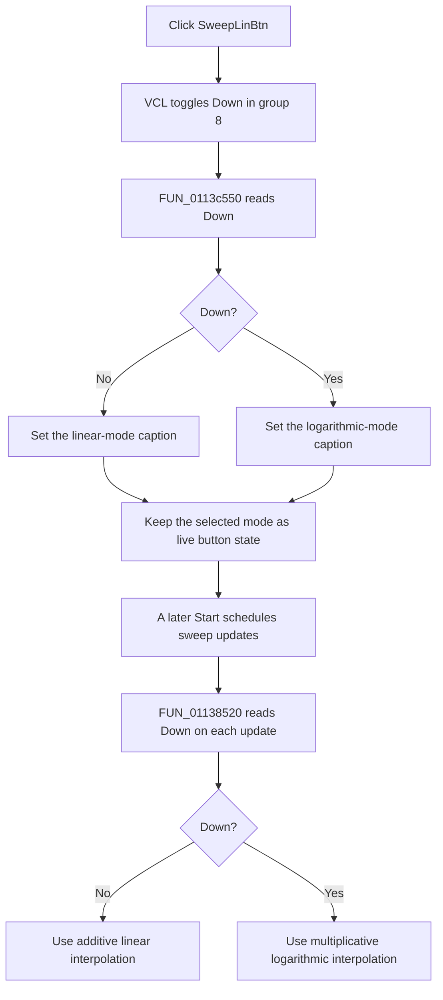

# Lin

> Analysis status: Complete source review.

## Control

| Property | Recovered value |
| --- | --- |
| Form | FuncGenWin |
| Component path | FuncGenWin.ParametersBox.SweepBox.SweepLinBtn |
| Control class | TSpeedButton |
| Caption | Lin |
| Hint | Liner or logarithmic sweep |
| Text | Not present in the recovered resource. |
| Handler name | SweepLinBtnClick |
| Handler address | 0113c550 |
| Graph node | `resource:dfm:FuncGenWin/FuncGenWin.ParametersBox.SweepBox.SweepLinBtn` |
| Handler node | `function:0113c550` |
| Graph layer | UI |

## What happens when clicked

This speed button selects the interpolation formula for a Function Generator
sweep. The DFM sets `AllowAllUp = true` and `GroupIndex = 8`. No other
recovered control in this group exists. VCL therefore toggles the button's
`Down` state before it calls `FUN_0113c550`.

The state mapping is inverted:

| `SweepLinBtn.Down` | Selected sweep mode | Update formula |
| --- | --- | --- |
| `false` | Linear | `start + index * (stop - start) / stepCount` |
| `true` | Logarithmic | `start * exp(ln(stop / start) * index / stepCount)` |

The DFM starts with `Down = false` and caption **Lin**. The click handler reads
the current `Down` byte and assigns the matching mode caption through the VCL
control-text setter. It does not use `Sender`. It does not copy sweep values,
call the generator backend, redraw output, or report an error.

The Boolean snapshot helpers expose the same mapping as `isLinear = !Down`.
The restore helper performs the inverse conversion, sets `Down`, and calls this
handler to refresh the caption. A separate waveform-state refresh can disable
this button. That path forces `Down = false` before it refreshes the caption,
so an incompatible waveform configuration falls back to linear mode.

## Effect on a later or active sweep

The Start command owns sweep setup. When **Sweep On** is selected, it applies
the start value, prepares the step index and direction, and schedules the
sweep-update callback. The mode click does not perform this setup.

On each scheduled update, `FUN_01138520` reads `SweepLinBtn.Down` directly. It
uses the linear formula when the button is up and the logarithmic formula when
the button is down. The mode is not copied into a separate start-time field in
this recovered path. Therefore, if this control is enabled and a user changes
it during a sweep, the next callback uses the newly selected formula.

The click does not validate the start value, stop value, or step count. The
logarithmic formula requires a valid logarithm for `stop / start`; this handler
does not enforce that domain. The normal value-setting paths are responsible
for valid sweep parameters.

## State, persistence, and failure behavior

- Each normal click toggles `Down` and then refreshes the caption. A direct
  programmatic call without a VCL toggle only refreshes the caption for the
  current state.
- The click changes live control state only. It does not write a file,
  registry value, project-modified flag, or backend setting.
- Snapshot and restore helpers preserve the mode inside the running process.
  The recovered path does not prove persistence across an application restart.
- The handler has no local exception handler, rollback, or error dialog. An
  exception from the caption setter propagates. The already changed `Down`
  state can then remain with an old caption.
- The handler has no explicit no-op branch. Both states call the caption
  setter.

## Click flow

## Handler evidence

- Handler: [FUN_0113c550](../../../DecompiledSources/Tina16/functions/000000000113C550__FUN_0113c550.c)
- Mode snapshot from live values: [FUN_01138d40](../../../DecompiledSources/Tina16/functions/0000000001138D40__FUN_01138d40.c)
- Mode snapshot from stored numeric values: [FUN_01138dc0](../../../DecompiledSources/Tina16/functions/0000000001138DC0__FUN_01138dc0.c)
- Sweep-value restore: [FUN_01138e40](../../../DecompiledSources/Tina16/functions/0000000001138E40__FUN_01138e40.c)
- Waveform-state refresh: [FUN_0113a180](../../../DecompiledSources/Tina16/functions/000000000113A180__FUN_0113a180.c)
- Start coordinator: [FUN_011393f0](../../../DecompiledSources/Tina16/functions/00000000011393F0__FUN_011393f0.c)
- Scheduled sweep update: [FUN_01138520](../../../DecompiledSources/Tina16/functions/0000000001138520__FUN_01138520.c)
- VCL caption setter: [FUN_0064de00](../../../DecompiledSources/Tina16/functions/000000000064DE00__FUN_0064de00.c)
- Resource evidence: [ui-evidence.json](../../../DecompiledSources/Tina16/resources/dfm/ui-evidence.json)
- Complexity: `FUN_0113c550` is simple with one distinct outgoing call.

`FUN_0113c550` loads the control at form offset `+0x998`, reads its `Down`
byte at control offset `+0x328`, and calls `FUN_0064de00` in both branches.
`FUN_01138d40` and `FUN_01138dc0` export the linear flag as `Down == false`.
`FUN_01138e40` sets `Down` from the inverse of that flag and invokes the click
handler as a caption refresh. `FUN_01138520` supplies the two formulas shown
above and reads the same control byte for every scheduled update.

## Resource evidence

- The DFM supplies caption **Lin** and hint **Liner or logarithmic sweep**.
- The control has `AllowAllUp = true` and `GroupIndex = 8`.
- No button kind, modal result, list item, image reference, or extracted glyph
  is present.

## Analysis limits

- Ghidra did not decode the handler's two caption constants as Unicode
  literals. The initial **Lin** caption, the hint, the state snapshot, and the
  two update formulas prove the linear and logarithmic state meanings. They do
  not prove the exact spelling of the logarithmic-state caption.
- The recovered click path does not show whether another layer prevents a
  mode change while a sweep is active. The source proves only that the update
  callback reads the live button state on each invocation.
- The source does not expose Delphi field names for the form and control
  offsets. This article uses the DFM component binding and repeated access from
  the snapshot, restore, refresh, Start, and update paths.
