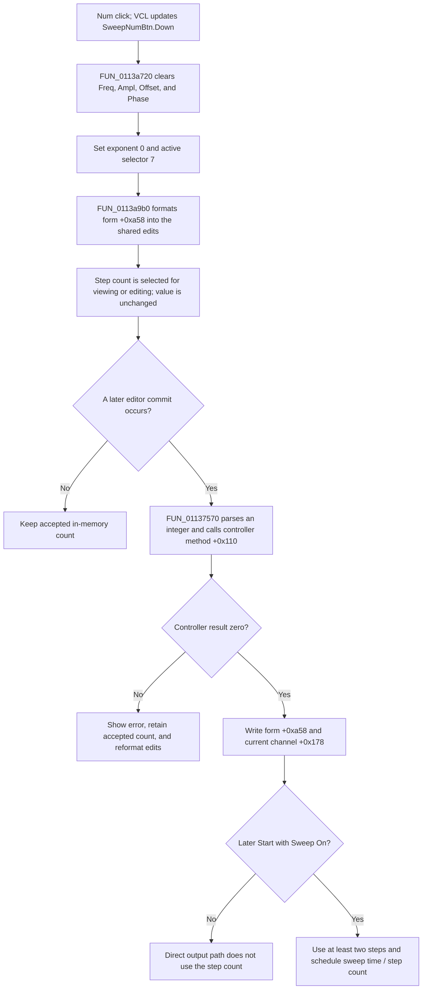

# Num

> Analysis status: Source-reviewed. The DFM, selector helpers, shared editor renderer, commit dispatcher, channel synchronization, and Start path establish the behavior below.

## Control

| Property | Recovered value |
| --- | --- |
| Form | FuncGenWin |
| Component path | FuncGenWin.ParametersBox.SweepBox.SweepNumBtn |
| Control class | TSpeedButton |
| Caption | Num |
| Hint | Number of steps |
| Group index | 5 |
| Allow all up | true |
| Handler name | SweepNumBtnClick |
| Handler address | 0113b300 |
| Graph node | `resource:dfm:FuncGenWin/FuncGenWin.ParametersBox.SweepBox.SweepNumBtn` |
| Handler node | `function:0113b300` |
| Graph layer | UI |

## What happens when clicked

Num selects the sweep step-count parameter for the Function Generator's shared numeric editor. VCL updates the clicked speed button's `Down` state before it calls `FUN_0113b300`. Because the DFM sets `AllowAllUp = true`, a repeated click can release the button. The handler selects parameter mode 7 regardless and does not set `SweepNumBtn.Down` directly.

The handler then:

1. calls `FUN_0113a720`, which temporarily lets the normal Frequency, Amplitude, Offset, and Phase subgroup have no selected button and clears those four buttons;
2. restores `AllowAllUp = false` on the first sweep subgroup button, at form field `+0x9a0`, after the cross-subgroup reset;
3. stores zero in the engineering-format selector at form field `+0xa78`, because the step count is an integer without an SI multiplier;
4. stores active parameter selector `7` at form field `+0xa0c`; and
5. calls the shared renderer `FUN_0113a9b0`.

Renderer case 7 reads the current in-memory step count from form field `+0xa58`, formats it as an integer, and writes the main numeric edit, multiplier edit, and unit edit. It also repairs an out-of-range digit index and restores the active text selection. The click therefore changes the selected parameter and its displayed text. It does not change the step count.

## Editing, validation, and model effects

The shared editor commit path is separate from this click. Edit-mode exit, Enter, multiplier input, and digit or spin completion can dispatch the current editor text through `FUN_01137540` to `FUN_01137570`. For selector 7, that routine:

- parses an integer from the combined editor text;
- calls Function Generator controller virtual method `+0x110` to validate or apply the requested count;
- on result zero, writes the count to form working field `+0xa58` and current channel field `+0x178`; and
- on a nonzero result, keeps the accepted count, shows the shared localized parameter error, and rebuilds the editor from the accepted value.

The source does not expose the accepted numeric range behind controller method `+0x110`. It proves only that zero is success and a nonzero result is rejected. Selecting Num runs none of this validation or backend work. Channel synchronization later reloads `+0xa58` from the selected channel's `+0x178` field, so the committed count belongs to the current Function Generator channel rather than only to the text control.

## Relationship to sweep modes and Start or Stop

The inspected run-time consumer is the sweep-enabled Start path. When **Sweep On** is up, Start runs the direct generator path and does not use the count. When **Sweep On** is down, `FUN_011393f0` initializes the sweep and calculates the scheduled update interval as the configured sweep time in milliseconds divided by the step count, rounded and limited to at least 1 ms.

As a start-time safety check, that path replaces a form count below 1 with 2 before division. The recovered branch changes form field `+0xa58`; it does not also write current channel field `+0x178` and does not refresh the Num editor. This fallback is therefore not evidence of a durable correction to the channel setting.

Continuous versus single and linear versus logarithmic are separate sweep-button states. Their handlers update captions or modes but do not change the step count. Num does not start, stop, enable, disable, or change any sweep mode. Stop cancels the active run through its own handler and does not edit the count in the inspected path.

## No-op and failure boundaries

- Clicking an already selected Num button still runs the subgroup reset, stores format code 0 and selector 7, and rebuilds the editor. It is not a strict no-op.
- The click has no empty-input or numeric-error branch because it does not parse the editor.
- A rejected later edit preserves the accepted step count and reports the shared validation error.
- The handler has no local exception catch or rollback. It stores the selector fields before it calls the renderer. A rendering exception can therefore leave Num selected and selector 7 active with only part of the editor refreshed.
- The click and commit paths write no file, INI value, registry value, project-modified flag, or other durable setting. The proved result is current-session form, channel, controller, and display state.

## Click and later-use flow

## Handler evidence

- [FUN_0113b300](../../../DecompiledSources/Tina16/functions/000000000113B300__FUN_0113b300.c) calls the cross-subgroup reset, sets the format and parameter selectors, and calls the renderer.
- [FUN_0113a720](../../../DecompiledSources/Tina16/functions/000000000113A720__FUN_0113a720.c) allows the normal subgroup to be all-up and clears Frequency, Amplitude, Offset, and Phase.
- [FUN_0113a9b0](../../../DecompiledSources/Tina16/functions/000000000113A9B0__FUN_0113a9b0.c) case 7 reads form field `+0xa58`, formats the integer, writes the three shared edit controls, and restores the digit selection.
- [FUN_01137570](../../../DecompiledSources/Tina16/functions/0000000001137570__FUN_01137570.c) case 7 parses the integer, calls controller method `+0x110`, writes accepted values to `+0xa58` and channel `+0x178`, or reports the shared error.
- [FUN_011390d0](../../../DecompiledSources/Tina16/functions/00000000011390D0__FUN_011390d0.c) reloads the form count from current channel field `+0x178` when the selected channel changes.
- [FUN_011393f0](../../../DecompiledSources/Tina16/functions/00000000011393F0__FUN_011393f0.c) uses the count only in its Sweep On branch, applies the below-one fallback, and calculates the scheduled interval.
- The complete Edit and commit behavior is documented in [Edit](editbtn-3ba1d69c10.md). The complete Start behavior is documented in [Start](fstartbtn-3d63ee59be.md).

## Resource evidence

- The recovered DFM binds `SweepNumBtn.OnClick` to `SweepNumBtnClick` at `0113b300`.
- Caption **Num** and hint **Number of steps** identify the parameter; the handler's selector 7 data flow proves that meaning.
- `GroupIndex = 5` and `AllowAllUp = true` match the handler's explicit cross-subgroup reset and restoration logic.
- The control has no recovered text property, action, image reference, embedded glyph, button kind, or modal result.

## Analysis limits and ownership

- `FUN_0113b300` and shared sweep-parameter group reset `FUN_0113a720` are annotated with this control.
- Shared renderer `FUN_0113a9b0` is owned by the Amplitude selector analysis. Commit helpers `FUN_01137540` and `FUN_01137570` are owned by the Edit analysis. Start coordinator `FUN_011393f0` is owned by the Start analysis. They are evidence only here.
- The recovered controller interface does not reveal the exact permitted count range or hardware transport. This article does not infer either one.
- No recovered source path proves durable persistence for the step count.
