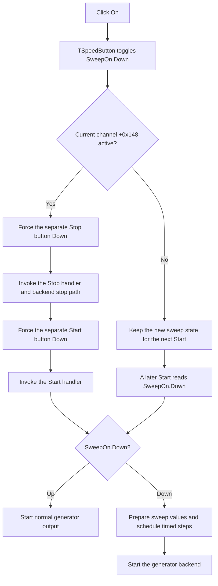

# Toggle function-generator sweep mode

`SweepOnBtn` enables or disables frequency sweep for the current function-generator channel. It is a toggle, not the generator Start button. If the generator is already active, the click stops and starts it so the new sweep state takes effect.

## Control

| Property | Recovered value |
| --- | --- |
| Form | FuncGenWin |
| Component path | FuncGenWin.ParametersBox.SweepBox.SweepOnBtn |
| Control class | TSpeedButton |
| Caption | On |
| Hint | Not present in the recovered resource. |
| Group behavior | `GroupIndex = 6`, `AllowAllUp = true` |
| Handler name | SweepOnBtnClick |
| Handler address | 0113c5c0 |
| Graph node | `resource:dfm:FuncGenWin/FuncGenWin.ParametersBox.SweepBox.SweepOnBtn` |
| Handler node | `function:0113c5c0` |
| Graph layer | UI |

The button has no recovered hint or glyph. Its `TSpeedButton` state supplies the evidence that matters: Down means that sweep is enabled, and Up means that the next Start uses normal generation. `AllowAllUp` permits a second click to release the button. The caption stays `On`; the handler does not replace it with `Off`.

## What happens when clicked

The speed button changes its Down state before `FUN_0113c5c0` runs. The handler then checks byte `+0x148` in the current channel object at form field `+0xA10`. The Start path sets this byte when generation begins, and the Stop path tests and normally clears it, so it is the recovered active-generator flag.

- If the channel is not active, the handler does nothing else. The new Down state remains staged in the form. The next Start reads it.
- If the channel is active, the handler forces the separate Stop transport button Down and invokes the form's Stop handler. It then forces the Start transport button Down and invokes the Start handler. This restart is how a live generator changes between normal and swept output.

The Start coordinator reads `SweepOnBtn.Down` at form field `+0x990`. When it is Up, Start invokes the normal backend start path. When it is Down, Start prepares sweep state, disables waveform controls for the run, initializes the current sweep value, invokes the backend start path, marks the channel active, and schedules sweep updates. The update interval is calculated from the sweep time at `+0xA50` and the step count at `+0xA58`. The recovered guard changes a step count below 1 to 2; it does not change a value of 1.

`SweepContBtn` and `SweepLinBtn` are separate mode toggles. Their handlers refresh the captions for continuous/single and linear/logarithmic sweep. The numeric buttons named Sweep Start, Sweep Stop, Sweep Time, and Sweep Num select values in the shared numeric editor; they are not transport controls.

## Sweep state transfer

The shared state functions show how the toggle participates in the larger model.

| Setting | Current form export | Channel-backed export | Apply path |
| --- | --- | --- | --- |
| Sweep start | `+0xA28` | channel `+0x168` | Normalized by the controller, then stored in both locations. |
| Sweep stop | `+0xA48` | channel `+0x170` | Normalized by the controller, then stored in both locations. |
| Sweep time | `+0xA50` | form `+0xA50` | Applied through controller method `+0x108`, then stored in the form. |
| Sweep steps | `+0xA58` | channel `+0x178` | Applied through controller method `+0x110`, then stored in both locations. |
| Continuous mode | `!SweepContBtn.Down` | Same UI state | Restores the inverse Down state and refreshes its caption. |
| Linear mode | `!SweepLinBtn.Down` | Same UI state | Restores the inverse Down state and refreshes its caption. |
| Sweep enabled | `SweepOnBtn.Down` | Same UI state | Restores Down and invokes this handler, which restarts an active generator. |

`FUN_01138d40` exports the current form values. `FUN_01138dc0` exports the channel-backed start, stop, and step values while taking time and mode state from the form. `FUN_01138e40` normalizes and applies all values, rebuilds the numeric readout, refreshes the continuous and linear captions, and applies Sweep On last. Analysis and external-control paths use this family to inspect, override, and later restore sweep state.

These functions do not write a file, registry value, or project setting. The click changes working UI state and can cause an immediate backend restart. Start, stop, steps, and mode values can later be copied through the state-transfer functions, but that is not proof of durable disk persistence.

## Click flow

## Validation and failure boundaries

`FUN_0113c5c0` does not parse or validate a number, and it does not inspect a return value. Validation and backend-availability checks occur in the Start coordinator. If those checks reject Start, generation remains stopped. If Stop is still completing and leaves the active flag set, the Start wrapper sees an already active channel and does not start it again. The click handler has no local exception recovery, rollback, or message of its own.

This means that the Down state can remain changed even when a backend restart does not complete. The state import function also stores normalized values before it invokes this click path, so a later restart failure does not roll those earlier assignments back.

## Handler evidence

- [SweepOnBtnClick source](../../../DecompiledSources/Tina16/functions/000000000113C5C0__FUN_0113c5c0.c) checks the channel active byte, then invokes Stop and Start through the form's virtual event slots.
- [Start wrapper](../../../DecompiledSources/Tina16/functions/00000000011393B0__FUN_011393b0.c) starts only when the current channel is inactive.
- [Start coordinator](../../../DecompiledSources/Tina16/functions/00000000011393F0__FUN_011393f0.c) selects normal or sweep startup from `SweepOnBtn.Down` and configures timed sweep updates.
- [Stop handler](../../../DecompiledSources/Tina16/functions/0000000001139900__FUN_01139900.c) checks the Stop button and active flag, calls the backend stop method, runs cleanup, and conditionally clears the flag.
- [Current-form sweep exporter](../../../DecompiledSources/Tina16/functions/0000000001138D40__FUN_01138d40.c), [channel-backed sweep exporter](../../../DecompiledSources/Tina16/functions/0000000001138DC0__FUN_01138dc0.c), and [sweep-state applier](../../../DecompiledSources/Tina16/functions/0000000001138E40__FUN_01138e40.c) establish the state fields and transfer boundary.
- [Continuous caption refresh](../../../DecompiledSources/Tina16/functions/000000000113C4E0__FUN_0113c4e0.c) changes `Cont` to `Sing` from its Down state. [Linear caption refresh](../../../DecompiledSources/Tina16/functions/000000000113C550__FUN_0113c550.c) performs the parallel mode-caption update.
- [Recovered DFM evidence](../../../DecompiledSources/Tina16/resources/dfm/ui-evidence.json) supplies the component class, caption, group settings, and resolved event address.

## Ownership and limits

This analysis owns the specific handler `FUN_0113c5c0` and the shared sweep-state family `FUN_01138d40`, `FUN_01138dc0`, and `FUN_01138e40`. The Start and Stop handlers, shared numeric readout builder, caption setters, controller virtual methods, and external analysis callers are evidence only. Their broader responsibilities belong to their direct controls or other analyses.
