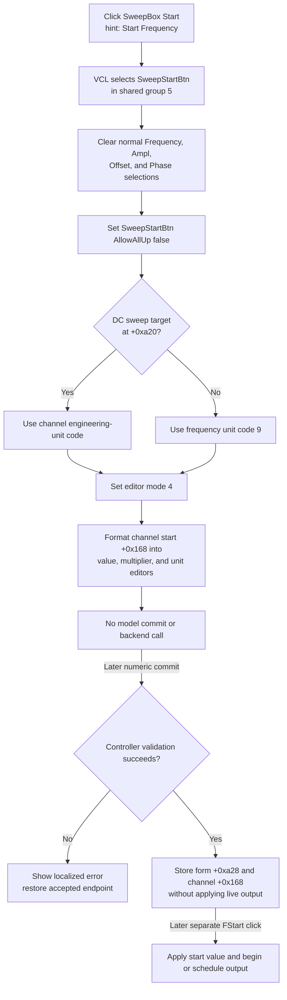

# Select sweep-start value editing

## Control

| Property | Recovered value |
| --- | --- |
| Form | FuncGenWin |
| Component path | FuncGenWin.ParametersBox.SweepBox.SweepStartBtn |
| Control class | TSpeedButton |
| Caption | Start |
| Hint | Start Frequency |
| Group index | 5 |
| AllowAllUp | true in the recovered resource |
| Handler name | SweepStartBtnClick |
| Handler address | 0113b200 |
| Graph node | `resource:dfm:FuncGenWin/FuncGenWin.ParametersBox.SweepBox.SweepStartBtn` |
| Handler node | `function:0113b200` |
| Graph layer | UI |

## What happens when clicked

This **Start** button selects the sweep start value for the shared numeric editor. It does not start the Function Generator.

`SweepStartBtn`, `SweepStopBtn`, `SweepTimeBtn`, `SweepNumBtn`, and the normal Frequency, Amplitude, Offset, and Phase selectors all use VCL group `5`. VCL selects `SweepStartBtn` before it dispatches `FUN_0113b200` and releases the previously selected group member.

The handler then performs these operations:

1. It calls the shared sweep-parameter group helper. That helper lets the normal Frequency button be released and clears the Down state of Frequency, Amplitude, Offset, and Phase.
2. It changes `SweepStartBtn.AllowAllUp` from the streamed true state to false. This keeps one sweep-parameter button selected until a normal-parameter handler restores the all-up policy.
3. It chooses the engineering-unit code for the active sweep target.
4. It stores editor mode `4` at form offset `+0xa0c`.
5. It calls the shared readout builder, which displays the current sweep-start value in the central value, multiplier, and unit editors and restores the active digit selection.

The handler does not parse the editor, validate a new endpoint, change the stored sweep-start value, apply output to the backend, or schedule a sweep.

## Value and unit selected

The current channel stores the sweep start endpoint at channel offset `+0x168`. The shared live sweep state also uses form field `+0xa28`. The click reads and formats the channel value; a later successful editor commit updates both locations.

The endpoint unit depends on the active sweep target:

- When form byte `+0xa20` is zero, the DC waveform is active. The handler copies the current channel's engineering-unit code at `+0x149`. The later commit uses the same controller validator as DC Offset, and Function Generator Start applies the endpoint through the DC-value backend method.
- When byte `+0xa20` is nonzero, the handler selects engineering-unit code `9`, the same code used by the normal Frequency editor. The later commit uses the frequency-endpoint validator, and Function Generator Start applies the endpoint through the frequency backend method.

The readout builder also derives the code from the current channel type before it formats the value. This keeps the display synchronized with the selected channel after waveform or channel changes. The resource hint says **Start Frequency**, but the recovered branch proves that the same selector represents a DC sweep start level when the DC waveform is active.

## Shared editor result

For mode `4`, `FUN_0113a9b0` formats channel field `+0x168` into:

- the central numeric `Edit` control;
- `MultiplierEdit`; and
- `UnitEdit`.

It updates editor unit state `+0xa78`, corrects an invalid digit index at `+0xa6c`, and selects either the current numeric digit or the multiplier. These are presentation changes only. The compact Function Generator readout and the stored endpoint do not change on this click.

Repeated clicks select the same mode and rebuild the same editor display. Because the handler has changed `AllowAllUp` to false, a repeated click does not release the selected Sweep Start button.

## Later validation and commit

Keyboard, multiplier, digit, spin, or edit-mode completion handlers later call the shared commit dispatcher. For mode `4`, that path:

1. combines the central value, multiplier, and unit text;
2. converts the engineering notation to a double;
3. calls the DC-value validator when `+0xa20` is zero, or the frequency-endpoint validator otherwise;
4. on success, stores the value in form field `+0xa28` and current-channel field `+0x168`, and copies it to current sweep value `+0xa60`; and
5. reformats the editor from the accepted value.

If validation fails, it does not replace `+0xa28` or `+0x168`. It shows localized error resource `0x132` with the attempted value and restores the editor from the accepted endpoint.

The mode-4 commit calls a controller validation method, but it does not call the output-apply methods used by normal Frequency or Offset commits. Thus, selecting and editing the start endpoint prepares model state for a later sweep. It does not immediately change the live output value.

## Difference from the actual Start command

The actual run control is `FuncGenWin.ControlBox.FStartBtn`, with hint **Start Function Generator** and handler `FUN_011393b0`. That control builds command `0x538` and enters the shared start coordinator.

When Sweep On is selected, the run coordinator uses the accepted start field `+0xa28` to initialize current value `+0xa60`. It applies that first value through the DC or frequency backend path, marks output and sweep state active, calls the backend start method, and schedules timed message `0x52C`. Without Sweep On, it starts the current direct output instead.

None of those operations occur in `SweepStartBtnClick`. The duplicate **Start** captions refer to different actions: the SweepBox button selects an endpoint for editing; the ControlBox button starts generator execution.

## Click flow

## Model, backend, and persistence boundaries

- The click changes VCL group state, `AllowAllUp`, editor mode `+0xa0c`, unit state `+0xa78`, formatted editor text, and digit selection.
- It does not change form endpoint `+0xa28`, channel endpoint `+0x168`, current sweep value `+0xa60`, running state, direction, step index, or timer state.
- A later valid commit updates the live form and channel model. The shared sweep getters expose `+0xa28` as the live start and `+0x168` as the stored channel start. The shared applicator validates and restores both fields.
- The click and later commit do not call a file, registry, INI, project serializer, or settings writer. The adapter paths prove that other owners can copy this state, but they do not establish durable persistence.
- The selector does not affect a running sweep. A later successful commit also copies the accepted start into current sweep field `+0xa60`; the timed sweep callback's response to that field is outside this click handler. The commit does not itself restart the sweep.

## No-op and error behavior

- The click has no invalid-input, busy-backend, running-state, confirmation, or error-message branch. It only selects and formats an already stored value.
- A repeated click is an idempotent display refresh apart from any VCL repaint or selection notification.
- The handler does not inspect `Sender`. A programmatic call therefore performs the same mode and readout update, but VCL group selection must already match if the caller needs the button's Down state changed.
- VCL selects the button before the handler formats the value. A missing channel, control pointer, or formatting exception can leave Sweep Start selected while the old editor text remains.
- The click path has no local rollback. Later commit errors are handled by the shared dispatcher, which keeps the accepted endpoint and reports the attempted value.
- If the controller is busy when the later commit message arrives, the dispatcher reposts that message through the common retry path. This selector does not queue work itself.

## Evidence

- [Sweep Start selector `FUN_0113b200`](../../../DecompiledSources/Tina16/functions/000000000113B200__FUN_0113b200.c) selects the sweep group, changes `AllowAllUp`, chooses the unit code, stores mode `4`, and calls the readout builder without a model or backend setter.
- [Shared sweep-parameter selector `FUN_0113a720`](../../../DecompiledSources/Tina16/functions/000000000113A720__FUN_0113a720.c) lets the normal Frequency control be released and clears Frequency, Amplitude, Offset, and Phase. Bead `.564` owns its canonical annotation.
- [Numeric readout builder `FUN_0113a9b0`](../../../DecompiledSources/Tina16/functions/000000000113A9B0__FUN_0113a9b0.c) maps mode `4` to current-channel field `+0x168`, chooses the engineering units, writes the three shared editor controls, and restores digit selection. Bead `.555` owns it.
- [Commit dispatcher `FUN_01137570`](../../../DecompiledSources/Tina16/functions/0000000001137570__FUN_01137570.c) proves later mode-4 parsing, target-specific validation, successful form and channel stores, error reporting, and display recovery. Bead `.556` owns it and its wrapper.
- [Sweep target switch `FUN_011390d0`](../../../DecompiledSources/Tina16/functions/00000000011390D0__FUN_011390d0.c) sets byte `+0xa20` from the DC control and swaps the endpoint set between the DC-value and frequency validation paths.
- [Live and stored sweep getters `FUN_01138d40`](../../../DecompiledSources/Tina16/functions/0000000001138D40__FUN_01138d40.c) and [`FUN_01138dc0`](../../../DecompiledSources/Tina16/functions/0000000001138DC0__FUN_01138dc0.c) expose form `+0xa28` and channel `+0x168` as the start endpoints. [Shared applicator `FUN_01138e40`](../../../DecompiledSources/Tina16/functions/0000000001138E40__FUN_01138e40.c) validates and restores them. Bead `.565` owns all three.
- [Actual run handler `FUN_011393b0`](../../../DecompiledSources/Tina16/functions/00000000011393B0__FUN_011393b0.c) and [start coordinator `FUN_011393f0`](../../../DecompiledSources/Tina16/functions/00000000011393F0__FUN_011393f0.c) prove that the separate ControlBox Start command applies the endpoint, marks active state, and schedules a sweep. Bead `.553` owns both.
- [Recovered Delphi resource evidence](../../../DecompiledSources/Tina16/resources/dfm/ui-evidence.json) supplies the SweepBox location, **Start** caption, **Start Frequency** hint, group `5`, `AllowAllUp`, sibling parameter controls, actual ControlBox Start control, and event binding.

## Annotation ownership and analysis limits

- This control owns only unique handler `FUN_0113b200`. The shared selector, readout, commit, sweep-state, and run functions are cited and omitted under the coordinated owners listed above.
- The original Delphi field and enum names for `+0xa20`, `+0xa0c`, `+0xa28`, `+0xa60`, `+0xa78`, and channel fields are not recovered. The article uses offsets and roles established by repeated readers and writers.
- Engineering-unit code `9` is identified as the frequency code from the normal Frequency and sweep endpoint paths. The display text for that code is produced by the shared unit formatter and is not hard-coded in this handler.
- The backend virtual method names are not recovered. Paired validation, output-apply, Start, Stop, and sweep-update paths establish their roles, but not the physical instrument or simulator implementation behind them.
- The control has no recovered glyph, image-list reference, action, built-in button kind, modal result, or same-parent label candidate. Its caption and hint support the meaning; the mode-4 readout and later consumers prove it.
