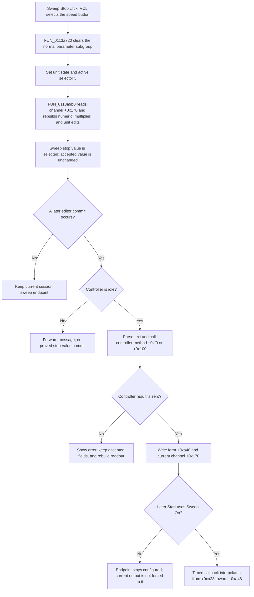

# Stop

> Analysis status: Source-reviewed. The DFM, selector handler, shared readout builder, commit dispatcher, channel synchronization, and timed sweep path establish the behavior below.

## Control

| Property | Recovered value |
| --- | --- |
| Form | FuncGenWin |
| Component path | FuncGenWin.ParametersBox.SweepBox.SweepStopBtn |
| Control class | TSpeedButton |
| Caption | Stop |
| Hint | Stop Frequency |
| Group index | 5 |
| Allow all up | true |
| Handler name | SweepStopBtnClick |
| Handler address | 0113b260 |
| Graph node | `resource:dfm:FuncGenWin/FuncGenWin.ParametersBox.SweepBox.SweepStopBtn` |
| Handler node | `function:0113b260` |
| Graph layer | UI |

## What happens when clicked

This **Stop** button selects the sweep stop value for the Function Generator's shared numeric editor. It does not stop a running Function Generator. The separate `ControlBox.FStopBtn` runs that command.

VCL changes the grouped speed-button state before it calls `FUN_0113b260`; the handler does not set `SweepStopBtn.Down` itself. The handler then:

1. calls `FUN_0113a720`, which lets the normal Frequency, Amplitude, Offset, and Phase subgroup have no selected button and clears those four buttons;
2. sets `AllowAllUp = false` on the first sweep-parameter button at form field `+0x9a0`, so the Start, Stop, Time, and Num subgroup keeps one selection;
3. preloads engineering-unit state at form field `+0xa78`: it uses current-channel unit code `+0x149` when working-mode byte `+0xa20` is zero, or fixed code `9` otherwise;
4. stores active parameter selector `5` at form field `+0xa0c`; and
5. calls shared readout builder `FUN_0113a9b0`.

The readout builder is authoritative for the displayed value and final unit state. For selector 5, it reads the accepted sweep stop value from current-channel field `+0x170`. It uses the channel unit code at `+0x149` when channel mode byte `+0x110` is zero, or fixed unit code `9` otherwise, and writes that code back to form field `+0xa78`. In working mode `+0xa20 = 0`, it also prefixes a nonnegative stop value with a plus sign.

The builder splits the formatted value into the central numeric edit at form field `+0x960`, the multiplier edit at `+0x9f0`, and the unit edit at `+0x9e8`. It repairs an invalid digit index. When editor-selection flag `+0xa70` is zero, it selects the first character of the multiplier edit. Otherwise, it selects one character in the numeric edit at digit index `+0xa6c`. The click therefore changes the selected parameter and its readout. It does not change the sweep stop value.

## Later edit, validation, and model effects

The commit path is separate from this click. Edit-mode exit, Enter, multiplier input, and digit or spin completion can send the current editor text through `FUN_01137540` to `FUN_01137570`. For selector 5, the dispatcher:

- waits for the recovered editor-update message and requires the Function Generator controller to be idle;
- combines and parses the numeric, multiplier, and unit text;
- calls controller virtual method `+0xf0` when form mode `+0xa20` is zero, or method `+0x100` otherwise, to normalize or validate the requested stop value;
- on result zero, writes the accepted double to form working field `+0xa48` and current-channel field `+0x170`; and
- on a nonzero result, leaves the accepted fields unchanged, shows the shared localized parameter error with the rejected value, and rebuilds the edits from the accepted value.

The dispatcher marks the controller busy during this operation and clears that state on its normal exit. If the controller is already busy, it forwards the message to the inherited path; the inspected source does not prove a stop-value commit in that branch. The controller interface does not reveal the accepted numeric range. The click itself has no text parser, validation branch, backend call, or error message.

A successful edit configures the stored sweep endpoint. It does not set the current generator output to that endpoint. When a later Start uses **Sweep On**, the timed sweep callback reads start field `+0xa28` and stop field `+0xa48`, calculates linear or logarithmic intermediate values, and moves the live output toward the stop value. Shared sweep-state import and channel-change paths keep form field `+0xa48` and current-channel field `+0x170` synchronized.

## No-op, error, and persistence boundaries

- Clicking an already selected Stop parameter still resets the competing subgroup, stores selector 5, and rebuilds the editor. It is not a strict no-op.
- An empty or malformed value cannot fail during this click because the click does not read the editor text. Error behavior belongs to the later shared commit path.
- A rejected later edit preserves the accepted stop value and reports the shared validation error. The exact accepted range is not recovered.
- The handler has no local exception catch or rollback. It stores the selector fields before it calls the readout builder, so a rendering exception can leave selector 5 active with only part of the editor refreshed.
- Neither the click nor the later commit writes a file, INI value, registry value, project-modified flag, or other durable setting. The proved effects are current-session button, form, channel, controller, and display state. A separate save path could consume the channel model later, but this path does not prove that persistence.
- The actual Function Generator Stop command is [`ControlBox.FStopBtn`](fstopbtn-5e96890d5a.md). Its handler `FUN_01139900` calls the backend stop slot and cancels sweep scheduling. `FUN_0113b260` calls none of that pipeline.

## Click and later-use flow

## Handler evidence

- [FUN_0113b260](../../../DecompiledSources/Tina16/functions/000000000113B260__FUN_0113b260.c) selects mode 5, prepares unit state, and calls the shared renderer.
- [FUN_0113a720](../../../DecompiledSources/Tina16/functions/000000000113A720__FUN_0113a720.c) clears the competing normal parameter subgroup.
- [FUN_0082a890](../../../DecompiledSources/Tina16/functions/000000000082A890__FUN_0082a890.c) writes the recovered `AllowAllUp` byte, not the speed button's `Down` byte.
- [FUN_0113a9b0](../../../DecompiledSources/Tina16/functions/000000000113A9B0__FUN_0113a9b0.c) case 5 reads current-channel field `+0x170`, formats the engineering value, writes the three editor fields, and restores the text selection.
- [FUN_01137570](../../../DecompiledSources/Tina16/functions/0000000001137570__FUN_01137570.c) case 5 parses and validates a later edit, then stores accepted values or reports the shared error.
- [FUN_01138e40](../../../DecompiledSources/Tina16/functions/0000000001138E40__FUN_01138e40.c) applies imported sweep state and synchronizes form field `+0xa48` with current-channel field `+0x170`.
- [FUN_01138520](../../../DecompiledSources/Tina16/functions/0000000001138520__FUN_01138520.c) consumes the stop field as the endpoint of an active timed sweep.
- [FUN_01139900](../../../DecompiledSources/Tina16/functions/0000000001139900__FUN_01139900.c) proves that the actual Stop command is a different handler and pipeline.

## Resource evidence

- The recovered DFM binds `SweepStopBtn.OnClick` to `SweepStopBtnClick` at `0113b260`.
- Caption **Stop** and hint **Stop Frequency** identify the parameter; selector 5 and the `+0x170` data flow prove that it is the sweep endpoint.
- `GroupIndex = 5` and `AllowAllUp = true` match the handler's cross-subgroup selection repair.
- The control has no recovered text property, action, image reference, embedded glyph, button kind, or modal result.

## Analysis limits and ownership

- This analysis annotates only unique handler `FUN_0113b260`.
- Sweep subgroup selector `FUN_0113a720` is owned by the Num selector analysis. Shared readout builder `FUN_0113a9b0` is owned by the Amplitude selector analysis. Commit helpers `FUN_01137540` and `FUN_01137570` are owned by the Edit analysis. Sweep-state exporters and applicator `FUN_01138d40`, `FUN_01138dc0`, and `FUN_01138e40` are owned by the Sweep On analysis. The timed sweep and Start paths and the actual Stop pipeline are evidence only here.
- The recovered controller interface does not name methods `+0xf0` and `+0x100` or expose their accepted range. This article describes their observed result and data flow without assigning an unsupported hardware-specific meaning.
