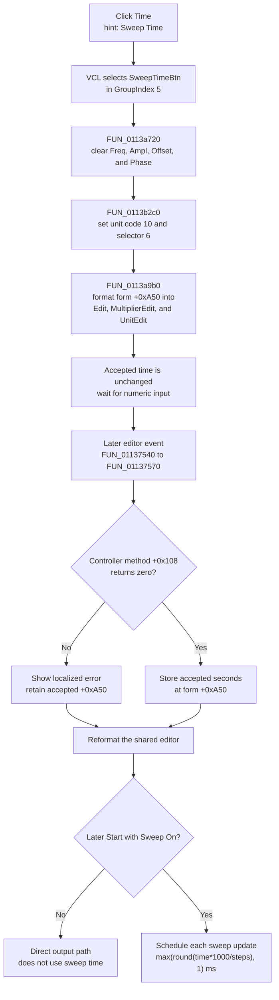

# Select sweep-time editing

> Analysis status: Complete. The DFM, selector helpers, shared editor renderer, commit dispatcher, sweep-state transfer, Start coordinator, and timed callback establish the behavior below.

## Control

| Property | Recovered value |
| --- | --- |
| Form | FuncGenWin |
| Component path | FuncGenWin.ParametersBox.SweepBox.SweepTimeBtn |
| Control class | TSpeedButton |
| Caption | Time |
| Hint | Sweep Time |
| Group index | 5 |
| Allow all up | true |
| Handler name | SweepTimeBtnClick |
| Handler address | 0113b2c0 |
| Graph node | `resource:dfm:FuncGenWin/FuncGenWin.ParametersBox.SweepBox.SweepTimeBtn` |
| Handler node | `function:0113b2c0` |
| Graph layer | UI |

The control has no glyph. Its caption and hint identify the intended parameter. The handler's selector, form-field, formatter, commit, and scheduler data flow prove that this is the sweep-duration editor.

## What happens when clicked

Time selects the sweep-time parameter for the shared Function Generator numeric editor. It does not change the duration, start a sweep, or send a new value to the generator by itself.

VCL selects `SweepTimeBtn` in speed-button group 5 before it calls `FUN_0113b2c0`. The handler then:

1. Calls shared sweep-parameter selector `FUN_0113a720`. This lets the normal subgroup have no selected button and clears Frequency, Amplitude, Offset, and Phase.
2. Clears `AllowAllUp` on the sweep subgroup anchor at form field `+0x9a0`. This restores the sweep subgroup's non-empty selection rule.
3. Stores engineering-unit code `10` at form field `+0xa78`.
4. Stores active parameter selector `6` at form field `+0xa0c`.
5. Calls shared renderer `FUN_0113a9b0`.

Renderer case 6 reads the accepted sweep-time double from form field `+0xa50`, sets unit code `10`, and formats the value for the central numeric `Edit`, `MultiplierEdit`, and `UnitEdit` controls. It also repairs an out-of-range digit index and restores the active digit or unit selection. The later scheduler multiplies this value by 1000 before it derives a millisecond interval, which establishes that the stored duration is in seconds.

The click does not inspect `Sender`. Clicking the already selected button repeats the subgroup reset, selector writes, and display rebuild. It does not accumulate a time change.

## Later validation and commit

The value changes only after a keyboard, digit, multiplier, or spin event sends the editor text through shared wrapper `FUN_01137540` to central dispatcher `FUN_01137570`. The Time click does not call these functions.

For selector `6`, the dispatcher:

1. Combines the numeric, multiplier, and unit edit text and converts it with unit code `+0xa78`.
2. Calls Function Generator controller virtual method `+0x108` with the converted double by reference.
3. Treats return value zero as success and stores the accepted, possibly normalized double at form field `+0xa50`.
4. Reformats the accepted value into the shared editor fields and restores the active selection.

The recovered controller interface does not expose the permitted duration range. It proves only that zero accepts the value and a nonzero result rejects it. Unlike normal frequency, amplitude, offset, and phase commits, selector 6 has no second controller apply call after validation. Controller method `+0x108` is the complete recovered backend validation or normalization boundary for sweep time.

On a nonzero result, the dispatcher leaves `+0xa50` unchanged, formats localized error resource `0x132`, shows the error, and rebuilds the editor from the previously accepted time.

## Use by the sweep scheduler

The accepted time has no effect when Sweep On is released. In that state, Function Generator Start uses the direct output path.

When Sweep On is down, Start coordinator `FUN_011393f0` initializes the sweep and schedules message `0x52c`. It replaces a step count below 1 with 2, then calculates the delay as:

`max(round(sweep time seconds * 1000 / step count), 1) milliseconds`

Timed callback `FUN_01138520` applies the next linear or logarithmic sweep value and calculates the same delay again before it posts the next update. It reads form fields `+0xa50` and `+0xa58` each time. Therefore, a successful time edit during an active sweep changes the delay used for the next scheduled callback. The minimum-delay clamp prevents a calculated value below 1 ms from producing a zero-delay schedule.

The configured time controls scheduler cadence. It is not passed as a duration to the generator's start method. Start, Stop, Sweep On, continuous or single operation, linear or logarithmic interpolation, start frequency, stop frequency, and step count remain separate controls and states.

## Click and later-use flow

## State transfer and persistence

- Sweep time is form working state at `+0xa50`. It is not stored in the current channel fields used for sweep start, stop, and step count.
- Both `.565`-owned sweep exporters return time from form field `+0xa50`, including the exporter that otherwise reads channel-backed values. This proves that channel changes do not supply a separate time field in the inspected model.
- The shared sweep-state applier calls controller method `+0x108`, stores the supplied time at `+0xa50`, and rebuilds the selected readout. Measurement and external-control callers can therefore copy and restore this working value.
- The click, commit, state-transfer, Start, and timed-callback paths write no file, registry value, INI value, project-modified flag, or settings record. No durable persistence is proven.

## No-op and failure boundaries

- The direct click has no empty-input, range, controller-busy, or error-message branch because it does not parse or commit text.
- A rejected later edit preserves the accepted time and shows the shared parameter error.
- If the editor-update message does not match or the controller is already updating, the shared dispatcher forwards the message instead of running its local selector-6 commit. The Time handler has no retry result.
- The handler has no local catch or rollback. It stores unit code and selector before it calls the renderer. A formatting exception can leave Time selected and selector 6 active with only part of the editor refreshed.
- The later commit also has no local transaction. An exception from conversion, controller code, error display, or VCL formatting propagates. The source does not prove rollback after an external controller side effect.

## Source evidence

- [Time selector `FUN_0113b2c0`](../../../DecompiledSources/Tina16/functions/000000000113B2C0__FUN_0113b2c0.c) selects the sweep group, sets unit code `10` and selector `6`, and calls the renderer without storing a new duration or starting output.
- [Sweep-parameter selector `FUN_0113a720`](../../../DecompiledSources/Tina16/functions/000000000113A720__FUN_0113a720.c) clears the four normal parameter buttons. Its canonical annotation belongs to `.564`.
- [Numeric renderer `FUN_0113a9b0`](../../../DecompiledSources/Tina16/functions/000000000113A9B0__FUN_0113a9b0.c) case 6 formats form field `+0xa50` with unit code `10` and rebuilds the three editor fields. Its canonical annotation belongs to `.555`.
- [Commit wrapper `FUN_01137540`](../../../DecompiledSources/Tina16/functions/0000000001137540__FUN_01137540.c) and [central dispatcher `FUN_01137570`](../../../DecompiledSources/Tina16/functions/0000000001137570__FUN_01137570.c) prove the later conversion, controller method `+0x108`, accepted store, error path, and display recovery. Their canonical annotations belong to `.556`.
- [Current-form exporter `FUN_01138d40`](../../../DecompiledSources/Tina16/functions/0000000001138D40__FUN_01138d40.c), [channel-backed exporter `FUN_01138dc0`](../../../DecompiledSources/Tina16/functions/0000000001138DC0__FUN_01138dc0.c), and [sweep-state applier `FUN_01138e40`](../../../DecompiledSources/Tina16/functions/0000000001138E40__FUN_01138e40.c) establish the form-local time and transfer boundary. `.565` owns this shared family.
- [Start coordinator `FUN_011393f0`](../../../DecompiledSources/Tina16/functions/00000000011393F0__FUN_011393f0.c) uses sweep time and count for the first interval. Its canonical annotation belongs to `.553`.
- [Timed sweep callback `FUN_01138520`](../../../DecompiledSources/Tina16/functions/0000000001138520__FUN_01138520.c) recalculates the interval from the live time and count before every subsequent post.
- [Recovered Delphi resource evidence](../../../DecompiledSources/Tina16/resources/dfm/ui-evidence.json) supplies caption `Time`, hint `Sweep Time`, group state, the text-only control, and the resolved event binding.

## Analysis limits and ownership

- The exact Delphi field names for editor selector `+0xa0c`, unit code `+0xa78`, sweep time `+0xa50`, controller `+0xa18`, and the controller's virtual method `+0x108` are not recovered. The article uses only source-proven responsibilities.
- `.568` owns only unique handler `FUN_0113b2c0`.
- Shared selector `FUN_0113a720`, renderer `FUN_0113a9b0`, commit helpers `FUN_01137540` and `FUN_01137570`, sweep-state family `FUN_01138d40`, `FUN_01138dc0`, and `FUN_01138e40`, and Start coordinator `FUN_011393f0` are cited and omitted under the coordinated ownership.
- The timed callback is broad run-state evidence and remains unannotated here.
