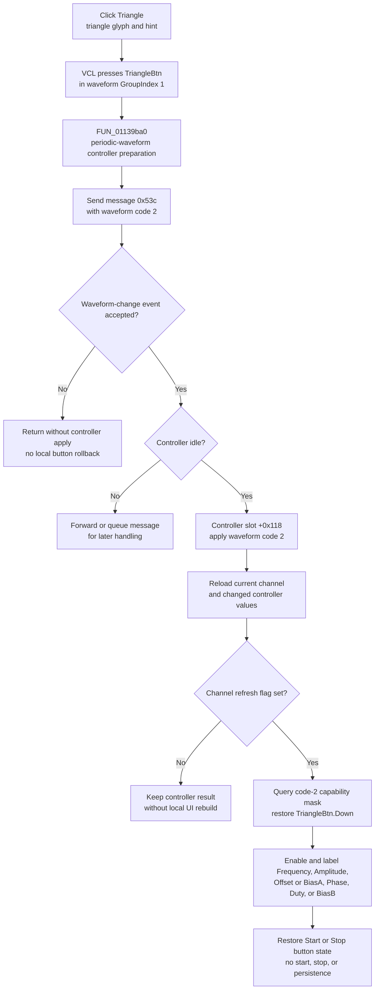

# Select the triangle waveform

> Analysis status: Complete. The DFM waveform group, triangle wrapper, shared waveform dispatcher, channel refresh, capability renderer, and Start/Stop paths support this explanation.

## Control

| Property | Recovered value |
| --- | --- |
| Form | FuncGenWin |
| Component path | FuncGenWin.WaveformBox.TriangleBtn |
| Control class | TSpeedButton |
| Caption | Not present in the recovered resource. |
| Hint | Triangle |
| Group index | 1 |
| Handler name | TriangleBtnClick |
| Handler address | 01139ba0 |
| Graph node | `resource:dfm:FuncGenWin/FuncGenWin.WaveformBox.TriangleBtn` |
| Handler node | `function:01139ba0` |
| Graph layer | UI |

The extracted 30 by 30 glyph shows a black triangle-wave trace. The glyph and `Triangle` hint identify the control. The source confirms that the handler selects recovered waveform code `2`.

## What happens when clicked

The VCL first presses `TriangleBtn` in waveform `GroupIndex = 1` and releases the selected sibling. `FUN_01139ba0` then makes a controller virtual call at slot `+0x80` with arguments `(0, 1)`. The sinusoidal and square wrappers make the same call, but the DC and arbitrary-waveform wrappers do not. This proves that it is common preparation for the three periodic waveform selections. The exact provider-side operation is not recovered, so this article does not assign it a stronger name.

The handler creates waveform-change message `0x53c` with payload `2` and passes it to shared dispatcher `FUN_011399d0`. The sibling wrappers use payload `0` for DC, `1` for sinusoidal, `3` for square, and `4` for arbitrary waveform. The shared renderer later maps current-channel waveform field `+0x110` value `2` back to `TriangleBtn.Down`. This repeated mapping establishes the payload meaning.

When the recovered event guard accepts the message and the function-generator controller is idle, the shared dispatcher:

1. marks a controller update as active;
2. prevents the waveform group from having no selected button;
3. calls controller virtual slot `+0x118` with waveform code `2`;
4. reloads the controller channel collection and current channel into the form;
5. refreshes waveform, parameter, readout, and Start/Stop controls when the controller reports changed channel data; and
6. clears the active-update state.

The handler does not write current-channel field `+0x110` directly. The controller call and subsequent channel reload are the live update boundary. It does not open a dialog or edit an arbitrary waveform object.

## Parameter availability and phase or bias roles

After the controller refresh, `FUN_0113a180` asks controller slot `+0x90` for the capability mask of current waveform code `2`. It applies the returned mask to the four shared parameter selectors:

- bit `1` enables Frequency;
- bit `2` enables Amplitude;
- bit `4` enables the third selector and captions it `Offset`;
- bit `0x40` enables the same selector and captions it `BiasA`;
- bit `8` enables the fourth selector, captions it `Phase`, and assigns engineering-unit code `0x0b`;
- bit `0x10` enables the fourth selector, captions it `Duty`, and assigns unit code `0x11`; and
- bit `0x80` enables the fourth selector, captions it `BiasB`, and assigns unit code `1`.

If a selected parameter is unavailable under the new mask, the renderer moves selection to an available parameter and updates editor selector field `+0xa0c`. The common readout functions then rebuild the compact values and central numeric editor from the current channel.

The source does not contain one fixed capability mask for triangle mode. The active controller implementation supplies it at run time. Therefore, triangle selection is proven to recalculate Frequency, Amplitude, Offset or Bias A, and Phase, Duty, or Bias B availability, but it is not proven that every controller exposes the same subset. The click selects the waveform only; later numeric-edit paths validate and apply the chosen parameter values.

## Start, Stop, and repeated clicks

Triangle selection does not start or stop output. It does not call controller Start slot `+0x78`, Stop slot `+0x70`, or change current-channel running byte `+0x148`. The refresh only restores the Start or Stop button Down state from that byte.

For normal output, a Triangle click can therefore send code `2` while the channel is already running. The exact device-side transition remains inside the controller virtual method. When frequency sweep starts, the Start coordinator disables the sinusoidal, triangle, square, and arbitrary-waveform buttons. This normally prevents a Triangle click during an active sweep. The Stop cleanup re-enables those buttons. `FUN_01139ba0` itself has no running or enabled-state guard, so a programmatic invocation can still reach the shared dispatcher.

The handler has no equality check for an already selected triangle waveform. A repeated click sends code `2` again and repeats the accepted controller and refresh path. It does not toggle the waveform off or accumulate a value.

## Errors and persistence

- If the recovered event guard rejects message `0x53c`, the dispatcher returns without applying the controller update. The VCL can already have pressed `TriangleBtn`; this path has no local button rollback.
- If another controller update is active, the dispatcher forwards or queues the message through the inherited event path instead of applying it immediately.
- Controller slot `+0x118` has no recovered status return, validation branch, or local error message in this path.
- The handler and shared dispatcher have no local exception handler or transactional rollback. A controller or refresh exception can leave the button state, active-update flag, or displayed channel data only partly reconciled.
- The click writes no file, INI value, registry value, project, or settings record. It changes live controller/channel state and UI only. Any later session or project persistence is outside this path.

## Click flow

## Source evidence

- [Triangle wrapper `FUN_01139ba0`](../../../DecompiledSources/Tina16/functions/0000000001139BA0__FUN_01139ba0.c) makes the periodic-waveform preparation call, creates message `0x53c` with payload `2`, and invokes the shared dispatcher.
- [Sinusoidal wrapper `FUN_01139b50`](../../../DecompiledSources/Tina16/functions/0000000001139B50__FUN_01139b50.c), [square wrapper `FUN_01139bf0`](../../../DecompiledSources/Tina16/functions/0000000001139BF0__FUN_01139bf0.c), [DC wrapper `FUN_01139c40`](../../../DecompiledSources/Tina16/functions/0000000001139C40__FUN_01139c40.c), and [ARB wrapper `FUN_0113ded0`](../../../DecompiledSources/Tina16/functions/000000000113DED0__FUN_0113ded0.c) establish the common waveform-code mapping and the periodic-only preparation call.
- [Shared waveform dispatcher `FUN_011399d0`](../../../DecompiledSources/Tina16/functions/00000000011399D0__FUN_011399d0.c) gates the event, applies its payload through controller slot `+0x118`, handles busy deferral, and starts the channel/UI refresh.
- [Channel and UI refresh `FUN_0113cec0`](../../../DecompiledSources/Tina16/functions/000000000113CEC0__FUN_0113cec0.c) reloads the controller channel list, selects the current channel, synchronizes changed controller values, and calls the shared renderers.
- [Waveform and capability renderer `FUN_0113a180`](../../../DecompiledSources/Tina16/functions/000000000113A180__FUN_0113a180.c) maps waveform code `2` to `TriangleBtn`, obtains the provider capability mask, assigns parameter enabled states and captions, repairs selection, and restores Start/Stop state.
- [Programmatic waveform applicator `FUN_01138b30`](../../../DecompiledSources/Tina16/functions/0000000001138B30__FUN_01138b30.c) independently maps code `2` to the Triangle button and applies that code before the four numeric waveform parameters.
- [Start coordinator `FUN_011393f0`](../../../DecompiledSources/Tina16/functions/00000000011393F0__FUN_011393f0.c) owns the output start and disables Triangle during an active sweep. [Stop cleanup `FUN_01139800`](../../../DecompiledSources/Tina16/functions/0000000001139800__FUN_01139800.c) re-enables the periodic waveform buttons.
- [Extracted triangle glyph](../../../glyph/0210_FuncGenWin_FuncGenWin_WaveformBox_TriangleBtn_Glyph_Data.png) visually agrees with the DFM hint. [Recovered Delphi resource evidence](../../../DecompiledSources/Tina16/resources/dfm/ui-evidence.json) supplies the hint, `GroupIndex = 1`, embedded glyph metadata, and `OnClick` binding.

## Analysis limits and ownership

- This Bead annotates only Triangle wrapper `FUN_01139ba0`.
- Bead `.569` owns shared waveform dispatcher `FUN_011399d0`, channel synchronizer and UI refresh `FUN_0113cec0`, and capability renderer `FUN_0113a180`. This article cites all three without redefining their graph annotations.
- The exact Delphi names for controller `+0xa18`, current channel `+0xa10`, waveform `+0x110`, running state `+0x148`, and selector `+0xa0c` are not recovered. Their roles follow from repeated writers, readers, controller calls, and DFM state.
- The controller method at slot `+0x80` is common to sinusoidal, triangle, and square selection, but its exact provider-side responsibility is not recovered. The source does not justify calling it a phase, bias, channel, or hardware reset.
- Controller slot `+0x90` proves dynamic capability selection, not one fixed triangle mask. Controller slot `+0x118` proves the live waveform update boundary, but not its physical transport or timing.
