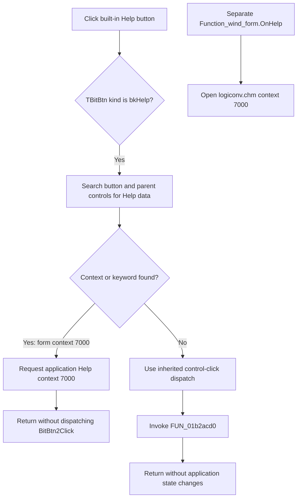

# Open Minterm/Maxterm Help context 7000

`BitBtn2` is the built-in Help button for the modeless `Minterm/Maxterm` result window. A normal click is handled by the Delphi `TBitBtn` runtime before its assigned application event: VCL finds the form's Help context 7000 and sends that context to the application Help service.

## Control

| Property | Recovered value |
| --- | --- |
| Form | Function_wind_form |
| Form caption | Minterm/Maxterm |
| Component path | Function_wind_form.BitBtn2 |
| Control class | TBitBtn |
| Kind | `bkHelp` |
| Caption | Supplied by the built-in button kind; no custom caption is stored. |
| Hint | Not present in the recovered resource. |
| Handler name | BitBtn2Click |
| Handler address | 01b2acd0 |
| Graph node | `resource:dfm:Function_wind_form/Function_wind_form.BitBtn2` |
| Handler node | `function:01b2acd0` |
| Graph layer | UI |

The DFM has no custom caption, hint, action, image reference, or embedded glyph. `bkHelp` supplies the standard Help caption and stock presentation at run time. The nearby labels name result fields; they do not select the Help topic.

## What happens when clicked

The complete control path has two layers:

1. The recovered `TBitBtn.Click` override sees built-in kind value 3, which the recovered RTTI identifies as `bkHelp`.
2. It walks from the button through its parent controls until it finds a nonempty Help keyword or context.
3. `Function_wind_form.FormCreate` has already set the form to context-based Help with context ID 7000. The search therefore stops at the form.
4. `TBitBtn.Click` calls the application Help-context path with 7000 and returns. It does not call the inherited control-click dispatcher in this branch, so the assigned `BitBtn2Click` event is not invoked during the normal click.

The graph correctly records the DFM event binding from the resource to `FUN_01b2acd0`, but a static event edge cannot represent the preceding `bkHelp` interception. The handler body contains only `return`. It is a fallback: if no parent supplied a Help context or keyword, `TBitBtn.Click` would delegate to inherited click dispatch, which would reach this handler and perform no application action.

## Help topic and form Help event

The form's separate `OnHelp` handler confirms the application-specific topic. `FUN_01b2abd0` builds the path to `logiconv.chm`, calls the Help service with context 7000, clears the continuation flag, and returns true. This is the form-level Help-event route, such as an F1 or window Help request. It is separate from the `TBitBtn.Click` call to the generic application Help-context method, but both use context 7000.

The generic application helper can report failure, for example when no Help system is available, but `TBitBtn.Click` does not test its return value. The button path has no custom retry, fallback topic, message, or error dialog.

## Result-window and diagram boundary

`Function_wind_form` contains read-only Minterm, Maxterm, Simplified minterm, and Simplified maxterm fields plus a read-only simplification list. The Schematic Diagram's New Function button and form double-click path show this result form together with `Func_diagram_form` as existing modeless singletons.

Clicking Help does not:

- change, clear, copy, save, or recalculate any Boolean-function result;
- select a Minterm, Maxterm, PLA, or simplified drawing mode;
- redraw or change the Schematic Diagram;
- close or hide the result window;
- change a modal result; or
- change the separate `bkClose` button.

## Click flow

## Repeated clicks, errors, and persistence

- Each normal click repeats the application Help-context request. It does not create another result form or Help context.
- `FUN_01b2acd0` has no parameters, reads or writes no memory, allocates nothing, and has no error path.
- The VCL Help dispatcher ignores the Boolean result from the application Help-context helper. A missing Help system or unresolved topic can therefore leave the click with no visible result and no handler-owned message.
- The form-level `OnHelp` path has no local recovery around its Help-service call.
- No result data, diagram state, file, registry value, project, setting, or undo record changes. Help display is not application-data persistence.

## Source evidence

- [Empty application event `FUN_01b2acd0`](../../../DecompiledSources/Tina16/functions/0000000001B2ACD0__FUN_01b2acd0.c) contains only `return` and has no outgoing graph call edge.
- [Canonical `TBitBtn.Click` override `FUN_0082b0e0`](../../../DecompiledSources/Tina16/functions/000000000082B0E0__FUN_0082b0e0.c) intercepts `bkHelp`, finds ancestor Help data, and calls the application context or keyword route instead of inherited click dispatch.
- [Inherited custom-button click `FUN_00687f30`](../../../DecompiledSources/Tina16/functions/0000000000687F30__FUN_00687f30.c) reaches the common event dispatcher only when the Help override falls back.
- [Form creation `FUN_01b2aba0`](../../../DecompiledSources/Tina16/functions/0000000001B2ABA0__FUN_01b2aba0.c) initializes recovered form parameters and calls the Help-context setter with 7000.
- [VCL Help-context setter `FUN_0064cf60`](../../../DecompiledSources/Tina16/functions/000000000064CF60__FUN_0064cf60.c) selects context-based Help and stores the supplied context ID.
- [Application context dispatcher `FUN_0080dac0`](../../../DecompiledSources/Tina16/functions/000000000080DAC0__FUN_0080dac0.c) checks the configured Help system and calls its context method.
- [Function result form Help handler `FUN_01b2abd0`](../../../DecompiledSources/Tina16/functions/0000000001B2ABD0__FUN_01b2abd0.c) opens context 7000 from `logiconv.chm` for the form-level Help event.
- [New Function opener `FUN_01221340`](../../../DecompiledSources/Tina16/functions/0000000001221340__FUN_01221340.c) shows this result form after the Schematic Diagram form without creating a new model.
- [Recovered Delphi resource evidence](../../../DecompiledSources/Tina16/resources/dfm/ui-evidence.json) supplies the `Minterm/Maxterm` caption, read-only result controls, `bkHelp` kind, and event bindings.

## Ownership and limits

This analysis owns the empty application fallback `FUN_01b2acd0`, the result-form initializer `FUN_01b2aba0`, and the form Help handler `FUN_01b2abd0`. The `TBitBtn` kind, click override, inherited click dispatcher, generic Help setters and application dispatchers, modeless form opener, and result calculation paths are canonical or shared evidence only.
