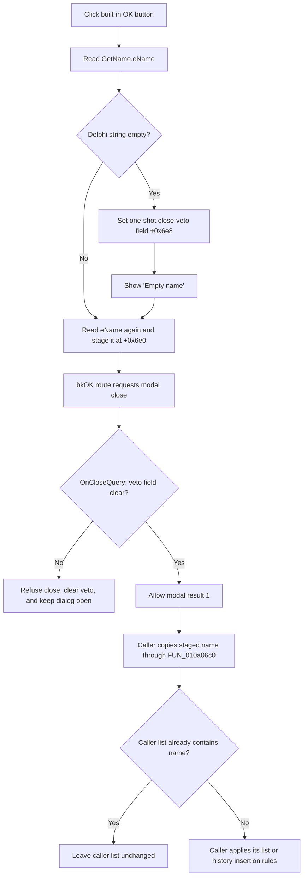

# Accept a non-empty name

> Analysis status: Source-reviewed. The DFM, OK handler, form lifecycle, staged-value getter, and two recovered callers establish the behavior below.

## Control

| Property | Recovered value |
| --- | --- |
| Form | GetName |
| Form caption | Get Name |
| Component path | GetName.BitBtn1 |
| Control class | TBitBtn |
| Button kind | bkOK |
| Handler name | BitBtn1Click |
| Handler address | 010a05c0 |
| Graph node | `resource:dfm:GetName/GetName.BitBtn1` |
| Handler node | `function:010a05c0` |
| Graph layer | UI |

The DFM does not store a separate caption, hint, text, action, image, glyph, `Default`, or `ModalResult` property for this button. Its built-in `bkOK` kind identifies the accepted-dialog route. Both recovered callers confirm that route by treating modal result `1` as acceptance.

## What happens when clicked

`FUN_010a05c0` reads the current text from `eName`, the `TEdit` at form field `+0x6b0`. It then performs these operations in order:

1. Sets Boolean field `+0x6e8` when the recovered Delphi `UnicodeString` is empty.
2. Calls `FUN_016fd940` with the literal **Empty name** when that field was set.
3. Reads `eName` again and assigns the text to the dialog-owned staged string at `+0x6e0`.

The handler does not trim or normalize the input. It only tests whether the Delphi string is empty. A name that contains only spaces is therefore not rejected by this code. The second read and assignment happen after the warning path, so even an empty attempt replaces the staged string with empty text.

The handler itself does not set a modal result or close the form. The button's recovered `bkOK` behavior initiates the accepted close. The form-level close query decides whether that close can finish.

## Close validation and retry behavior

`FUN_010a0690`, bound to `GetName.OnCloseQuery`, writes `CanClose = true` only when field `+0x6e8` is clear. It then clears the field on every close query.

- A non-empty OK click leaves the field clear. The close query permits the form to close with the accepted result.
- An empty OK click sets the field. The warning is shown, and the next close query refuses the close. The edit form remains open.
- The refused close clears the field. A later empty OK click sets it again and is refused again.
- Cancel and the window close route have no recovered click handler that sets this field. They are therefore allowed after form creation or after a refused empty attempt.

`FUN_010a06b0`, bound to `GetName.OnCreate`, initializes the field to clear. This makes the veto specific to an empty OK attempt. It is not a permanent invalid-state flag.

## Accepted output and caller ownership

The dialog owns the staged string at `+0x6e0`. `FUN_010a06c0` copies that string into caller-provided storage. The two recovered users follow the same ownership pattern:

1. Allocate a fresh `TGetName` instance with their main form as owner.
2. Set the dialog caption and the name label; one caller also enables and fills the optional hint label.
3. Run the dialog modally;
4. call `FUN_010a06c0` only when the modal result is `1`;
5. use the copied caller-owned string; and
6. destroy the dialog and finalize the local string.

`FUN_010a5240` uses **Add Voltage/Current**, label **Voltage/Current:**, and hint **Hint: V(p,n)**. `FUN_010a6770` uses **Add to history** and label **Name:**. A cancel or window close does not copy the staged value to either caller, even if a prior refused OK attempt changed it.

## Duplicate handling and later effects

The GetName dialog does not search for duplicates. Duplicate handling belongs to each caller after an accepted result:

- `FUN_010a5040` searches the Voltage/Current string list and adds the accepted text only when the search returns `-1`.
- `FUN_010a68b0` applies the same `-1` test to the History list. An existing name therefore skips the additional eligibility checks and the list or history-model update.

Both paths silently leave their respective list unchanged for a duplicate. The dialog shows no duplicate-name warning and returns no duplicate status. The callers still run their common debugger-view refresh after the modal dialog returns, including cancel and duplicate paths.

The History insertion path has additional recovered eligibility checks for a name that is not already in the list. Their exact user-facing rule is outside this control's validation boundary, so this article does not label them as GetName validation.

## Click and close flow

## Errors, partial state, and no-op cases

- Repeated empty OK attempts repeat the warning and close refusal. They are not no-ops.
- A duplicate accepted name closes the dialog normally. The downstream list check makes the insertion a silent no-op.
- The handler accepts no explicit duplicate list and does not check reserved characters, length, case, whitespace-only input, or file-system validity.
- The handler, close query, and getter have no recovered local exception catch or rollback. If the warning, second control-text read, or string assignment fails, the form can retain only the earlier state changes.
- `FUN_010a06c0` performs a Delphi string assignment into caller storage. It does not transfer ownership of the dialog's field or return a separate success code.

## Persistence boundary

The click writes only the dialog's staged string and one-shot close-veto field. The accepted callers can update current debugger lists and, for accepted History entries, an in-memory history object. No inspected GetName, caller, or duplicate-check path writes a project file, settings file, registry value, database, undo record, or modified flag. Durable persistence of an accepted name is not proved.

## Source evidence

- [OK handler `FUN_010a05c0`](../../../DecompiledSources/Tina16/functions/00000000010A05C0__FUN_010a05c0.c) reads `eName`, tests empty text, shows **Empty name**, sets the veto field, and stages the second text read.
- [Close-query handler `FUN_010a0690`](../../../DecompiledSources/Tina16/functions/00000000010A0690__FUN_010a0690.c) derives `CanClose` from the one-shot field and clears it.
- [Form-create handler `FUN_010a06b0`](../../../DecompiledSources/Tina16/functions/00000000010A06B0__FUN_010a06b0.c) initializes the field to clear.
- [Staged-name getter `FUN_010a06c0`](../../../DecompiledSources/Tina16/functions/00000000010A06C0__FUN_010a06c0.c) copies form field `+0x6e0` to caller storage.
- [Add Voltage/Current caller `FUN_010a5240`](../../../DecompiledSources/Tina16/functions/00000000010A5240__FUN_010a5240.c) configures, runs, conditionally reads, destroys, and refreshes around the modal dialog.
- [Voltage/Current duplicate guard `FUN_010a5040`](../../../DecompiledSources/Tina16/functions/00000000010A5040__FUN_010a5040.c) adds only when its list search returns `-1`.
- [Add to History caller `FUN_010a6770`](../../../DecompiledSources/Tina16/functions/00000000010A6770__FUN_010a6770.c) proves the second accepted/cancel ownership path.
- [History duplicate guard `FUN_010a68b0`](../../../DecompiledSources/Tina16/functions/00000000010A68B0__FUN_010a68b0.c) skips an existing list entry before later eligibility and model-update work.
- [Recovered Delphi resource evidence](../../../DecompiledSources/Tina16/resources/dfm/ui-evidence.json) supplies the form caption, `eName`, button kind, and OnClick, OnCreate, and OnCloseQuery bindings.

## Analysis limits and ownership

- This Bead owns the direct OK handler `FUN_010a05c0`, form close-query handler `FUN_010a0690`, form-create initializer `FUN_010a06b0`, and staged-name getter `FUN_010a06c0`.
- Generic VCL text access, dialog construction, caption and label setters, message display, modal execution, and object cleanup are evidence only here.
- The sibling GetValue dialog uses different handlers and lifecycle fields. It does not share these four function addresses.
- Caller-side duplicate guards and debugger refresh functions are documented as downstream evidence, not as GetName functions.
