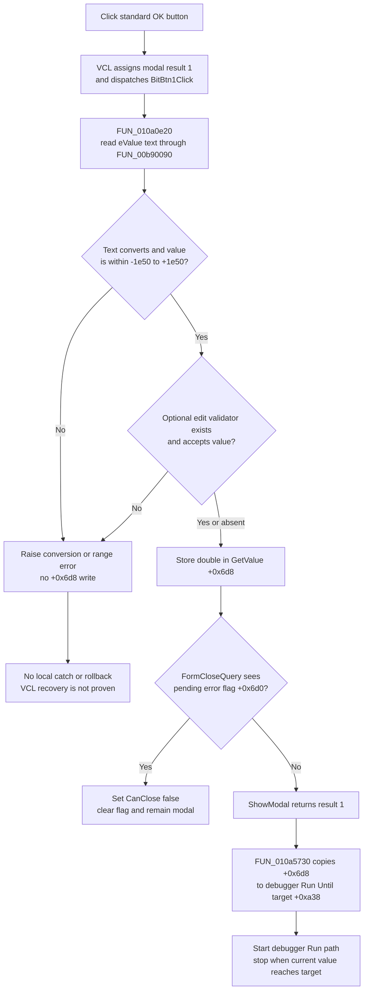

# Accept a numeric run-until value

> Analysis status: Complete. The recovered DFM, OK handler, float-edit parser, form error lifecycle, and sole dialog caller support this explanation.

## Control

| Property | Recovered value |
| --- | --- |
| Form | GetValue |
| Component path | GetValue.BitBtn1 |
| Control class | TBitBtn |
| Caption | Supplied by `Kind = bkOK`; no custom caption is present. |
| Hint | Not present in the recovered resource. |
| Numeric editor | GetValue.eValue (`TFloatEdit`) |
| Nearby label | Value: |
| Handler name | BitBtn1Click |
| Handler address | 010a0e20 |
| Graph node | `resource:dfm:GetValue/GetValue.BitBtn1` |
| Handler node | `function:010a0e20` |
| Graph layer | UI |

`BitBtn1` has `Kind = bkOK` and `NumGlyphs = 2`. These are standard VCL button-kind properties, not an extracted custom glyph. The nearby `Value:` label agrees with the `eValue` data flow, but the source and caller establish the control purpose.

## What happens when clicked

The VCL gives a `bkOK` button modal result `1`. Its inherited click path copies that result to the parent form and then dispatches `BitBtn1Click`. `FUN_010a0e20` reads the text from `eValue` through `FUN_00b90090`. When parsing and validation succeed, the handler stores the resulting 64-bit floating-point value at GetValue form field `+0x6d8`. This field is the dialog's staged result.

The float-edit getter reads the current Unicode text and calls the recovered numeric parser. That parser supports the normal floating-point conversion path and recovered engineering-suffix forms. The exact accepted suffix strings are not named in the recovered source. The getter then applies these checks:

- a value below `-1e50` or above `+1e50` raises a formatted range error;
- when the edit has an optional validator callback, a false result raises a formatted validation error; and
- only a successful value is stored in the edit's numeric cache and returned to `BitBtn1Click`.

The GetValue DFM and recovered form setup do not show an instance-specific validator callback. Therefore, the callback is a proven `TFloatEdit` capability, but an additional GetValue-specific numeric restriction is not proven.

`FormCreate` calls the float-edit setter with `0`. The setter stores zero in the edit's numeric cache, formats it with the edit's current numeric-format properties, and writes the formatted text. Thus, a newly created dialog starts with a zero value in `eValue`.

## Validation and close behavior

`eValue.OnError` resolves to `FUN_010a0e50`. It reads the error message stored in the `TFloatEdit` and forwards it through GetValue-specific helper `FUN_010a0dc0`. The shared presenter displays the first pending message and sets form flag `+0x6d0`. A second edit error while that flag is set does not display another message.

`GetValue.OnCloseQuery` resolves to `FUN_010a0e70`. It sets `CanClose` to true only when flag `+0x6d0` is clear. It then clears the flag in all cases. Therefore, a reported edit error vetoes one close attempt and leaves the dialog open for correction. A later close attempt can succeed unless the edit reports another error.

This error-event path and the direct parser path are separate in the recovered code. If `FUN_00b90090` raises during syntax conversion, range checking, or an optional callback, control does not reach the `+0x6d8` assignment. The OK handler has no local exception catch, fallback value, or rollback. The source does not prove that each direct parser exception also invokes `eValue.OnError`, so the exact VCL exception recovery after such an error remains outside this handler.

## Caller copy-back and downstream use

The sole recovered constructor call for this GetValue class is `FUN_010a5730`, the Verilog-A debugger's Run Until toolbar handler. It shows the dialog modally and checks the returned modal result:

- when the result is `1`, it copies GetValue field `+0x6d8` directly to debugger field `+0xa38`, then calls the debugger Run handler; and
- for any other result, it does not copy the staged value and does not start that Run path.

The caller destroys the dialog after `ShowModal` returns. The dialog does not write directly to the debugger or to persistent storage.

The debugger's recovered stop predicate compares field `+0xa38` with the current simulation value. It returns true when the current value reaches or exceeds the target. Target value `-1.0` disables this condition, and another debugger helper resets the field to `-1.0`. This establishes `+0xa38` as a live Run Until target, not a saved preference.

## Cancel, repeated attempts, and failure boundaries

- `BitBtn2` has `Kind = bkCancel` and no `OnClick` handler. It does not parse `eValue` or stage a new result.
- A normal Cancel result is not `1`, so the sole caller ignores any value already present at `+0x6d8`.
- Because `FormCloseQuery` is form-wide, a pending edit-error flag can veto one Cancel close attempt too. The flag is then clear for the next attempt unless a new error occurs.
- If an OK attempt stages a value but close is later vetoed by a pending edit error, the value remains staged inside the still-open dialog. A later successful OK parses and overwrites it. A later Cancel causes the caller to ignore it.
- Invalid conversion or range failure occurs before the staged-result write. The handler has no partial write to the debugger because caller copy-back happens only after a modal result of `1` returns.
- The parser, message presenter, modal loop, and caller have no recovered status-based error return in this path. Exceptions have no local transaction or rollback.
- No function in this path writes an INI file, registry value, project file, or document. State lasts only in the dialog and the live debugger target.

## Click flow

## Source evidence

- [TBitBtn kind setter `FUN_0082bc30`](../../../DecompiledSources/Tina16/functions/000000000082BC30__FUN_0082bc30.c) maps `bkOK` to modal result `1`, its standard caption and glyph, and the default-button state. [The inherited custom-button click `FUN_00687f30`](../../../DecompiledSources/Tina16/functions/0000000000687F30__FUN_00687f30.c) copies that modal result to the parent form before it dispatches `OnClick`.
- [OK handler `FUN_010a0e20`](../../../DecompiledSources/Tina16/functions/00000000010A0E20__FUN_010a0e20.c) passes `eValue` at form field `+0x6b0` to the float-edit getter and stores the returned double at form field `+0x6d8`.
- [Float-edit getter `FUN_00b90090`](../../../DecompiledSources/Tina16/functions/0000000000B90090__FUN_00b90090.c) reads the control text, parses it, checks the inclusive `-1e50` to `+1e50` range, invokes an optional validator, stores the successful numeric cache, and raises on failure.
- [Numeric parser `FUN_00b8f030`](../../../DecompiledSources/Tina16/functions/0000000000B8F030__FUN_00b8f030.c) performs floating-point conversion and handles the recovered suffix forms.
- [Edit error handler `FUN_010a0e50`](../../../DecompiledSources/Tina16/functions/00000000010A0E50__FUN_010a0e50.c) reads the `TFloatEdit` error string at `+0x4e0` and forwards it to the form error helper.
- [GetValue error forwarder `FUN_010a0dc0`](../../../DecompiledSources/Tina16/functions/00000000010A0DC0__FUN_010a0dc0.c) binds that message to form flag `+0x6d0` through the shared one-shot presenter.
- [One-shot error presenter `FUN_01b1cf30`](../../../DecompiledSources/Tina16/functions/0000000001B1CF30__FUN_01b1cf30.c) displays the message only when the supplied flag is clear, then sets the flag.
- [Close-query handler `FUN_010a0e70`](../../../DecompiledSources/Tina16/functions/00000000010A0E70__FUN_010a0e70.c) assigns `CanClose` from the inverse of flag `+0x6d0` and then clears that flag.
- [Form-create handler `FUN_010a0e90`](../../../DecompiledSources/Tina16/functions/00000000010A0E90__FUN_010a0e90.c) initializes `eValue` through the float-edit setter with value zero.
- [Float-edit setter `FUN_00b90440`](../../../DecompiledSources/Tina16/functions/0000000000B90440__FUN_00b90440.c) stores and formats the supplied double before it writes the edit text.
- [Run Until caller `FUN_010a5730`](../../../DecompiledSources/Tina16/functions/00000000010A5730__FUN_010a5730.c) shows this class, copies qword index `0xdb` (`+0x6d8`) to debugger field `+0xa38` only after modal result `1`, starts Run, and destroys the dialog.
- [Run Until predicate `FUN_010a56d0`](../../../DecompiledSources/Tina16/functions/00000000010A56D0__FUN_010a56d0.c) tests whether the current simulation value has reached target `+0xa38`, with `-1.0` as the disabled sentinel.
- [Run Until reset `FUN_010a5710`](../../../DecompiledSources/Tina16/functions/00000000010A5710__FUN_010a5710.c) restores the target sentinel to `-1.0`.
- [Recovered Delphi resource evidence](../../../DecompiledSources/Tina16/resources/dfm/ui-evidence.json) supplies the GetValue form events, `TFloatEdit` error binding, `bkOK` and `bkCancel` kinds, and the `Value:` label.

## Analysis limits and ownership

- This Bead owns GetValue-specific OK handler `FUN_010a0e20`, edit error handler `FUN_010a0e50`, error forwarder `FUN_010a0dc0`, close-query handler `FUN_010a0e70`, and form-create handler `FUN_010a0e90`.
- Generic float-edit getter `FUN_00b90090`, numeric parser `FUN_00b8f030`, float-edit setter `FUN_00b90440`, and one-shot error presenter `FUN_01b1cf30` are cited as shared evidence and are not redefined in this annotation fragment.
- Run Until caller `FUN_010a5730`, stop predicate `FUN_010a56d0`, reset helper `FUN_010a5710`, and Run handler are part of the debugger feature and remain evidence-only here.
- No GetValue result getter is recovered. The sole caller directly reads field `+0x6d8` after modal result `1`.
- The Delphi names of form fields `+0x6d0`, `+0x6d8`, and debugger field `+0xa38` are not recovered. Their roles follow from their writers and readers.
