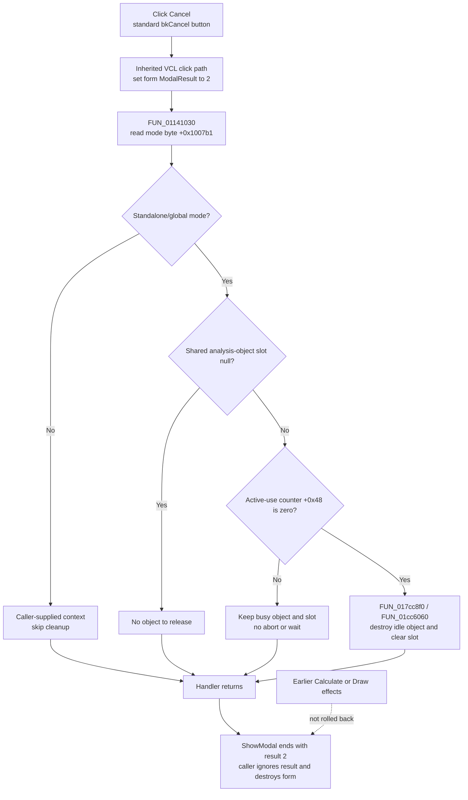

# Cancel the Fourier Series dialog

> Analysis status: Complete. The DFM button kind, VCL modal-button path, form constructor, Cancel handler, guarded lifetime helpers, Calculate and Draw handlers, and both modal callers support this explanation.

## Control

| Property | Recovered value |
| --- | --- |
| Form | HarmonicDistorsionDlg |
| Form caption | Fourier Series |
| Component path | HarmonicDistorsionDlg.Panel1.CancelBtn |
| Control class | TBitBtn |
| Button kind | bkCancel |
| Caption | Supplied by the standard `bkCancel` kind; no custom caption is stored in the DFM. |
| Glyph | Supplied by the standard `bkCancel` kind with `NumGlyphs = 2`; no custom glyph resource is stored. |
| Handler name | CancelBtnClick |
| Handler address | 01141030 |
| Graph node | `resource:dfm:HarmonicDistorsionDlg/HarmonicDistorsionDlg.Panel1.CancelBtn` |
| Handler node | `function:01141030` |
| Graph layer | UI |

The button kind is direct control evidence for cancellation. The recovered VCL path confirms that a `bkCancel` bit button supplies modal result `2`. The custom handler has a separate and narrower task: it tries to release one standalone analysis object.

## What happens when clicked

The inherited button-click path copies the button's modal result `2` to the form before it invokes `FUN_01141030`. The form has no recovered `OnCloseQuery` handler. After the custom handler returns, modal result `2` ends `ShowModal`; both recovered callers then destroy the dialog instance. Both callers ignore the returned modal-result value.

`FUN_01141030` reads mode byte `+0x1007b1` from the form:

- If the byte is clear, the dialog uses caller-supplied analysis context. The handler does no cleanup and returns.
- If the byte is set, the dialog uses the shared standalone analysis-object slot. The handler calls `FUN_017cc8f0` for that slot.

The constructor sets this byte only when both supplied context pointers are null. It also initializes the shared object slot to null in that mode. This proves that the byte selects standalone/global operation; it is not a running-state flag.

The shared release helper is guarded. A null slot is a no-op. For a non-null object, `FUN_01cc6060` destroys the object only when its active-use counter at `+0x48` is zero. The helper clears the shared slot only after that destruction succeeds. If the counter is nonzero, the object and slot remain intact.

This guarded release is not an analysis-abort command. The Cancel path does not decrement the use counter, signal a worker, wait for work, or force destruction. A busy standalone object can therefore remain alive after the dialog closes so that its existing owner can release it later.

## Calculate, Draw, and state boundaries

The `Calculate` button uses `FUN_01140e30`. It parses the Fourier parameters and, after validation, writes live application parameter state, adjusts the result UI, and calls the shared calculation coordinator `FUN_01142c20`. In standalone mode, that coordinator can create or reuse the shared analysis object and holds an active-use lease while it works.

Cancel does not call the parser or the calculation coordinator. Therefore:

- Cancel before Calculate does not parse pending editor text or commit Fourier parameters.
- Cancel after a successful Calculate does not restore the parameter values or result state that Calculate already changed.
- Cancel can release the standalone object only after its active-use count has returned to zero.

The `Draw` button uses `FUN_01142fd0`. It draws the calculated result and then assigns modal result `1` to the form. Cancel calls none of the Draw path and assigns no success result. If Draw already completed, its drawing side effect is not undone by a later Cancel action.

The form's edit-error path uses a separate one-shot error flag at `+0x1007b0`. Cancel does not read this flag. Invalid or uncommitted edit text does not create a Cancel veto in the recovered code.

## No-op, error, and persistence behavior

- Caller-supplied mode, a null standalone slot, and a busy standalone object are valid no-cleanup paths. They do not stop modal cancellation.
- The handler has no confirmation, status message, Boolean error result, retry, or local exception handler.
- If a cleanup exception escapes, the recovered handler has no fallback. Otherwise, modal result `2` closes the dialog even when guarded cleanup leaves a busy object alive.
- The Cancel handler writes no file, INI value, registry value, document, or settings record.
- The modal result and form instance are transient. Earlier in-memory changes made by Calculate or Draw remain because Cancel has no rollback path.

## Click flow

## Source evidence

- [Cancel handler `FUN_01141030`](../../../DecompiledSources/Tina16/functions/0000000001141030__FUN_01141030.c) tests mode byte `+0x1007b1` and calls only the shared release helper in the set branch.
- [Dialog constructor `FUN_01140920`](../../../DecompiledSources/Tina16/functions/0000000001140920__FUN_01140920.c) stores the two context pointers and sets standalone byte `+0x1007b1` only when both pointers are null.
- [Guarded slot release `FUN_017cc8f0`](../../../DecompiledSources/Tina16/functions/00000000017CC8F0__FUN_017cc8f0.c) tests the shared slot, asks whether the object can be released, and clears the slot only after successful release.
- [Idle-object release `FUN_01cc6060`](../../../DecompiledSources/Tina16/functions/0000000001CC6060__FUN_01cc6060.c) destroys the object only when counter `+0x48` is zero.
- [Use-counter increment `FUN_01cc6020`](../../../DecompiledSources/Tina16/functions/0000000001CC6020__FUN_01cc6020.c) and [use-counter decrement `FUN_01cc6080`](../../../DecompiledSources/Tina16/functions/0000000001CC6080__FUN_01cc6080.c) establish the active-use meaning of field `+0x48`.
- [Calculate handler `FUN_01140e30`](../../../DecompiledSources/Tina16/functions/0000000001140E30__FUN_01140e30.c) validates and commits Fourier parameters, changes result UI state, and calls the calculation coordinator; Cancel calls none of this path.
- [Calculation coordinator `FUN_01142c20`](../../../DecompiledSources/Tina16/functions/0000000001142C20__FUN_01142c20.c) creates or reuses the standalone object and brackets work with the shared lifetime path.
- [Draw handler `FUN_01142fd0`](../../../DecompiledSources/Tina16/functions/0000000001142FD0__FUN_01142fd0.c) draws the result and assigns modal result `1`; Cancel does neither action.
- [Embedded-context caller `FUN_011439c0`](../../../DecompiledSources/Tina16/functions/00000000011439C0__FUN_011439c0.c) supplies context pointers, calls `ShowModal`, ignores its result, and destroys the form.
- [Standalone caller `FUN_01143a60`](../../../DecompiledSources/Tina16/functions/0000000001143A60__FUN_01143a60.c) supplies two null context pointers, calls `ShowModal`, ignores its result, and destroys the form.
- [VCL bit-button kind setter `FUN_0082bc30`](../../../DecompiledSources/Tina16/functions/000000000082BC30__FUN_0082bc30.c) maps `bkCancel` to the standard Cancel button properties and modal result `2`.
- [Inherited button click `FUN_00687f30`](../../../DecompiledSources/Tina16/functions/0000000000687F30__FUN_00687f30.c) copies a nonzero button modal result to the owning form before the event callback.
- [Edit-error callback `FUN_01141150`](../../../DecompiledSources/Tina16/functions/0000000001141150__FUN_01141150.c) and [one-shot error presenter `FUN_01140a40`](../../../DecompiledSources/Tina16/functions/0000000001140A40__FUN_01140a40.c) use validation state that the Cancel handler does not test.
- [Recovered Delphi resource evidence](../../../DecompiledSources/Tina16/resources/dfm/ui-evidence.json) supplies the form caption, `TBitBtn` class, `bkCancel`, `NumGlyphs = 2`, and `OnClick` binding.

## Analysis limits and ownership

- This Bead annotates only `FUN_01141030`, the unique Cancel wrapper.
- The shared lifetime helpers `FUN_017cc8f0`, `FUN_01cc6060`, `FUN_01cc6020`, and `FUN_01cc6080` are evidence only because other application paths use them.
- Beads `.625` and `.626` own the Draw and Calculate analysis paths. This article cites those paths without adding graph annotations for them.
- The original Delphi names for mode byte `+0x1007b1`, error byte `+0x1007b0`, the shared object slot, and counter `+0x48` are not recovered. Their roles are established from constructor branches, readers, writers, and lifetime call sites.
