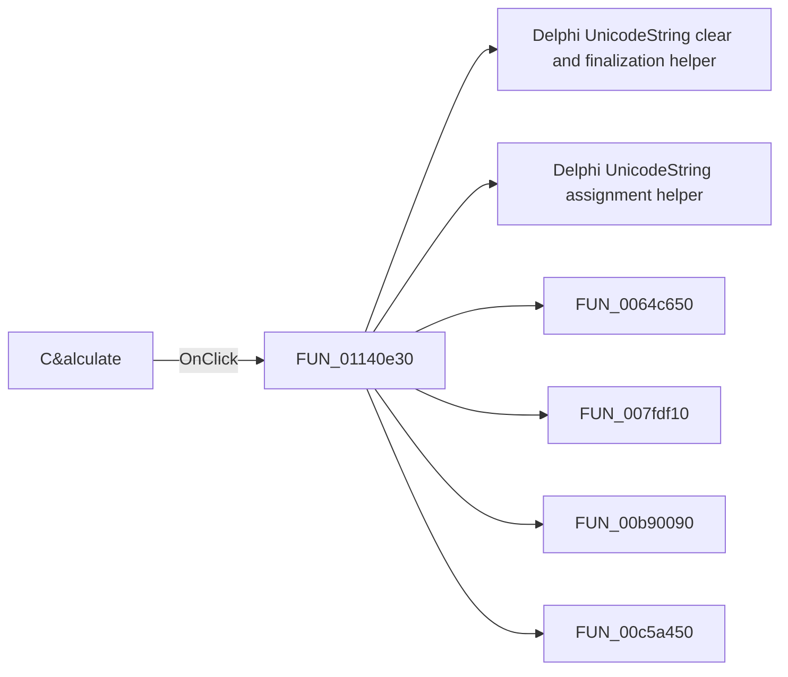

# C&alculate

> Analysis status: Pending individual source review.

## Control

| Property | Recovered value |
| --- | --- |
| Form | HarmonicDistorsionDlg |
| Component path | HarmonicDistorsionDlg.Panel1.OKBtn |
| Control class | TBitBtn |
| Caption | C&alculate |
| Hint | Not present in the recovered resource. |
| Text | Not present in the recovered resource. |
| Handler name | OKBtnClick |
| Handler address | 01140e30 |
| Graph node | `resource:dfm:HarmonicDistorsionDlg/HarmonicDistorsionDlg.Panel1.OKBtn` |
| Handler node | `function:01140e30` |
| Graph layer | UI |

## What happens when clicked

Pending individual analysis. An agent must read the recovered handler source and its relevant callees before it replaces this text.

## Click flow

## Handler evidence

- Source: [DecompiledSources/Tina16/functions/0000000001140E30__FUN_01140e30.c](../../../DecompiledSources/Tina16/functions/0000000001140E30__FUN_01140e30.c)
- Recovered role: Not present in the recovered resource.
- Current graph summary: Handles 1 Delphi UI event: HarmonicDistorsionDlg.Panel1.OKBtn.OnClick.
- Current graph behavior: Not present in the recovered resource.
- Current graph evidence: Not present in the recovered resource.
- Complexity: complex
- Distinct outgoing calls: 8

## Direct calls

- `function:00414480` — Delphi UnicodeString clear and finalization helper
- `function:00414ad0` — Delphi UnicodeString assignment helper
- `function:0064c650` — FUN_0064c650
- `function:007fdf10` — FUN_007fdf10
- `function:00b90090` — FUN_00b90090
- `function:00c5a450` — FUN_00c5a450
- `function:01142c20` — FUN_01142c20
- `function:01b1d750` — FUN_01b1d750

## Resource evidence

- Kind: Not present in the recovered resource.
- Modal result: Not present in the recovered resource.
- Checked state: Not present in the recovered resource.
- List items: Not present in the recovered resource.
- Image reference: Not present in the recovered resource.
- Extracted glyph: None.

## Nearby label candidates

Nearby labels are layout candidates only. They are not proof of behavior.

- Rank 1: Number of &samples at distance 257.
- Rank 2: &Base frequency at distance 266.
- Rank 3: Number of &harmonics at distance 282.

## Analysis limits

- Do not infer behavior from the control class, caption, hint, glyph, or nearby label alone.
- Do not replace the pending status until the handler source and relevant call path provide enough evidence.
