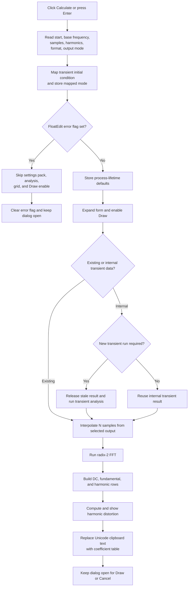

# Calculate Fourier coefficients and harmonic distortion

## Control

| Property | Recovered value |
| --- | --- |
| Form | HarmonicDistorsionDlg |
| Component path | HarmonicDistorsionDlg.Panel1.OKBtn |
| Control class | TBitBtn |
| Caption | C&alculate |
| Default button | true |
| Kind, modal result, hint, image, or glyph | Not present in the recovered resource |
| Handler name | OKBtnClick |
| Handler address | 01140e30 |
| Graph node | `resource:dfm:HarmonicDistorsionDlg/HarmonicDistorsionDlg.Panel1.OKBtn` |
| Handler node | `function:01140e30` |
| Graph layer | UI |

## Inputs and settings

Despite its name, `OKBtn` is the **Calculate** command. It reads these controls:

| Control | Recovered use |
| --- | --- |
| Sampling start time | Start of the sampled time window |
| Base frequency | Fundamental frequency and sampling-period input |
| Number of samples | List index plus `7`; sample count is `1 << exponent`, which maps the listed values 128 through 65536 |
| Number of harmonics | Highest harmonic included in the table and distortion sum |
| Format | Coefficient representation used in the result columns |
| Output | Signal selected from the available transient outputs |
| Transient initial condition | Analysis mode, remapped before it is sent to the transient engine |

The transient-initial-condition radio items use this mapping:

| UI item | Stored engine value |
| --- | --- |
| Calculate operating point | `1` |
| Use initial conditions | `2` |
| Zero initial values | `0` |

The handler stores the current values in form fields first. It then copies the packed start time, base frequency, sample exponent, harmonic count, and format to shared process state. It stores the mapped transient mode in the same shared state and, after output lookup succeeds, stores the selected output name. `FormCreate` reads these values when a later Fourier Series dialog opens, so they act as process-lifetime defaults.

## Validation and rejected execution

The Start time and Base frequency controls are `TFloatEdit` controls. Their value getter parses the text, applies the control's range check, and invokes the registered validation callback. These operations can raise a validation exception. The controls also bind `OnError` to a shared path that shows the first error message and sets the form error byte.

After reading the controls and mapping the transient radio item, Calculate tests this error byte. If it is set, it skips the packed-settings copy, output lookup, result-panel expansion, Fourier calculation, and grid update. It clears the error byte before it returns. The mapped transient mode is written before this test, so that one shared value can change even on the rejected path.

The Calculate handler has no additional checks for an unselected list item or radio item. For example, a Samples index of `-1` produces exponent `6`, and a transient-mode index of `-1` maps to `0`. Normal UI use limits these values through the drop-down lists and radio group, but the handler does not enforce their ranges itself.

`FormCreate` enables Calculate only when at least one output item is available. This prevents the normal user path from calculating without an output, but the handler itself has no second output-count guard.

## Analysis execution

On the accepted path, the handler expands and recenters the form, enables **Draw**, records the selected output text, and calls the harmonic-results coordinator.

The coordinator uses one of two transient-data sources:

- If the form was created with existing transient data, it samples that data directly.
- If it was created without data, it runs or reuses an internal transient result. A change to start time, base frequency, sample count, output, or transient initial condition invalidates the applicable cached data. The coordinator releases stale internal transient data before a new run.

The Fourier sampler calculates `N = 1 << sampleExponent` and a sampling interval of `1 / (N * baseFrequency)`. It interpolates the selected output from the requested start time into an `N`-sample complex buffer and runs the recovered radix-2 FFT in place.

## Results and clipboard output

The result publisher rebuilds the **Fourier coefficients** grid. It creates the format-specific headings, then adds the DC row, fundamental row, and harmonic rows through the requested harmonic count. Each complex coefficient is divided by `N` before it is formatted.

The **Harmonic distortion** value excludes DC and the fundamental. For harmonics `2` through the requested maximum, it calculates:

`100 * sqrt(sum(harmonicMagnitude^2)) / fundamentalMagnitude`

It formats the value with five significant digits and a percent suffix. If the fundamental magnitude is zero, it shows a recovered placeholder instead of dividing by zero.

The publisher also builds a text representation of the coefficient table and writes it to the process-wide VCL clipboard wrapper as Unicode text. This means Calculate replaces the current Unicode clipboard content as part of a successful result publication. The handler does not wait for **Draw** before it does this.

## Click flow

## Draw, Cancel, and input-change interaction

- **Draw** is disabled when the form is created. A normal Calculate path enables it before the result coordinator runs.
- Draw converts the current coefficient buffer to a diagram series, uses Base frequency for the x-axis spacing, publishes the series, and sets modal result `1`. That is the path that closes the dialog with a drawn result.
- **Cancel** is a separate `bkCancel` button. In the internal-transient mode, its handler releases the stored transient result before the standard modal cancellation closes the dialog.
- The form has no recovered `OnCloseQuery` handler. Calculate itself sets no modal result and does not request closure.
- A change to Start time, Base frequency, Samples, Output, or the transient-initial-condition radio group marks the transform or source data dirty. It invalidates the published result, collapses the result area, and disables Draw.
- A change to Format or Number of harmonics collapses the result area and disables Draw without invalidating the transform buffer. The next Calculate can reuse the coefficients and only rebuild their presentation and distortion range.

## Error, cleanup, and partial-state behavior

- The handler and result pipeline have no local retry, rollback, or status message for an analysis failure. They also do not catch an exception from either FloatEdit getter, so such an exception can stop the click before its later error-byte reset.
- Shared defaults, the expanded layout, selected-output global, and Draw enabled state are updated before the result coordinator finishes. If the transient run, interpolation, FFT, grid update, or clipboard write raises, some of those changes can remain while the table is incomplete or stale.
- The internal-run helper returns a success Boolean, but the recovered coordinator does not test it before it continues to the result publisher. A lower-level failure can therefore reach later result code unless the lower-level routine raises or handles the failure itself.
- Temporary FFT and transient-access objects are destroyed on their recovered normal-return paths. There is no local `try/finally` in Calculate that proves the same cleanup after an exception.
- Cancel does not restore shared defaults or clipboard data written by an earlier Calculate. Its specific cleanup concerns the internal transient result.

## Persistence boundary

Calculate writes process-wide Fourier-analysis defaults and the system clipboard. It does not write a project file, result file, registry value, or INI file. The shared defaults can affect later dialog instances in the same process, but this path does not prove persistence after application exit. A later Draw command publishes a diagram series; Calculate alone only updates the dialog results and clipboard.

## Evidence

- [Calculate handler `FUN_01140e30`](../../../DecompiledSources/Tina16/functions/0000000001140E30__FUN_01140e30.c) reads and packs the settings, maps the transient mode, gates execution on the error byte, expands the form, enables Draw, records the output, and calls the result coordinator.
- [FormCreate `FUN_01140aa0`](../../../DecompiledSources/Tina16/functions/0000000001140AA0__FUN_01140aa0.c) loads the shared defaults, populates the output selector, restores the inverse transient-mode mapping, disables Draw, and enables Calculate only when outputs exist.
- [Float value reader `FUN_00b90090`](../../../DecompiledSources/Tina16/functions/0000000000B90090__FUN_00b90090.c), [FloatEdit error handler `FUN_01141150`](../../../DecompiledSources/Tina16/functions/0000000001141150__FUN_01141150.c), and [one-message error gate `FUN_01b1cf30`](../../../DecompiledSources/Tina16/functions/0000000001B1CF30__FUN_01b1cf30.c) establish the parse, validation, message, and error-byte path.
- [Harmonic-results coordinator `FUN_01142c20`](../../../DecompiledSources/Tina16/functions/0000000001142C20__FUN_01142c20.c) selects existing, cached, or newly run transient data and then publishes the transform results.
- [Fourier sampling coordinator `FUN_01142a60`](../../../DecompiledSources/Tina16/functions/0000000001142A60__FUN_01142a60.c), [sample interpolator `FUN_0113eac0`](../../../DecompiledSources/Tina16/functions/000000000113EAC0__FUN_0113eac0.c), and [radix-2 FFT `FUN_0113edb0`](../../../DecompiledSources/Tina16/functions/000000000113EDB0__FUN_0113edb0.c) prove the sample-count, interval, start-time, interpolation, and transform data flow.
- [Coefficient-grid and THD publisher `FUN_011423a0`](../../../DecompiledSources/Tina16/functions/00000000011423A0__FUN_011423a0.c) formats the rows, calculates the distortion percentage, sets the result label, and writes the Unicode table to the clipboard wrapper.
- [Input-change handler `FUN_01141380`](../../../DecompiledSources/Tina16/functions/0000000001141380__FUN_01141380.c) and [result-collapse helper `FUN_011413d0`](../../../DecompiledSources/Tina16/functions/00000000011413D0__FUN_011413d0.c) establish source-data invalidation, presentation-only changes, form collapse, and Draw disable behavior.
- [Draw handler `FUN_01142fd0`](../../../DecompiledSources/Tina16/functions/0000000001142FD0__FUN_01142fd0.c) builds and publishes a coefficient series and sets modal result `1`; [Cancel handler `FUN_01141030`](../../../DecompiledSources/Tina16/functions/0000000001141030__FUN_01141030.c) releases internal transient data in the self-run mode.
- [Recovered Delphi resource evidence](../../../DecompiledSources/Tina16/resources/dfm/ui-evidence.json) supplies the Fourier Series captions, input lists, default Calculate button, initially disabled Draw button, `bkCancel`, and event bindings. It contains no OnCloseQuery binding for this form.

## Annotation ownership and limits

- This Bead owns `FUN_01140e30`, `FUN_01142c20`, `FUN_01142a60`, and `FUN_011423a0`.
- Bead `.624` owns Cancel and its transient-result cleanup. Bead `.625` owns Draw and curve publication. Bead `.627` owns the shared change/invalidation and collapse chain. This fragment cites and omits those sibling functions.
- Form lifecycle functions, generic FloatEdit and grid operations, clipboard infrastructure, transient-engine calls, complex-number formatting, interpolation, and generic FFT helpers remain evidence-only.
- The exact lower-level failure contract for the internal transient runner is not recovered. The article does not convert its ignored Boolean into a claimed success or failure state.
