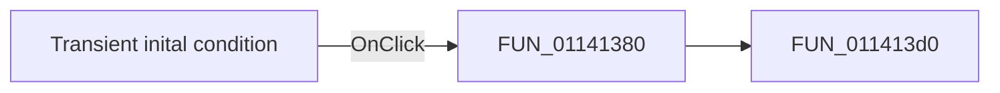

#  Transient inital condition

> Analysis status: Pending individual source review.

## Control

| Property | Recovered value |
| --- | --- |
| Form | HarmonicDistorsionDlg |
| Component path | HarmonicDistorsionDlg.Panel1.rgTRControls |
| Control class | TRadioGroup |
| Caption |  Transient inital condition  |
| Hint | Not present in the recovered resource. |
| Text | Not present in the recovered resource. |
| Handler name | EditChange |
| Handler address | 01141380 |
| Graph node | `resource:dfm:HarmonicDistorsionDlg/HarmonicDistorsionDlg.Panel1.rgTRControls` |
| Handler node | `function:01141380` |
| Graph layer | UI |

## What happens when clicked

Pending individual analysis. An agent must read the recovered handler source and its relevant callees before it replaces this text.

## Click flow

## Handler evidence

- Source: [DecompiledSources/Tina16/functions/0000000001141380__FUN_01141380.c](../../../DecompiledSources/Tina16/functions/0000000001141380__FUN_01141380.c)
- Recovered role: Not present in the recovered resource.
- Current graph summary: Handles 4 Delphi UI events: HarmonicDistorsionDlg.Panel1.rgTRControls.OnClick, HarmonicDistorsionDlg.Panel1.OutputSelectorCB.OnChange, HarmonicDistorsionDlg.Panel1.BaseFreqEdit.OnChange.
- Current graph behavior: Not present in the recovered resource.
- Current graph evidence: Not present in the recovered resource.
- Complexity: simple
- Distinct outgoing calls: 1

## Direct calls

- `function:011413d0` — FUN_011413d0

## Resource evidence

- Kind: Not present in the recovered resource.
- Modal result: Not present in the recovered resource.
- Checked state: Not present in the recovered resource.
- List items: ("Calculate operating point", "Use initial conditions", "Zero initial values")
- Image reference: Not present in the recovered resource.
- Extracted glyph: None.

## Nearby label candidates

Nearby labels are layout candidates only. They are not proof of behavior.

- Rank 1: &Output at distance 24.
- Rank 2: &Format at distance 50.
- Rank 3: Number of &harmonics at distance 77.

## Analysis limits

- Do not infer behavior from the control class, caption, hint, glyph, or nearby label alone.
- Do not replace the pending status until the handler source and relevant call path provide enough evidence.
