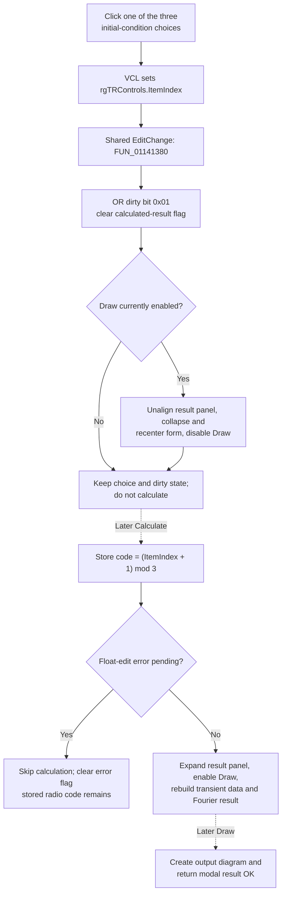

# Choose the transient initial condition

> Analysis status: Complete for the recovered control boundary. The radio choice, dirty-state split, result-panel invalidation, Calculate commit, transient-analysis use, Draw dependency, and XML conversion paths are recovered. The click does not itself validate, calculate, close, or write a file.

## Control

| Property | Recovered value |
| --- | --- |
| Form | HarmonicDistorsionDlg |
| Form caption | Fourier Series |
| Component path | HarmonicDistorsionDlg.Panel1.rgTRControls |
| Control class | TRadioGroup |
| Caption | ` Transient inital condition ` |
| Items | Calculate operating point; Use initial conditions; Zero initial values |
| Handler name | EditChange |
| Handler address | 01141380 |
| Graph node | `resource:dfm:HarmonicDistorsionDlg/HarmonicDistorsionDlg.Panel1.rgTRControls` |
| Handler node | `function:01141380` |
| Graph layer | UI |

The caption contains the recovered spelling `inital`. The radio group has no hint, glyph, explicit DFM `ItemIndex`, or explicit disabled state. FormCreate sets its runtime selection from the current harmonic-distortion setting.

## Radio selection mapping

The UI index and stored transient-condition code use different orders:

| Radio index | Displayed choice | Stored code |
| ---: | --- | ---: |
| 0 | Calculate operating point | 1 |
| 1 | Use initial conditions | 2 |
| 2 | Zero initial values | 0 |

FormCreate restores the radio index as `(stored code + 2) mod 3`. The Calculate handler stores it as `(ItemIndex + 1) mod 3`. These formulas prove both directions of the mapping; the labels alone are not the basis for it.

The resource has no static selected item. The selection therefore comes from the current setting at offset `0x82b` in the shared analysis-parameter record. FormCreate resets the dialog's dirty byte after it initializes the controls.

## What happens when clicked

The VCL first changes `rgTRControls.ItemIndex`. Shared `EditChange` handler `FUN_01141380` then performs three state changes:

1. It identifies the sender. Only `OutputSelectorCB` sets dirty bit `0x02`; this radio group is every other sender and sets dirty bit `0x01`.
2. It clears the dialog's calculated-result flag at `+0x1007b2`.
3. It calls result invalidator `FUN_011413d0`.

Dirty bit `0x01` means that the transient data itself must be rebuilt. This distinction matters in the later calculation coordinator: an output-only change can reuse an existing transient session, but a radio change forces the active session to be released and rebuilt before Fourier coefficients are generated.

The handler is shared with `StartTimeEdit`, `BaseFreqEdit`, `SamplesCB` through its forwarding handler, and `OutputSelectorCB`. It does not inspect the selected radio index. The VCL radio group enforces the three user choices; the handler only records which class of input changed.

## Existing result invalidation

`FUN_011413d0` first tests whether `DrawBtn` is enabled. This is also the recovered indication that a calculated result is currently available.

- If Draw is already disabled, the function returns. The new radio selection and dirty flags remain, but no layout property changes.
- If Draw is enabled, it enters a resize guard, changes the lower result panel from client alignment to no alignment, resets the form's vertical scroll range, shrinks the form to the input-panel height, recenters it, and disables Draw. It then clears the resize guard.

The function does not change `Visible` on the radio group, input panel, or result panel. The prior Fourier table stops being visible because the dialog is collapsed and the result panel is no longer client-aligned. The radio group and other input controls remain enabled.

## Calculate and Draw interactions

The button named `OKBtn` has recovered caption **Calculate**. Pressing it reads all input controls and writes the radio choice to the shared analysis-parameter record with the mapping above. This write occurs before the handler checks the dialog's float-edit error flag.

- If the error flag is set, Calculate skips result-panel expansion and skips the calculation coordinator. It then clears the error flag. The radio mode has already been stored, but no new result is produced.
- If there is no input error, Calculate expands and recenters the form, enables Draw, aligns the result panel to the client area, and calls `FUN_01142c20`.
- Because the radio click cleared the calculated flag and set dirty bit `0x01`, the coordinator enters its transient-data path. In live-session mode it releases the old session, applies the current analysis parameters, rebuilds transient data, and then computes the Fourier result. In the alternate preloaded-data path it performs the corresponding local calculation. The coordinator clears the dirty byte after it updates the result grid.

Draw does not read `rgTRControls` directly. It uses the already calculated harmonic-distortion data, creates the requested output diagram, sets the form modal result to OK, and closes the dialog. Because a radio click disables Draw when an old result exists, the ordinary UI path requires Calculate again before that changed mode can reach Draw.

Cancel is a separate `bkCancel` path. A radio click has not written the shared mode, so Cancel before Calculate leaves the previously stored mode unchanged. Cancel can also terminate the temporary transient session used by the standalone calculation mode; it does not call this radio handler.

## Click flow

## Validation, errors, and repeat behavior

- All three user-selectable radio indices are accepted. The click handler has no range check, error message, exception catch, or rollback.
- The later Calculate mapping also has no explicit radio-index validation. A programmatic `ItemIndex = -1` maps to stored code zero under the recovered formula; normal user interaction selects one of the three valid rows.
- Start-time and base-frequency controls have separate validation and error events. Those checks do not run because of a radio click. Their existing error flag can still prevent the later calculation as described above.
- Clicking the already selected choice can invoke the same shared handler. It sets bit `0x01` again and clears the calculated flag again. Bitwise OR makes the dirty update idempotent, but an available result is invalidated on the first such call.
- The invalidator makes several UI changes under a guard but has no local exception recovery. A failure during layout work has no proved rollback. The shared analysis setting is still unchanged until Calculate.

## Persistence and downstream use

- The click changes only the radio's form-local index, dirty byte, calculated flag, and possibly the current result layout. It performs no INI, registry, file, database, or backend write.
- Calculate copies the mapped code to the shared harmonic-distortion setting at `0x82b`. During transient preparation, `FUN_01349310` copies this value to the main transient-analysis field at `0x2ad`.
- The transient netlist path passes that field as an argument of the generated `.TRAN` analysis command. Thus the choice affects how the later transient run establishes initial conditions before Fourier analysis.
- Separate XML conversion code writes the choice as parameter `icond` and restores it through the same three-value mapping. This proves that the shared setting can be persisted with serialized analysis parameters, but the radio click itself does not perform serialization. Durable persistence occurs only when that separate save or conversion path runs.

## Source evidence

- [Shared EditChange handler `FUN_01141380`](../../../DecompiledSources/Tina16/functions/0000000001141380__FUN_01141380.c) separates output-selector changes from all other senders, sets dirty bit `0x01` for this radio, clears the calculated flag, and calls the invalidator.
- [Result invalidator `FUN_011413d0`](../../../DecompiledSources/Tina16/functions/00000000011413D0__FUN_011413d0.c) checks Draw's enabled state, changes result-panel alignment, collapses and recenters the dialog, and disables Draw.
- [Form creation `FUN_01140aa0`](../../../DecompiledSources/Tina16/functions/0000000001140AA0__FUN_01140aa0.c) restores `(stored + 2) mod 3`, captures the result-panel height, and resets dirty state.
- [Calculate handler `FUN_01140e30`](../../../DecompiledSources/Tina16/functions/0000000001140E30__FUN_01140e30.c) stores `(ItemIndex + 1) mod 3`, handles the existing input-error flag, expands the result area, enables Draw, and calls the calculation coordinator.
- [Calculation coordinator `FUN_01142c20`](../../../DecompiledSources/Tina16/functions/0000000001142C20__FUN_01142c20.c) uses dirty bit `0x01` to select transient-session rebuild instead of reuse and clears the dirty byte after result generation.
- [Draw handler `FUN_01142fd0`](../../../DecompiledSources/Tina16/functions/0000000001142FD0__FUN_01142fd0.c) uses calculated data, creates the output diagram, and sets modal result OK.
- [Analysis preparation `FUN_01349310`](../../../DecompiledSources/Tina16/functions/0000000001349310__FUN_01349310.c) copies the harmonic-distortion initial-condition code to the main transient-analysis field, and [transient netlist generation `FUN_01532880`](../../../DecompiledSources/Tina16/functions/0000000001532880__FUN_01532880.c) supplies that value to `.TRAN`.
- [XML export `FUN_01295950`](../../../DecompiledSources/Tina16/functions/0000000001295950__FUN_01295950.c) and [XML import `FUN_01296780`](../../../DecompiledSources/Tina16/functions/0000000001296780__FUN_01296780.c) serialize and restore parameter `icond` with the radio mapping.
- [Recovered Delphi resource evidence](../../../DecompiledSources/Tina16/resources/dfm/ui-evidence.json) supplies the radio caption, item order, event binding, Calculate and Draw captions, Draw's disabled DFM state, and the related edit validation events.

## Analysis ownership

- `.627` owns shared change handler `FUN_01141380` and result invalidator `FUN_011413d0`.
- Sibling `.624` owns the Cancel handler. `.625` owns Draw and diagram-output functions. `.626` owns Calculate and the calculation coordinator. This article cites and omits those sibling-owned functions.
- Generic VCL radio, alignment, form-size, centering, and scrollbar helpers remain evidence-only.
