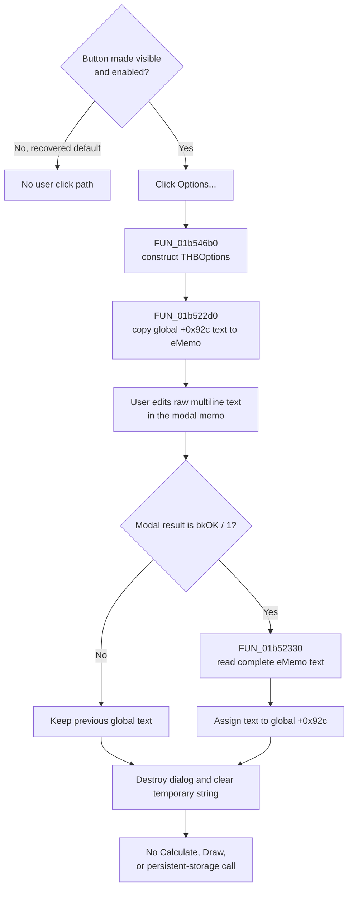

# Edit the harmonic-balance options text

> Analysis status: Complete. The DFM, `THBOptions` published fields, modal-result branch, text transfer helpers, and parent Calculate and Draw handlers support this explanation.

## Control

| Property | Recovered value |
| --- | --- |
| Form | HBAnalysisDlgDiscrete |
| Component path | HBAnalysisDlgDiscrete.Panel1.bOptions |
| Control class | TButton |
| Caption | Options... |
| Enabled | `false` in the recovered DFM |
| Visible | `false` in the recovered DFM |
| Handler name | bOptionsClick |
| Handler address | 01b546b0 |
| Graph node | `resource:dfm:HBAnalysisDlgDiscrete/HBAnalysisDlgDiscrete.Panel1.bOptions` |
| Handler node | `function:01b546b0` |
| Graph layer | UI |

The recovered form resource creates this plain button as both hidden and disabled. No recovered `THBAnalysisDlgDiscrete` method changes its published `bOptions` field to visible or enabled. The click behavior therefore applies if another build, unrecovered path, or direct program call makes the command available; it is not reachable through the recovered default form state.

## What happens when clicked

`FUN_01b546b0` constructs a modal `THBOptions` form. Before it shows the form, `FUN_01b522d0` copies the process-global Unicode string at application-state offset `+0x92c` into the form's `eMemo` text property. This existing value, not a DFM literal, is the editor's initial text.

The nested form contains only these controls:

| Component | Recovered purpose |
| --- | --- |
| `eMemo` | An editable, multiline `TMemo` aligned across the top of the form. The DFM supplies no default text. |
| `BitBtn1` | A `TBitBtn` with `Kind=bkOK`. It returns modal result `1`. |
| `BitBtn2` | A `TBitBtn` with `Kind=bkCancel`. |
| `BitBtn3` | A `TBitBtn` with `Kind=bkHelp`. Its standard VCL help behavior is outside this handler. |

There are no recovered check boxes, combo boxes, typed fields, reset button, or defaults command in `THBOptions`. The control edits one raw text value. The source does not recover the option grammar or assign meanings to individual lines.

## Staging and commit

Edits remain in `eMemo` while the nested dialog is open. After the modal call returns, the handler tests for result `1` only:

- For OK, `FUN_01b52330` reads the memo's complete text into a temporary Unicode string. The handler then assigns that string to the same global field at `+0x92c`.
- For Cancel, the window close command, or any other modal result, the handler skips the memo read and global assignment. The previous global value remains in place.

The handler then destroys the temporary `THBOptions` instance and clears its temporary string. It does not compare old and new text, so accepting unchanged text still performs the assignment. It also does not reject empty text or validate individual lines. Because the value passes through VCL memo `Text` accessors, exact preservation of input line-ending representation is not proven.

The Options OK button commits before the parent `HBAnalysisDlgDiscrete` closes. The parent's recovered close and close-query handlers do not restore offset `+0x92c`. Thus, closing or canceling the parent after accepting Options does not provide a recovered rollback path for this text.

## Effect on Calculate and Draw

No direct Options-to-analysis data flow is recovered:

- `FUN_01b53580`, the parent `Calculate` handler, parses and validates base frequencies and harmonic counts, runs `FUN_01b4f420`, and saves the output selection and format. It neither reads offset `+0x92c` nor calls either Options text helper.
- `FUN_01b54260`, the `Draw` handler, redraws the existing result through `FUN_01b50510` and sets an in-form state field. It does not read offset `+0x92c`.
- The Options handler does not start an analysis, enable Draw, redraw a result, or close the parent form.

The parent form-show handler is the only other recovered direct reference to the global text. It assigns the string to a temporary string-list object and immediately destroys that object; no resulting value is passed to Calculate or Draw. This supports a multiline text representation but does not establish an analysis effect. A consumer outside the recovered direct references can exist, so the text's intended simulator semantics remain unknown.

## Cancel, error, and persistence boundaries

- Nested Cancel or close is a clean no-op for the global options value.
- There is no parse, range, empty-text, confirmation, file, or overwrite branch in this command.
- There is no local exception handler or error message. An exception during form construction, text transfer, or modal display propagates through the normal Delphi exception mechanism; this wrapper has no recovered retry or rollback code.
- The global assignment occurs only after the modal result is OK and the memo text has been read. An earlier failure therefore cannot reach that assignment.
- The handler writes process memory only. It does not call an INI, registry, project serializer, or file writer. Cross-session persistence is not established.

## Click flow

## Source evidence

- [Options click handler `FUN_01b546b0`](../../../DecompiledSources/Tina16/functions/0000000001B546B0__FUN_01b546b0.c) constructs `THBOptions`, preloads the global string, tests modal result `1`, conditionally commits the edited text, and destroys the dialog.
- [`THBOptions` memo loader `FUN_01b522d0`](../../../DecompiledSources/Tina16/functions/0000000001B522D0__FUN_01b522d0.c) writes its string argument to the component at form field `+0x6b0`, which published-field RTTI identifies as `eMemo`.
- [`THBOptions` memo exporter `FUN_01b52330`](../../../DecompiledSources/Tina16/functions/0000000001B52330__FUN_01b52330.c) reads that memo's text and assigns it to the caller's Unicode-string output.
- [Parent form-show handler `FUN_01b53340`](../../../DecompiledSources/Tina16/functions/0000000001B53340__FUN_01b53340.c) contains the only other recovered direct reference to global offset `+0x92c`; it loads a temporary string-list object and destroys it.
- [Calculate handler `FUN_01b53580`](../../../DecompiledSources/Tina16/functions/0000000001B53580__FUN_01b53580.c) validates the visible analysis inputs and starts harmonic-balance calculation without directly reading the Options string.
- [Draw handler `FUN_01b54260`](../../../DecompiledSources/Tina16/functions/0000000001B54260__FUN_01b54260.c) redraws an existing result without reading or writing the Options string.
- [Parent close handler `FUN_01b531b0`](../../../DecompiledSources/Tina16/functions/0000000001B531B0__FUN_01b531b0.c) and [close-query handler `FUN_01b531c0`](../../../DecompiledSources/Tina16/functions/0000000001B531C0__FUN_01b531c0.c) do not restore the Options field.
- [Recovered Delphi resource evidence](../../../DecompiledSources/Tina16/resources/dfm/ui-evidence.json) supplies the hidden and disabled parent button, its click binding, and the `THBOptions` memo plus built-in OK, Cancel, and Help buttons.

## Analysis limits and ownership

- This Bead owns the annotations for unique handler `FUN_01b546b0` and its `THBOptions` text transfer helpers `FUN_01b522d0` and `FUN_01b52330`.
- Beads `.594` and `.593` own the Calculate and Draw handlers. This article cites those functions only to define the Options command's proven boundary.
- Generic form construction, VCL text access, modal dispatch, Unicode-string lifetime, and object-destruction helpers remain shared framework evidence and are not reannotated here.
- The owner and Delphi field name of global offset `+0x92c`, the text grammar, the meaning of its lines, and any consumer outside the recovered direct references remain unknown.
