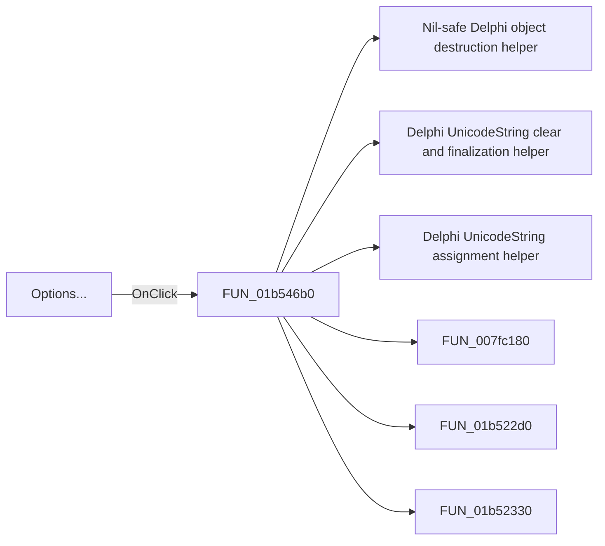

# Options...

> Analysis status: Pending individual source review.

## Control

| Property | Recovered value |
| --- | --- |
| Form | HBAnalysisDlgDiscrete |
| Component path | HBAnalysisDlgDiscrete.Panel1.bOptions |
| Control class | TButton |
| Caption | Options... |
| Hint | Not present in the recovered resource. |
| Text | Not present in the recovered resource. |
| Handler name | bOptionsClick |
| Handler address | 01b546b0 |
| Graph node | `resource:dfm:HBAnalysisDlgDiscrete/HBAnalysisDlgDiscrete.Panel1.bOptions` |
| Handler node | `function:01b546b0` |
| Graph layer | UI |

## What happens when clicked

Pending individual analysis. An agent must read the recovered handler source and its relevant callees before it replaces this text.

## Click flow

## Handler evidence

- Source: [DecompiledSources/Tina16/functions/0000000001B546B0__FUN_01b546b0.c](../../../DecompiledSources/Tina16/functions/0000000001B546B0__FUN_01b546b0.c)
- Recovered role: Not present in the recovered resource.
- Current graph summary: Handles 1 Delphi UI event: HBAnalysisDlgDiscrete.Panel1.bOptions.OnClick.
- Current graph behavior: Not present in the recovered resource.
- Current graph evidence: Not present in the recovered resource.
- Complexity: complex
- Distinct outgoing calls: 6

## Direct calls

- `function:00410f20` — Nil-safe Delphi object destruction helper
- `function:00414480` — Delphi UnicodeString clear and finalization helper
- `function:00414ad0` — Delphi UnicodeString assignment helper
- `function:007fc180` — FUN_007fc180
- `function:01b522d0` — FUN_01b522d0
- `function:01b52330` — FUN_01b52330

## Resource evidence

- Kind: Not present in the recovered resource.
- Modal result: Not present in the recovered resource.
- Checked state: Not present in the recovered resource.
- List items: Not present in the recovered resource.
- Image reference: Not present in the recovered resource.
- Extracted glyph: None.

## Nearby label candidates

Nearby labels are layout candidates only. They are not proof of behavior.

- Rank 1: &Output at distance 213.
- Rank 2: &Format at distance 239.
- Rank 3: Number of &harmonics at distance 266.

## Analysis limits

- Do not infer behavior from the control class, caption, hint, glyph, or nearby label alone.
- Do not replace the pending status until the handler source and relevant call path provide enough evidence.
