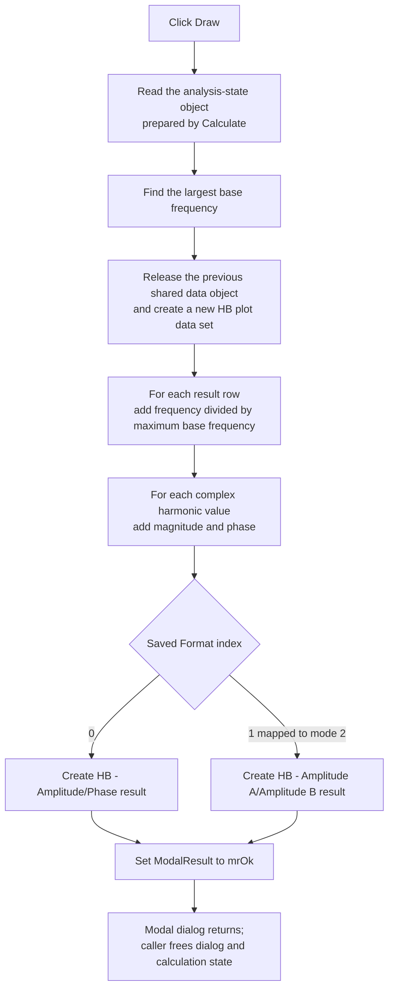

# Draw the calculated harmonic-balance result

> Analysis status: Complete for the control boundary. The handler, plotting helper, Calculate path, result parser, modal caller, and diagram constructor establish the behavior below.

## Control

| Property | Recovered value |
| --- | --- |
| Form | HBAnalysisDlgDiscrete |
| Form caption | HB Analysis Dialog |
| Component path | HBAnalysisDlgDiscrete.Panel1.DrawBtn |
| Control class | TBitBtn |
| Caption | &Draw |
| Initial Enabled state | False |
| Handler name | DrawBtnClick |
| Handler address | 01b54260 |
| Graph node | `resource:dfm:HBAnalysisDlgDiscrete/HBAnalysisDlgDiscrete.Panel1.DrawBtn` |
| Handler node | `function:01b54260` |
| Graph layer | UI |

The button has no hint, action, image reference, or embedded glyph. Its caption is direct text evidence, but the recovered call path proves that it draws an already calculated result rather than running harmonic-balance analysis.

## Required state

The DFM disables **Draw** initially. The default button is **Calculate**, handled by `FUN_01b53580`. Its accepted calculation path does this work before it enables **Draw**:

1. Splits the **Base frequency** text into a comma-separated list and requires every parsed frequency to be positive.
2. Splits **Number of harmonics** into a matching list. Each item must be an integer from 1 through 64.
3. Reads the selected output and the **Format** index.
4. Runs the harmonic-balance engine and parses its output into the analysis-state object attached to the dialog at `+0x5580`.
5. Rebuilds the result grid, remembers the successful input text, selected output, and format, and enables **Draw**.

`DrawBtnClick` does not repeat any of those reads, checks, or calculations. It receives no frequency, harmonic count, output name, or format from a control. It relies on the analysis-state object and arrays prepared by **Calculate**.

## What happens when clicked

`FUN_01b54260` performs two operations:

1. Passes the form's analysis-state object at `+0x5580` to `FUN_01b50510`.
2. After that helper returns, writes `1` to the form field at `+0x508`. Recovered VCL form code identifies this field as `ModalResult`, so the value is `mrOk` and ends the modal dialog.

`FUN_01b50510` builds the plotted result as follows:

1. Finds the largest configured base frequency through `FUN_01b50450` and formats it for the diagram's frequency context.
2. Releases the prior shared analysis-data object at `PTR_DAT_02003118`, if one exists, and creates a new data object.
3. Creates the result series and configures its data channels.
4. For every parsed result row, adds an X coordinate equal to the row frequency divided by the largest base frequency.
5. For every complex result value in that row, calculates its magnitude with `FUN_00c44590` and its phase angle in radians with `FUN_00c445d0`, then stores the values in the plot data.
6. Reads the format saved in the analysis state. Format index `0` remains display mode `0`; format index `1` is mapped to display mode `2`.
7. Calls `FUN_013dd1c0` to create and register the application result diagram.

The two recovered format branches match the combo-box resources:

| Combo-box item | Diagram branch |
| --- | --- |
| `D*cos(kwt + fi)` | `HB - Amplitude/Phase` |
| `A*cos(kwt) + B*sin(kwt)` | `HB - Amplitude A/Amplitude B` |

The diagram constructor uses frequency and voltage units and registers an analysis-result object in the main application. It is a new result diagram, not a preview drawn inside this dialog. The dialog's grid is not changed by the **Draw** handler.

## Click flow

## Calculate, Cancel, and Options interaction

- **Calculate** is the default button. It performs validation and analysis, updates the result grid, and enables **Draw** only after the analysis error flag is clear. It does not close the dialog.
- The format-change handler only rebuilds the text grid from stored results. It does not run the analysis again. **Draw** uses the format index that the successful Calculate path stored in the analysis state.
- **Cancel** is a built-in `bkCancel` button with no application handler. It can close the dialog without creating a diagram. If Calculate already succeeded, Cancel does not undo the input, output, and format values that Calculate already copied to application-global settings.
- **Options...** is initially invisible and disabled in the recovered DFM. Its separate handler opens an options dialog and stores accepted option text globally. **Draw** neither opens that dialog nor commits options. Options affect the earlier analysis setup, not the conversion of stored result arrays into a diagram.

## Guards, errors, and repeated use

- Neither `FUN_01b54260` nor `FUN_01b50510` checks for a null analysis-state object, empty result arrays, a zero normalization frequency, or a prior successful calculation. The disabled-button workflow is the normal guard.
- The helper replaces the prior shared analysis-data object before it finishes the new one. It has no local exception catch or rollback. A later allocation, data-conversion, or diagram-construction exception can therefore leave the prior shared data released and the replacement only partly built.
- The handler sets `mrOk` only after the plotting helper returns. If plotting raises an exception, this write is not reached through the recovered path, so the handler itself does not request a modal close.
- There is no conditional no-op path. A successful click creates a result and closes this dialog, so the user cannot repeat the click in the same modal session. Reopening the dialog, calculating again, and clicking **Draw** creates another result and replaces the shared current analysis-data object.
- The phase helper handles zero and quadrant cases explicitly. The Draw path has no separate message for conversion or display errors.

## Ownership and persistence

The caller `FUN_01ca4df0` creates the temporary analysis-state object, creates the dialog, attaches the state through `FUN_01b53570`, shows the dialog modally, and frees both objects after the modal call returns. It does not inspect the returned modal result.

The plotting helper copies the calculated frequency and complex-value data into a separate shared plot-data object before the temporary analysis state is freed. `FUN_013dd1c0` registers the new diagram with the application's result-document system.

The click does not write a result file, project file, registry value, or INI value. The new diagram exists in the running application and can be saved later through separate document commands. The successful Calculate path has already remembered its input settings before **Draw** is available.

## Source evidence

- [Draw handler `FUN_01b54260`](../../../DecompiledSources/Tina16/functions/0000000001B54260__FUN_01b54260.c) calls the plotting helper and then writes modal result `1`.
- [HB plot-data builder `FUN_01b50510`](../../../DecompiledSources/Tina16/functions/0000000001B50510__FUN_01b50510.c) replaces the shared data object, normalizes frequencies, converts complex results, selects the display mode, and invokes the diagram constructor.
- [Maximum base-frequency helper `FUN_01b50450`](../../../DecompiledSources/Tina16/functions/0000000001B50450__FUN_01b50450.c) scans the supplied double array and returns its largest value.
- [Calculate handler `FUN_01b53580`](../../../DecompiledSources/Tina16/functions/0000000001B53580__FUN_01b53580.c) validates the input lists, runs the analysis, enables **Draw**, refreshes the grid, and remembers the accepted settings. Its canonical analysis belongs to `.594`.
- [HB analysis runner `FUN_01b4f420`](../../../DecompiledSources/Tina16/functions/0000000001B4F420__FUN_01b4f420.c) stores the format and base-frequency array, runs the external solver, and calls the result parser. [Result parser `FUN_01b4d0a0`](../../../DecompiledSources/Tina16/functions/0000000001B4D0A0__FUN_01b4d0a0.c) fills the frequency rows and complex result arrays. `.594` owns these calculation-side functions.
- [Grid rebuild `FUN_01b54290`](../../../DecompiledSources/Tina16/functions/0000000001B54290__FUN_01b54290.c) displays stored results in the dialog and remains part of the `.594` Calculate analysis.
- [Magnitude helper `FUN_00c44590`](../../../DecompiledSources/Tina16/functions/0000000000C44590__FUN_00c44590.c) returns the square root of the real and imaginary squares. [Phase helper `FUN_00c445d0`](../../../DecompiledSources/Tina16/functions/0000000000C445D0__FUN_00c445d0.c) returns the quadrant-correct phase angle.
- [Diagram constructor `FUN_013dd1c0`](../../../DecompiledSources/Tina16/functions/00000000013DD1C0__FUN_013dd1c0.c) creates the two HB result forms, assigns units and result names, registers the document, and refreshes the application UI.
- [Modal caller `FUN_01ca4df0`](../../../DecompiledSources/Tina16/functions/0000000001CA4DF0__FUN_01ca4df0.c) proves the temporary dialog and analysis-state ownership boundary.
- [Recovered VCL close path `FUN_00805200`](../../../DecompiledSources/Tina16/functions/0000000000805200__FUN_00805200.c) identifies form offset `+0x508` as the modal-result field.
- [Options handler `FUN_01b546b0`](../../../DecompiledSources/Tina16/functions/0000000001B546B0__FUN_01b546b0.c) is owned by `.595` and proves that Draw does not open or save options.
- [Recovered Delphi resource evidence](../../../DecompiledSources/Tina16/resources/dfm/ui-evidence.json) supplies the control caption, initial disabled state, absent glyph, input labels and hints, format items, button kinds, and event bindings.

## Analysis limits and annotation ownership

- `.593` owns `FUN_01b54260`, its unique plot-data builder `FUN_01b50510`, and the precise maximum-base-frequency helper `FUN_01b50450`.
- `.594` owns the Calculate, runner, parser, grid, progress, and cleanup path. `.595` owns the Options handler and its dialog helpers. This article cites those functions as prerequisite evidence and does not redefine them.
- Broad plot-container, VCL, complex-number, result-document, and reference-count helpers remain evidence-only.
- Field names for the private analysis-state arrays are not present in recovered RTTI. This article uses their proven contents and offsets without inventing Delphi member names.
