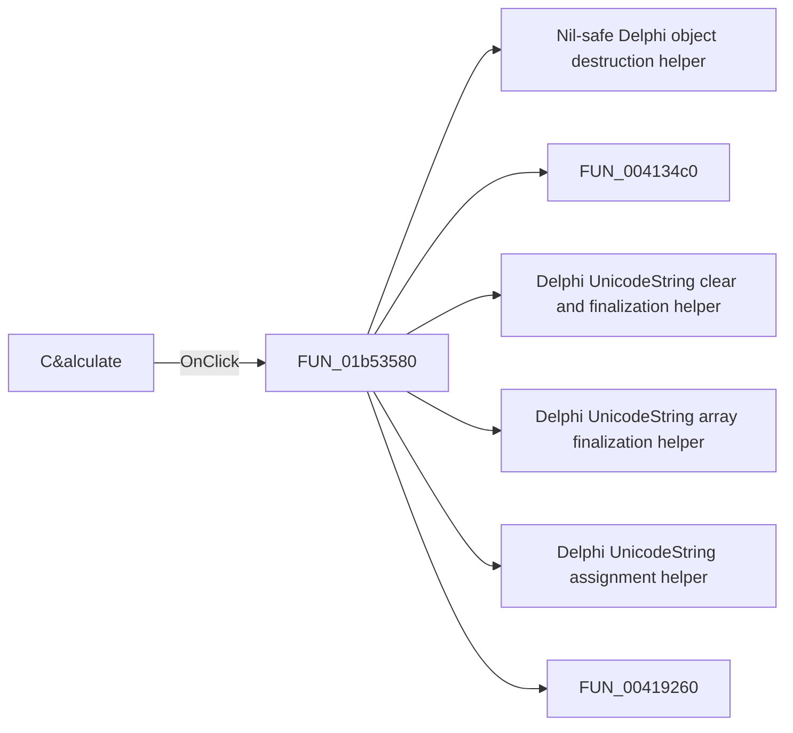

# C&alculate

> Analysis status: Pending individual source review.

## Control

| Property | Recovered value |
| --- | --- |
| Form | HBAnalysisDlgDiscrete |
| Component path | HBAnalysisDlgDiscrete.Panel1.OKBtn |
| Control class | TBitBtn |
| Caption | C&alculate |
| Hint | Not present in the recovered resource. |
| Text | Not present in the recovered resource. |
| Handler name | OKBtnClick |
| Handler address | 01b53580 |
| Graph node | `resource:dfm:HBAnalysisDlgDiscrete/HBAnalysisDlgDiscrete.Panel1.OKBtn` |
| Handler node | `function:01b53580` |
| Graph layer | UI |

## What happens when clicked

Pending individual analysis. An agent must read the recovered handler source and its relevant callees before it replaces this text.

## Click flow

## Handler evidence

- Source: [DecompiledSources/Tina16/functions/0000000001B53580__FUN_01b53580.c](../../../DecompiledSources/Tina16/functions/0000000001B53580__FUN_01b53580.c)
- Recovered role: Not present in the recovered resource.
- Current graph summary: Handles 1 Delphi UI event: HBAnalysisDlgDiscrete.Panel1.OKBtn.OnClick.
- Current graph behavior: Not present in the recovered resource.
- Current graph evidence: Not present in the recovered resource.
- Complexity: complex
- Distinct outgoing calls: 25

## Direct calls

- `function:00410f20` — Nil-safe Delphi object destruction helper
- `function:004134c0` — FUN_004134c0
- `function:00414480` — Delphi UnicodeString clear and finalization helper
- `function:00414560` — Delphi UnicodeString array finalization helper
- `function:00414ad0` — Delphi UnicodeString assignment helper
- `function:00419260` — FUN_00419260
- `function:0043fc00` — FUN_0043fc00
- `function:0043fc80` — FUN_0043fc80
- `function:00442f70` — FUN_00442f70
- `function:0044d490` — FUN_0044d490
- `function:004b4b10` — Delphi comma-text list parser
- `function:004b6930` — FUN_004b6930
- `function:0064c650` — FUN_0064c650
- `function:0064dd90` — VCL control Unicode text reader
- `function:007fc180` — FUN_007fc180
- `function:007fdf10` — FUN_007fdf10
- `function:008059a0` — FUN_008059a0
- `function:0080cc70` — FUN_0080cc70
- `function:00848a70` — FUN_00848a70
- `function:00b8f030` — FUN_00b8f030
- `function:01054c00` — FUN_01054c00
- `function:01b1d750` — FUN_01b1d750
- `function:01b4f420` — FUN_01b4f420
- `function:01b53e60` — FUN_01b53e60
- `function:01b54290` — FUN_01b54290

## Resource evidence

- Kind: Not present in the recovered resource.
- Modal result: Not present in the recovered resource.
- Checked state: Not present in the recovered resource.
- List items: Not present in the recovered resource.
- Image reference: Not present in the recovered resource.
- Extracted glyph: None.

## Nearby label candidates

Nearby labels are layout candidates only. They are not proof of behavior.

- Rank 1: Number of &harmonics at distance 284.
- Rank 2: &Format at distance 295.
- Rank 3: &Base frequency at distance 315.

## Analysis limits

- Do not infer behavior from the control class, caption, hint, glyph, or nearby label alone.
- Do not replace the pending status until the handler source and relevant call path provide enough evidence.
