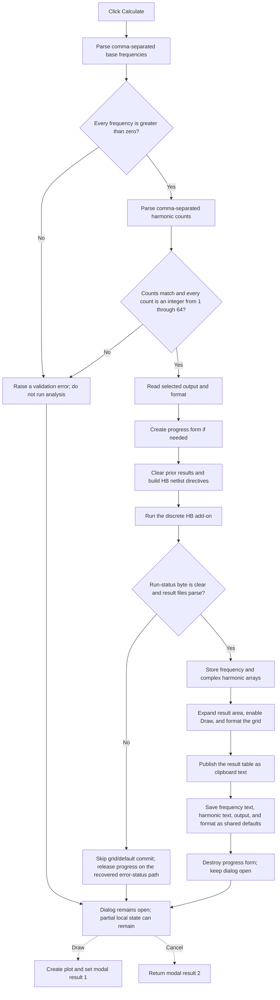

# Run the discrete Harmonic Balance calculation

> Analysis status: Reviewed from the recovered handler, form lifecycle, Harmonic Balance runner, result parser, result-grid formatter, modal caller, and sibling controls.

## Control

| Property | Recovered value |
| --- | --- |
| Form | HBAnalysisDlgDiscrete |
| Form caption | HB Analysis Dialog |
| Component path | HBAnalysisDlgDiscrete.Panel1.OKBtn |
| Control class | TBitBtn |
| Caption | C&alculate |
| Default button | true |
| Handler name | OKBtnClick |
| Handler address | 01b53580 |
| Graph node | `resource:dfm:HBAnalysisDlgDiscrete/HBAnalysisDlgDiscrete.Panel1.OKBtn` |
| Handler node | `function:01b53580` |
| Graph layer | UI |

## What happens when clicked

Calculate validates the requested base frequencies and harmonic counts, configures the selected output and result format, runs the discrete Harmonic Balance add-on, parses its result files, shows the results in the dialog grid, and copies a text form of the table to the Windows clipboard.

This is not a normal OK button. The DFM does not give it `Kind = bkOK` or a nonzero modal result. The handler does not set a modal result and does not close the dialog. A successful calculation keeps the modal dialog open so the user can inspect the table or select **Draw**.

The modal caller [`FUN_01ca4df0`](../../../DecompiledSources/Tina16/functions/0000000001CA4DF0__FUN_01ca4df0.c) creates one Harmonic Balance analysis object for the dialog, supplies its output or meter list, shows the form modally, and destroys the form and analysis object after the modal session ends. There is no caller copy-back after Calculate. Successful settings are written to shared Harmonic Balance defaults inside the handler.

## Inputs and validation

The handler reads these four controls:

- `BaseFreqEdit`, labelled **Base frequency**, contains a comma-separated list. Each item must parse as a floating-point value greater than zero.
- `NumHarmonicsEdit`, labelled **Number of harmonics**, contains a comma-separated list. It must contain one item for each base frequency. Each item must parse as an integer from 1 through 64.
- `OutputSelectorCB`, labelled **Output**, supplies the selected meter or output name. The list comes from the analysis object. `FormShow` restores the prior selection when possible and enables Calculate only when this list is not empty.
- `FormatCB`, labelled **Format**, supplies index 0 for `D*cos(kwt + fi)` or index 1 for `A*cos(kwt) + B*sin(kwt)`.

[`FUN_004b4b10`](../../../DecompiledSources/Tina16/functions/00000000004B4B10__FUN_004b4b10.c) applies Delphi comma-text parsing to both edit strings. The handler resizes its frequency and harmonic arrays to the parsed counts before it validates every element. It reports these explicit failures:

- `Frequency must be a positive number!`
- `The Number of harmonics must be specified for each Base frequency, separated by commas (e.g., 3, 1, 1)!`
- `Number of harmonics must be an integer number!`
- `Number of harmonics must be a positive number!`
- `Number of harmonics exceed a limit (64)`

There is no explicit nonempty-list check. Two empty lists pass the handler's count and loop checks, but the later Harmonic Balance configuration can still fail.

## Analysis setup and execution

After input validation, the handler sizes the result grid from the largest requested harmonic count and creates a shared progress form when none exists. The progress caption is **Harmonic Balance Analysis is running...**. This path also disables or updates the main window through the recovered VCL helpers.

The handler takes the selected output string from `OutputSelectorCB`, takes the selected format index from `FormatCB`, and calls [`FUN_01b4f420`](../../../DecompiledSources/Tina16/functions/0000000001B4F420__FUN_01b4f420.c). That runner performs these proven operations:

1. It clears prior parsed results in the dialog-owned analysis object.
2. It copies the harmonic counts, base frequencies, output name, and format index into that object.
3. It requires a nonempty output name and resolves it against the analysis meter table. It builds `V(node)` or `V(node1,node2)` from the resolved meter.
4. It writes the harmonic counts to `.OPTIONS HBINT numfreq=...`, writes the base frequencies to `.HB ...`, and writes the selected voltage expression to `.PRINT HB ...`.
5. It validates the derived HB initialization mode as 1 through 3, replaces the prior analysis directives, removes `.PRINT TRAN`, and writes the working circuit file.
6. For this dialog, the recovered call arguments select the installed discrete HB executable under `VHDL\HBDist\hb.exe`.
7. It runs the executable and, when the run-status byte remains clear, parses the generated Harmonic Balance result.

The runner can report `Meter string is empty`, `Meter not found: ...`, `HB init mode invalid parameter value (valid range: 1..3)`, `.options not found`, `.PRINT TRAN not found`, or `HB Add-on is not installed!` before result parsing.

## Result parsing, grid, and clipboard

[`FUN_01b4d0a0`](../../../DecompiledSources/Tina16/functions/0000000001B4D0A0__FUN_01b4d0a0.c) parses the generated result and log files. When the requested result is absent, it examines `result-temp-s.log`. If that log contains `netlist error`, it writes the relevant log tail to `result-temp-s-pr.log` and raises `Netlist error`. If the requested result is still absent, it reports `HB result not found`.

For a valid result, the parser allocates a result record for each parsed frequency. Each record holds the frequency and an allocated array of complex harmonic values. It stores the array at analysis-object offset `+0x1480`, the valid frequency-record count at `+0x1490`, and the complex-value count at `+0x149c`.

[`FUN_01b54290`](../../../DecompiledSources/Tina16/functions/0000000001B54290__FUN_01b54290.c) then rebuilds the three-column result grid. It omits records whose frequency is negative and formats the two value columns according to `FormatCB`:

- format 0: `D = 2 * magnitude` and `fi = phase * 180 / pi`;
- format 1: `A = 2 * real part` and `B = -2 * imaginary part`.

The formatter also builds a text table from the same header and result cells. It obtains the process-wide VCL clipboard object through [`FUN_006a6030`](../../../DecompiledSources/Tina16/functions/00000000006A6030__FUN_006a6030.c) and publishes that Unicode text through [`FUN_006a58e0`](../../../DecompiledSources/Tina16/functions/00000000006A58E0__FUN_006a58e0.c). Changing `FormatCB` later calls the same formatter, so it reformats both the grid and clipboard without rerunning the analysis.

On the first successful calculation, while the form error marker is clear, the handler expands and recenters the dialog, aligns the result panel as the client area, and enables **Draw**. Later successful calculations reuse the expanded result area.

## Successful settings commit

Only the success branch writes the current UI choices to shared Harmonic Balance defaults:

- base-frequency text to global offset `+0x914`;
- harmonic-count text to global offset `+0x91c`;
- selected output string to global offset `+0x924`;
- selected format index to global offset `+0x934`.

`FormShow` reads these four values when a later dialog instance opens. The recovered path does not write them to a file, registry key, or project document. Their process-global lifetime is proven; persistence across application restarts is not.

The handler then destroys the shared progress form, clears its global pointer, and updates the main window. It still does not close the Harmonic Balance dialog.

## Draw, Options, and Cancel interaction

- **Draw** is initially disabled. Calculate enables it after the first clean success. The separately owned Draw path uses the same analysis-object result arrays to create a plot and then sets modal result 1. Draw therefore ends the modal session only after it has created the plot.
- **Options...** is hidden and disabled in the recovered DFM. Its separate handler opens an options dialog and writes its accepted string directly to shared offset `+0x92c`. Calculate does not call the Options handler, and its recovered direct path does not read `+0x92c`.
- **Cancel** is a built-in `bkCancel` button with no application OnClick handler. It ends the modal session with result 2. The caller then destroys the form and its analysis object. Cancel does not roll back defaults that a previous successful Calculate click already wrote, and it does not undo clipboard text or a plot already created by Draw.

## Modal close query

[`FUN_01b531c0`](../../../DecompiledSources/Tina16/functions/0000000001B531C0__FUN_01b531c0.c), the form's `OnCloseQuery`, sets `CanClose` only when form byte `+0x5568` is clear. It then clears the byte, so the veto lasts for one close attempt.

The recovered message callback [`FUN_01b53100`](../../../DecompiledSources/Tina16/functions/0000000001B53100__FUN_01b53100.c) is the proven non-OK writer of this byte: it sets the byte before it displays a message. Its caller is indirect and is not present in the graph, so the exact set of errors routed through this marker is unknown. Calculate also reads the marker after the runner. A set marker suppresses the first-time dialog expansion; the normal success branch then clears it before it formats and commits the result.

Calculate itself does not request a close, so `FormCloseQuery` normally runs only for Cancel, the window close command, or Draw's modal-result change.

## Click flow

## Error and partial-state behavior

- The parsed arrays are resized and filled before all input checks finish. A failure in a later list item can leave a partially changed dialog-local array. Shared defaults are not written on that path.
- The runner clears the prior result arrays before it edits the netlist or starts the add-on. A later runner or parser failure has no rollback. After a previously successful calculation, the old grid can remain visible and Draw can remain enabled even though the underlying analysis object now has cleared or partial results.
- Missing meters, invalid netlist directives, missing add-on files, process failures, missing results, and simulator netlist errors all occur after at least part of the analysis object has changed. None of these paths restores the previous analysis object.
- The handler has no recovered transaction around clipboard publication and global-default writes. The clipboard is updated before the four shared defaults. A later assignment failure can therefore leave the new clipboard text with only some default fields changed.
- When the analysis object's run-status byte is set, [`FUN_01b53e60`](../../../DecompiledSources/Tina16/functions/0000000001B53E60__FUN_01b53e60.c) destroys the recovered error-path object and the shared progress form, clears the progress pointer, and updates the main window. Exceptions raised outside that status branch use Delphi exception handling; cleanup and rollback beyond the visible calls are not proven.
- Repeating Calculate always reparses and reruns. There is no equality test, cached-result shortcut, or repeated-click guard.

## Handler and call-path evidence

- Calculate handler: [FUN_01b53580](../../../DecompiledSources/Tina16/functions/0000000001B53580__FUN_01b53580.c)
- Harmonic Balance runner and netlist coordinator: [FUN_01b4f420](../../../DecompiledSources/Tina16/functions/0000000001B4F420__FUN_01b4f420.c)
- Result-file parser: [FUN_01b4d0a0](../../../DecompiledSources/Tina16/functions/0000000001B4D0A0__FUN_01b4d0a0.c)
- Result-grid and clipboard formatter: [FUN_01b54290](../../../DecompiledSources/Tina16/functions/0000000001B54290__FUN_01b54290.c)
- Run-status cleanup: [FUN_01b53e60](../../../DecompiledSources/Tina16/functions/0000000001B53E60__FUN_01b53e60.c)
- Close query: [FUN_01b531c0](../../../DecompiledSources/Tina16/functions/0000000001B531C0__FUN_01b531c0.c)
- Form-show default restoration and output-list setup: [FUN_01b53340](../../../DecompiledSources/Tina16/functions/0000000001B53340__FUN_01b53340.c)
- Modal caller and analysis-object ownership: [FUN_01ca4df0](../../../DecompiledSources/Tina16/functions/0000000001CA4DF0__FUN_01ca4df0.c)
- Draw handler and plot builder: [FUN_01b54260](../../../DecompiledSources/Tina16/functions/0000000001B54260__FUN_01b54260.c) and [FUN_01b50510](../../../DecompiledSources/Tina16/functions/0000000001B50510__FUN_01b50510.c)
- Options handler: [FUN_01b546b0](../../../DecompiledSources/Tina16/functions/0000000001B546B0__FUN_01b546b0.c)
- Recovered form and control resources: [ui-evidence.json](../../../DecompiledSources/Tina16/resources/dfm/ui-evidence.json)

## Resource evidence

- `BaseFreqEdit` and `NumHarmonicsEdit` both have the hint **comma separated list**.
- `FormatCB` is a read-only list with the two recovered formulas used by the grid formatter.
- Calculate is the form's default button, so Enter invokes it when normal focus rules permit.
- Draw starts disabled. Options starts hidden and disabled. Cancel uses the built-in `bkCancel` kind.
- Calculate has `NumGlyphs = 2`, but the resource evidence contains no embedded glyph bytes, image-list reference, or extracted glyph for this button.

## Analysis limits and annotation ownership

- The original Delphi field names for form offsets and the analysis-object result fields are not recovered. Their responsibilities are established by control bindings, call-site data flow, repeated reads, and downstream consumers.
- The exact exception-to-message callback routing is indirect and not recovered. This article does not claim that every listed validation or runner error sets the one-shot close-veto byte.
- The exact external executable output format is not documented by source symbols. The parser's file checks, row parsing, allocations, and destination fields are recovered.
- `TIARA-diz.6.7.593` owns the Draw handler and plot builder. `TIARA-diz.6.7.595` owns the Options handler and options-dialog helpers. This fragment cites those paths without duplicating their annotations.
- This control owns the Calculate handler, Harmonic Balance runner, result parser, result formatter, run-status cleanup, and form close-query annotations.
