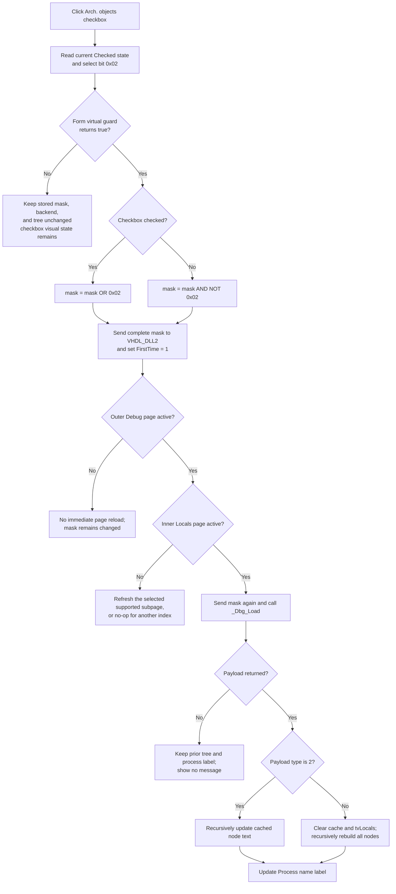

# Include architecture objects in HDL debugger Locals

> Analysis status: Complete for the recovered control boundary. The checkbox bit, combined filter mask, VHDL debugger calls, page-gated refresh, Locals payload paths, and tree update are recovered. The name and exact conditions of the form virtual guard are not recovered, and the implementation of the imported `VHDL_DLL2` functions is outside this source set.

## Control

| Property | Recovered value |
| --- | --- |
| Form | HDLDebugger |
| Form caption | HDL Debugger |
| Page | Debug > Locals |
| Component path | HDLDebugger.pnClient.pnMessages.pnDebug.pcDebug.tsDebug.pcDebugPages.tsLocalVariables.pnLocalVariablesLeft.cbArchitectureObjects |
| Control class | TCheckBox |
| Caption | &Arch. objects |
| DFM checked state | Not set; VCL default is clear |
| Runtime initial state | Checked by FormCreate |
| Hint | Not present |
| Glyph | Not present |
| Handler name | cbArchitectureObjectsClick |
| Handler address | 0109e060 |
| Graph node | `resource:dfm:HDLDebugger/HDLDebugger.pnClient.pnMessages.pnDebug.pcDebug.tsDebug.pcDebugPages.tsLocalVariables.pnLocalVariablesLeft.cbArchitectureObjects` |
| Handler node | `function:0109e060` |
| Graph layer | UI |

The checkbox has no glyph, list items, action, group index, or modal result. Its caption is consistent with the recovered mask bit and backend call, but the source data flow is the behavior evidence.

## What happens when clicked

`FUN_0109e060` reads the current `Checked` value from `cbArchitectureObjects` at form offset `+0x7d0` and calls shared updater `FUN_0109dfb0` with category bit `0x02`.

The updater first calls form virtual slot `+0x2e8`:

- If the virtual returns false, the updater returns. It does not change stored mask `+0xa0c`, call the backend, set the first-load marker, or request a tree refresh. The source does not identify the virtual method or prove that false means only “no debug session.” The checkbox's current visual state is not restored, so UI and stored mask can differ after this branch.
- If the virtual returns true and the checkbox is clear, it removes bit `0x02` with `mask & ~0x02`.
- If the virtual returns true and the checkbox is checked, it adds bit `0x02` with `mask | 0x02`.

The updater preserves every other category bit. It then calls `_Dbg_SetDebugLocals(debuggerHandle, fullMask)`, calls `_Dbg_SetFirstTime(debuggerHandle, 1)`, and requests a page refresh through `FUN_0109ddd0`.

This is a backend query filter. It does not remove objects from the existing `tvLocals` tree by itself. The backend produces the next Locals payload from the complete category mask.

## Category-mask relationship

The four sibling handlers differ only in checkbox field and mask bit:

| Checkbox | Handler | Bit | Runtime state after FormCreate |
| --- | --- | ---: | --- |
| Entity objects | `FUN_0109e020` | `0x01` | Checked |
| Architecture objects | `FUN_0109e060` | `0x02` | Checked |
| Process objects | `FUN_0109e0a0` | `0x04` | Clear |
| Subp. objects | `FUN_0109e0e0` | `0x08` | Clear |

`FUN_0109c800`, the form's OnCreate handler, sets mask `+0xa0c` to `3`, sets Entity checked, and derives the other three check states from bits `2`, `4`, and `8`. Thus the default includes Entity and Architecture objects. Later clicks can create any combination, including a zero mask. There is no mutual exclusion and no requirement that one category remain selected.

This checkbox does not change any sibling's `Checked` property. For example, clearing Architecture while Entity remains checked normally changes mask `3` to mask `1`.

## Refresh and Locals query

The refresh path is page-sensitive:

1. `FUN_0109ddd0` reads the outer page control. Only index `1`, the DFM's **Debug** page after **Messages**, enters the debug-subpage dispatcher.
2. `FUN_0109dd80` reads the inner debug page. Index `0` reloads BreakPoints, index `1` reloads Locals, and index `2` reloads Watches.
3. Only inner index `1` calls Locals loader `FUN_0109d930`.

The checkbox is on the Locals page, so an ordinary user click occurs with both required pages active and reaches the loader. If the handler is invoked while another page is active, the mask and backend first-load state still change, but no Locals tree refresh occurs in that call. Both page controls call the same refresh dispatcher on later page changes.

`FUN_0109d930` performs the Locals query and UI update:

- It selects local-data index zero, sends the full mask to `_Dbg_SetDebugLocals` again, and calls `_Dbg_Load` with the debugger handle.
- A null payload causes no tree rebuild and no process-name label update. The loader returns without a message.
- A non-null payload is copied into an in-memory stream and targets `tvLocals` at form offset `+0x810`.
- Payload type `2` updates text in the existing cached top-level and child nodes through recursive decoder `FUN_0109dab0`.
- Other payload types clear the page's node cache and the complete `tvLocals` item collection, recursively create the returned top-level and child nodes, and cache the new top-level nodes.
- After either non-null payload branch, the backend-supplied string is assigned to `lProcessName`, the label beside **Process name:**.

The full rebuild has no explicit selection or expansion-state restore after the tree clear. The type-2 path reuses existing nodes, but it also contains no explicit selection change.

## Click flow

## No-session, error, and no-op boundaries

- The shared updater has no direct `debuggerHandle != 0` test. It relies on the unrecovered form virtual guard before it passes handle `+0x9c0` to `VHDL_DLL2`. Therefore, this source does not prove a separate no-session message or a specific no-session return value.
- A false guard is a silent no-backend branch. It does not roll the checkbox back to the stored mask.
- If the Debug or Locals page is not active, the filter state is still sent and marked for first-time loading, but this call does not rebuild the Locals tree.
- A null `_Dbg_Load` result is also silent and leaves the previous tree and process label in place.
- The handler, updater, and loader have no local exception catch, message, retry, progress display, or rollback. The mask changes before the external calls. If a backend or tree operation fails, the mask, backend, and UI can be only partly synchronized.
- The full-load branch clears the cache and tree before recursive decoding completes. A decoder or tree error can leave an empty or partly rebuilt tree.
- Repeated clicks alternate the checkbox state. Each accepted guarded click clears or sets only bit `0x02` and requests a new backend load; there is no equality no-op after the guard succeeds.

## Persistence and model boundaries

- The filter mask is in the HDLDebugger form and is sent to the current debugger backend handle. It controls which local-object categories the backend returns.
- It does not edit the HDL design, simulator values, source, breakpoint list, watch expressions, or caller document.
- FormCreate resets the mask to `3` and restores the Entity-plus-Architecture default. No registry, INI, project, recent-state, or file write occurs in the click or reload path.
- Closing and recreating the form therefore does not recover the last category combination from a durable setting.

## Source evidence

- [Architecture checkbox handler `FUN_0109e060`](../../../DecompiledSources/Tina16/functions/000000000109E060__FUN_0109e060.c) reads the checked state and passes bit `2` to the shared updater.
- [Shared category updater `FUN_0109dfb0`](../../../DecompiledSources/Tina16/functions/000000000109DFB0__FUN_0109dfb0.c) applies the virtual guard, changes only the supplied bit, sends the full mask, sets first-time state, and requests refresh.
- [Outer page dispatcher `FUN_0109ddd0`](../../../DecompiledSources/Tina16/functions/000000000109DDD0__FUN_0109ddd0.c) and [debug-subpage dispatcher `FUN_0109dd80`](../../../DecompiledSources/Tina16/functions/000000000109DD80__FUN_0109dd80.c) prove the page-gated Locals reload.
- [Locals loader `FUN_0109d930`](../../../DecompiledSources/Tina16/functions/000000000109D930__FUN_0109d930.c) sends the mask, calls `_Dbg_Load`, selects update or rebuild, and changes the process-name label only for a non-null payload.
- [Cache clear `FUN_0109d6b0`](../../../DecompiledSources/Tina16/functions/000000000109D6B0__FUN_0109d6b0.c), [tree clear `FUN_0109d760`](../../../DecompiledSources/Tina16/functions/000000000109D760__FUN_0109d760.c), [top-level decoder `FUN_0109dcf0`](../../../DecompiledSources/Tina16/functions/000000000109DCF0__FUN_0109dcf0.c), [recursive item decoder `FUN_0109dab0`](../../../DecompiledSources/Tina16/functions/000000000109DAB0__FUN_0109dab0.c), and [cache rebuild `FUN_0109d6d0`](../../../DecompiledSources/Tina16/functions/000000000109D6D0__FUN_0109d6d0.c) establish the two tree-update branches.
- [Form creation `FUN_0109c800`](../../../DecompiledSources/Tina16/functions/000000000109C800__FUN_0109c800.c) initializes mask `3` and the four checkbox states.
- [Entity handler `FUN_0109e020`](../../../DecompiledSources/Tina16/functions/000000000109E020__FUN_0109e020.c), [Process handler `FUN_0109e0a0`](../../../DecompiledSources/Tina16/functions/000000000109E0A0__FUN_0109e0a0.c), and [Subprogram handler `FUN_0109e0e0`](../../../DecompiledSources/Tina16/functions/000000000109E0E0__FUN_0109e0e0.c) prove bits `1`, `4`, and `8`.
- [VHDL_DLL2 `_Dbg_SetDebugLocals`](../../../DecompiledSources/Tina16/functions/0000000000E03720__VHDL_DLL2.DLL___Dbg_SetDebugLocals.c), [`_Dbg_SetFirstTime`](../../../DecompiledSources/Tina16/functions/0000000000E03740__VHDL_DLL2.DLL___Dbg_SetFirstTime.c), and [`_Dbg_Load`](../../../DecompiledSources/Tina16/functions/0000000000E036C0__VHDL_DLL2.DLL___Dbg_Load.c) are imported backend boundaries; their implementation is not in this source set.
- [Recovered Delphi resource evidence](../../../DecompiledSources/Tina16/resources/dfm/ui-evidence.json) supplies the Debug and Locals page order, four checkbox captions and event bindings, `tvLocals`, the process-name label, and missing hint/glyph evidence.

## Analysis ownership

- `.602` owns unique handler `FUN_0109e060`, shared category updater `FUN_0109dfb0`, outer page dispatcher `FUN_0109ddd0`, subpage dispatcher `FUN_0109dd80`, and Locals loader `FUN_0109d930` using their existing canonical graph fields.
- Sibling Beads `.603`, `.604`, and `.605` own only their Entity, Process, and Subprogram checkbox handlers. They cite and omit the shared functions above.
- Generic VCL checkbox/page/tree primitives, recursive stream helpers, and imported `VHDL_DLL2` functions remain evidence-only.
