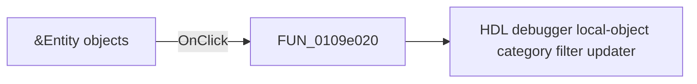

# &Entity objects

> Analysis status: Pending individual source review.

## Control

| Property | Recovered value |
| --- | --- |
| Form | HDLDebugger |
| Component path | HDLDebugger.pnClient.pnMessages.pnDebug.pcDebug.tsDebug.pcDebugPages.tsLocalVariables.pnLocalVariablesLeft.cbEntityObjects |
| Control class | TCheckBox |
| Caption | &Entity objects |
| Hint | Not present in the recovered resource. |
| Text | Not present in the recovered resource. |
| Handler name | cbEntityObjectsClick |
| Handler address | 0109e020 |
| Graph node | `resource:dfm:HDLDebugger/HDLDebugger.pnClient.pnMessages.pnDebug.pcDebug.tsDebug.pcDebugPages.tsLocalVariables.pnLocalVariablesLeft.cbEntityObjects` |
| Handler node | `function:0109e020` |
| Graph layer | UI |

## What happens when clicked

Pending individual analysis. An agent must read the recovered handler source and its relevant callees before it replaces this text.

## Click flow

## Handler evidence

- Source: [DecompiledSources/Tina16/functions/000000000109E020__FUN_0109e020.c](../../../DecompiledSources/Tina16/functions/000000000109E020__FUN_0109e020.c)
- Recovered role: HDL debugger entity-object filter checkbox handler
- Current graph summary: Applies the Entity objects checkbox state with filter mask bit 0x01. Handles 1 Delphi UI event: HDLDebugger.pnClient.pnMessages.pnDebug.pcDebug.tsDebug.pcDebugPages.tsLocalVariables.pnLocalVariablesLeft.cbEntityObjects.OnClick.
- Current graph behavior: Applies the Entity objects checkbox state with filter mask bit 0x01.
- Current graph evidence: The Entity objects checkbox resolves here. It reads its checked state and calls the shared updater with bit 1.
- Complexity: simple
- Distinct outgoing calls: 1

## Direct calls

- `function:0109dfb0` — HDL debugger local-object category filter updater

## Resource evidence

- Kind: Not present in the recovered resource.
- Modal result: Not present in the recovered resource.
- Checked state: Not present in the recovered resource.
- List items: Not present in the recovered resource.
- Image reference: Not present in the recovered resource.
- Extracted glyph: None.

## Nearby label candidates

Nearby labels are layout candidates only. They are not proof of behavior.

- No same-parent label candidate is available.

## Analysis limits

- Do not infer behavior from the control class, caption, hint, glyph, or nearby label alone.
- Do not replace the pending status until the handler source and relevant call path provide enough evidence.
