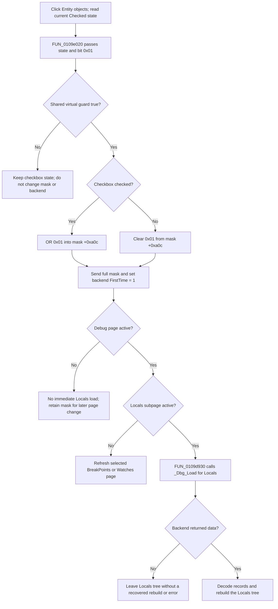

# Filter Locals by entity objects

> Analysis status: Source-reviewed. The DFM, form initialization, Entity handler, shared mask updater, page dispatchers, Locals loader, and normal debugger opener establish the behavior below.

## Control

| Property | Recovered value |
| --- | --- |
| Form | HDLDebugger |
| Form caption | HDL Debugger |
| Component path | HDLDebugger.pnClient.pnMessages.pnDebug.pcDebug.tsDebug.pcDebugPages.tsLocalVariables.pnLocalVariablesLeft.cbEntityObjects |
| Control class | TCheckBox |
| Caption | &Entity objects |
| Runtime initial state | Checked by `FUN_0109c800` |
| Handler name | cbEntityObjectsClick |
| Handler address | 0109e020 |
| Graph node | `resource:dfm:HDLDebugger/HDLDebugger.pnClient.pnMessages.pnDebug.pcDebug.tsDebug.pcDebugPages.tsLocalVariables.pnLocalVariablesLeft.cbEntityObjects` |
| Handler node | `function:0109e020` |
| Graph layer | UI |

The DFM does not store a `Checked` value, hint, text, action, image, glyph, button kind, or modal result for this checkbox. Form creation sets its actual initial state.

## What happens when clicked

`FUN_0109e020` reads the current `Checked` state from `cbEntityObjects`, the checkbox at form field `+0x7d8`. It passes that state and category bit `0x01` to shared updater `FUN_0109dfb0`.

The shared updater first calls a Boolean virtual guard at form VMT slot `+0x2e8`. The exact Delphi method name is not recovered. If the guard returns false, the updater returns without changing the stored filter mask, calling the debugger DLL, or requesting a page refresh. The checkbox can therefore show its newly selected state while the backend mask remains unchanged on this guarded no-op path.

When the guard returns true, the updater performs these operations in order:

1. If Entity objects is checked, OR bit `0x01` into the 32-bit local-object mask at form field `+0xa0c`.
2. If Entity objects is clear, AND that mask with the inverse of `0x01`.
3. Call VHDL debugger export `_Dbg_SetDebugLocals` with the session at `+0x9c0` and the complete updated mask.
4. Call `_Dbg_SetFirstTime` with the same session and value `1`, which marks debugger data for a fresh load.
5. Call the shared page-refresh dispatcher `FUN_0109ddd0`.

The direct effect is a category-filter change for HDL debugger Local Variables. The handler does not add, remove, or edit an HDL object. It changes which object categories the backend supplies to the Locals view.

## Relationship to the other category checkboxes

All four controls call the same updater with a different independent bit:

| Checkbox | Mask bit |
| --- | --- |
| Entity objects | `0x01` |
| Arch. objects | `0x02` |
| Process objects | `0x04` |
| Subp. objects | `0x08` |

Setting or clearing Entity preserves every other mask bit. The checkboxes are not a radio group, and no recovered rule requires at least one category. The four known controls can therefore represent any low-nibble combination from `0x00` through `0x0f`.

`FUN_0109c800`, the form-create handler, initializes mask field `+0xa0c` to `3`. It then checks Entity and Architecture and clears Process and Subprogram through their VCL setters. Thus a new debugger form starts with Entity and Architecture included. The DFM's absent `Checked` properties are not the final runtime defaults.

Architecture, Process, and Subprogram clicks can change only their own bits. They still send the full combined mask, set the same backend first-load flag, and use the same refresh path. No sibling click resets the Entity bit unless it is the Entity checkbox itself.

## Backend reload and active-page behavior

The refresh request is page-sensitive:

- `FUN_0109ddd0` reads outer page control `pcDebug`. On its **Debug** page, index `1`, it calls `FUN_0109dd80`. The **Messages** branch performs no recovered reload.
- `FUN_0109dd80` reads inner `pcDebugPages`. Index `0` reloads **BreakPoints**, index `1` reloads **Locals**, and index `2` reloads **Watches**.
- The DFM starts on **Debug** and **Locals**, so the normal initial-page click reaches `FUN_0109d930` immediately.

The Locals loader sends the current mask to `_Dbg_SetDebugLocals` again, resets its local load index to zero, and calls `_Dbg_Load`. When `_Dbg_Load` returns a nonzero data pointer, the loader copies and decodes the returned records, rebuilds the Locals tree, and updates its recovered status text. A zero data pointer returns without rebuilding the tree and without showing a local error.

If another page is active, the updater has already changed the mask and marked backend data for a first-time load. The immediate dispatcher either does no work on Messages or refreshes the selected BreakPoints or Watches subpage. Page-change handlers call the same dispatchers, so selecting Locals later reaches the Locals loader with the retained filter mask.

## Click and reload flow

## Session, error, and repeated-click boundaries

- The normal opener `FUN_01c99b80` creates the HDLDebugger form, calls `FUN_0109cf80` to store the supplied debugger session at `+0x9c0`, and only then shows the form. Normal interactive clicks therefore follow a configured-session path.
- Neither `FUN_0109e020` nor `FUN_0109dfb0` checks the session pointer for zero. If the virtual guard is true while `+0x9c0` is absent or invalid, that value is passed to the VHDL debugger exports. Their behavior is not present in the recovered executable.
- The updater does not check a stopped or running debugger state before sending the filter. It also does not inspect a return value from `_Dbg_SetDebugLocals` or `_Dbg_SetFirstTime`.
- The mask is changed before the external calls. There is no recovered local exception catch or rollback, so a DLL or refresh failure can leave the form mask changed without a corresponding completed backend or tree update.
- A programmatic handler call with a state that already matches its mask bit still sends the mask, marks first-time data, and requests a refresh when the guard passes. There is no equality-based no-op branch.
- A user click normally toggles the checkbox. Repeated user clicks alternate inclusion and exclusion and request a new backend load each time that the guard passes.

## Persistence boundary

The filter exists in the current form field and debugger session. `FUN_0109c800` resets a newly created form to mask `3`, with Entity and Architecture selected. The inspected click, form-close, and form-destroy paths do not write this filter to a project file, settings file, registry value, database, or undo record. Persistence across a new debugger form or application restart is not proved.

## Source evidence

- [Entity handler `FUN_0109e020`](../../../DecompiledSources/Tina16/functions/000000000109E020__FUN_0109e020.c) reads checkbox field `+0x7d8` and passes bit `1` to the shared updater.
- [Shared category updater `FUN_0109dfb0`](../../../DecompiledSources/Tina16/functions/000000000109DFB0__FUN_0109dfb0.c) applies the virtual guard, changes one bit in field `+0xa0c`, calls the two VHDL debugger exports, and dispatches a refresh.
- [Form-create handler `FUN_0109c800`](../../../DecompiledSources/Tina16/functions/000000000109C800__FUN_0109c800.c) proves mask `3` and the four runtime checkbox defaults.
- [Architecture](../../../DecompiledSources/Tina16/functions/000000000109E060__FUN_0109e060.c), [Process](../../../DecompiledSources/Tina16/functions/000000000109E0A0__FUN_0109e0a0.c), and [Subprogram](../../../DecompiledSources/Tina16/functions/000000000109E0E0__FUN_0109e0e0.c) handlers prove sibling bits `2`, `4`, and `8`.
- [Outer page dispatcher `FUN_0109ddd0`](../../../DecompiledSources/Tina16/functions/000000000109DDD0__FUN_0109ddd0.c) routes the active Debug page to the inner dispatcher.
- [Debug subpage dispatcher `FUN_0109dd80`](../../../DecompiledSources/Tina16/functions/000000000109DD80__FUN_0109dd80.c) maps indices `0`, `1`, and `2` to BreakPoints, Locals, and Watches reloads.
- [Locals loader `FUN_0109d930`](../../../DecompiledSources/Tina16/functions/000000000109D930__FUN_0109d930.c) sends the mask, loads backend data, and conditionally rebuilds the view.
- [Debugger configuration `FUN_0109cf80`](../../../DecompiledSources/Tina16/functions/000000000109CF80__FUN_0109cf80.c) stores the supplied session at form field `+0x9c0`.
- [Normal opener `FUN_01c99b80`](../../../DecompiledSources/Tina16/functions/0000000001C99B80__FUN_01c99b80.c) configures the new form before showing it.
- [Recovered Delphi resource evidence](../../../DecompiledSources/Tina16/resources/dfm/ui-evidence.json) supplies the control hierarchy, captions, active pages, and event bindings.

## Analysis limits and ownership

- This Bead owns only direct Entity handler `FUN_0109e020` and repeats its existing core annotation exactly.
- The Architecture, Process, and Subprogram Beads own their direct handlers.
- The Architecture analysis owns shared updater `FUN_0109dfb0`, outer dispatcher `FUN_0109ddd0`, inner dispatcher `FUN_0109dd80`, and Locals loader `FUN_0109d930`. They are source evidence only here.
- The VMT `+0x2e8` guard name and the VHDL_DLL2 implementation are not recovered. This article does not infer their internal readiness, validation, transport, or error rules.
- The returned Locals record format and full tree-building algorithm are outside this control's direct responsibility.
