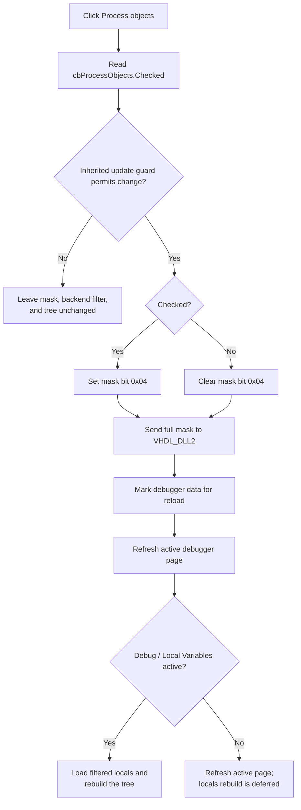

# Filter HDL process objects in Local Variables

## Control

| Property | Recovered value |
| --- | --- |
| Form | HDLDebugger |
| Component path | HDLDebugger.pnClient.pnMessages.pnDebug.pcDebug.tsDebug.pcDebugPages.tsLocalVariables.pnLocalVariablesLeft.cbProcessObjects |
| Control class | TCheckBox |
| Caption | &Process objects |
| Hint, image, or nearby label | Not present in the recovered resource |
| Handler name | cbProcessObjectsClick |
| Handler address | 0109e0a0 |
| Graph node | `resource:dfm:HDLDebugger/HDLDebugger.pnClient.pnMessages.pnDebug.pcDebug.tsDebug.pcDebugPages.tsLocalVariables.pnLocalVariablesLeft.cbProcessObjects` |
| Handler node | `function:0109e0a0` |
| Graph layer | UI |

## What happens when clicked

The checkbox controls whether HDL process objects are included in the Local Variables object-category filter. The handler reads the current `Checked` value from `cbProcessObjects` at form field `+0x7c8` and passes it to the shared filter updater with mask bit `0x04`.

The updater first calls an inherited Boolean guard. The exact method behind that virtual slot is not recovered. If the guard returns false, it does not change the form mask, call the debugger backend, mark debugger data for reload, or request a page refresh. The handler does not restore the checkbox state on this path.

If the guard permits the update, the shared routine changes the mask at form field `+0xa0c`:

- checked: `mask = mask | 0x04`;
- unchecked: `mask = mask & ~0x04`.

This operation preserves the other three category bits. The four sibling checkboxes use this mapping:

| Bit | Category |
| --- | --- |
| `0x01` | Entity objects |
| `0x02` | Architecture objects |
| `0x04` | Process objects |
| `0x08` | Subprogram objects |

These are independent checkboxes, not a radio group. The source does not enforce that at least one bit remains set. A mask of zero is sent to the backend when the user clears all four categories.

## Backend update and Local Variables refresh

After changing the form-local mask, the shared updater sends the complete mask to the current VHDL debugger session through `_Dbg_SetDebugLocals`. It then calls `_Dbg_SetFirstTime(session, 1)` so that debugger data is loaded again, and dispatches a refresh for the active debugger page.

The dispatcher refreshes the Local Variables tree immediately only when the outer **Debug** page and its **Local Variables** subpage are active. The locals loader sends the mask to the backend again, calls `_Dbg_Load`, decodes the returned local-object data, rebuilds the Local Variables tree, and updates its associated status text. If another page is active, that page receives the immediate refresh. The changed mask and backend reload flag remain ready for the next Local Variables load.

This action changes which backend objects are requested and displayed. It does not add, remove, or edit an HDL design object.

## Click flow

## Initial, repeated, and empty-filter behavior

- Form creation initializes the category mask to `0x03`. Entity and Architecture are checked, while Process and Subprogram are unchecked. It then sets each checkbox from its corresponding mask bit. The resource itself does not stream a `Checked` value.
- A normal click applies the control's current state. If the handler is invoked again without changing `Checked`, it re-applies the same bit value and repeats the backend, reload-flag, and refresh calls when the guard permits it.
- Clearing Process affects only bit `0x04`; it does not clear the other category selections.
- With all four bits clear, the handler still sends mask `0`. There is no local warning or validation. Whether the backend returns an empty tree is determined by the backend response.

## No-session, error, and partial-state behavior

- The handler and shared updater do not contain an explicit null-session test. All state changes are behind the inherited guard, but the recovered source does not prove that this guard tests the debugger session.
- After the guard passes, the code does not check a return value from `_Dbg_SetDebugLocals` or `_Dbg_SetFirstTime`. It has no local exception handler, retry, rollback, or error message.
- The form-local mask changes before either backend call. If a backend call or the later refresh fails, the local mask can already contain the new Process bit while the backend or displayed tree remains stale. The handler does not restore the earlier mask.
- If `_Dbg_Load` returns no data during an immediate locals refresh, the loader skips the tree and status rebuild. This handler does not show an empty-result message.

## Persistence boundary

The checkbox updates the live `THDLDebugger` mask and the current VHDL debugger session. Form creation resets the mask to `0x03`, and no file, registry, INI, project serializer, or settings call occurs in this click path. Therefore, this analysis does not establish persistence across debugger-form instances or application restarts.

## Evidence

- [Process checkbox handler `FUN_0109e0a0`](../../../DecompiledSources/Tina16/functions/000000000109E0A0__FUN_0109e0a0.c) reads `cbProcessObjects.Checked` from form field `+0x7c8` and passes bit `4` to the shared updater.
- [Shared category updater `FUN_0109dfb0`](../../../DecompiledSources/Tina16/functions/000000000109DFB0__FUN_0109dfb0.c) proves the guard, bit set or clear operation, full-mask backend call, reload flag, and refresh dispatch.
- [Active-page dispatcher `FUN_0109ddd0`](../../../DecompiledSources/Tina16/functions/000000000109DDD0__FUN_0109ddd0.c) and [Debug-subpage dispatcher `FUN_0109dd80`](../../../DecompiledSources/Tina16/functions/000000000109DD80__FUN_0109dd80.c) show when the Local Variables loader runs immediately.
- [Local Variables loader `FUN_0109d930`](../../../DecompiledSources/Tina16/functions/000000000109D930__FUN_0109d930.c) sends the mask, loads and decodes returned local objects, rebuilds the tree, and updates status text.
- [Entity handler `FUN_0109e020`](../../../DecompiledSources/Tina16/functions/000000000109E020__FUN_0109e020.c), [Architecture handler `FUN_0109e060`](../../../DecompiledSources/Tina16/functions/000000000109E060__FUN_0109e060.c), and [Subprogram handler `FUN_0109e0e0`](../../../DecompiledSources/Tina16/functions/000000000109E0E0__FUN_0109e0e0.c) establish the parallel `1`, `2`, and `8` bit mapping.
- [FormCreate `FUN_0109c800`](../../../DecompiledSources/Tina16/functions/000000000109C800__FUN_0109c800.c) initializes mask `0x03` and synchronizes all four checkbox states from it.
- [Recovered Delphi resource evidence](../../../DecompiledSources/Tina16/resources/dfm/ui-evidence.json) supplies the component path, `TCheckBox` class, caption, event binding, and absence of direct hint or image evidence.

## Annotation ownership and limits

- This Bead owns only the unique handler `FUN_0109e0a0`.
- Bead `.602` owns the shared updater `FUN_0109dfb0`, active-page dispatcher `FUN_0109ddd0`, Debug-subpage dispatcher `FUN_0109dd80`, and locals loader `FUN_0109d930`. This fragment cites and omits those functions.
- The exact Delphi name and purpose of the inherited virtual Boolean guard are not recovered. The article does not describe it as a session, visibility, or enabled-state check.
- The backend's internal filtering rules and the exact decoded local-object record format are outside this handler and remain unspecified.
