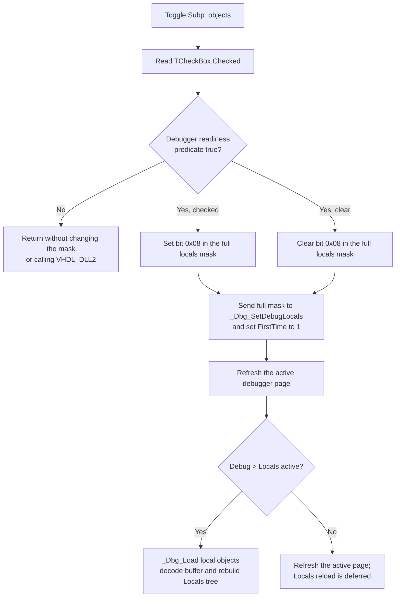

# Show or hide subprogram objects in HDL debugger Locals

> Analysis status: Complete for the checkbox boundary. The handler, four sibling filters, form initialization, shared mask updater, page dispatchers, local-object loader, and external debugger calls establish the behavior below.

## Control

| Property | Recovered value |
| --- | --- |
| Form | HDLDebugger |
| Local page | Locals |
| Component path | HDLDebugger.pnClient.pnMessages.pnDebug.pcDebug.tsDebug.pcDebugPages.tsLocalVariables.pnLocalVariablesLeft.cbSubpObjects |
| Control class | TCheckBox |
| Caption | &Subp. objects |
| Handler name | cbSubpObjectsClick |
| Handler address | 0109e0e0 |
| Graph node | `resource:dfm:HDLDebugger/HDLDebugger.pnClient.pnMessages.pnDebug.pcDebug.tsDebug.pcDebugPages.tsLocalVariables.pnLocalVariablesLeft.cbSubpObjects` |
| Handler node | `function:0109e0e0` |
| Graph layer | UI |

The control has no hint, action, image reference, or glyph. Its DFM resource does not store an initial checked value. Form creation initializes the runtime filter mask and sets the checked states.

## What happens when clicked

`FUN_0109e0e0` reads the checkbox's current `Checked` value through its VCL getter and calls shared updater `FUN_0109dfb0` with category bit `0x08`.

The shared updater first calls a virtual debugger-readiness predicate. If the predicate returns true, it performs these operations in order:

1. If **Subp. objects** is checked, it ORs `0x08` into the 32-bit local-object mask at form offset `+0xa0c`.
2. If the checkbox is clear, it ANDs the mask with the inverse of `0x08`.
3. Sends the complete updated mask, not only bit `0x08`, to `VHDL_DLL2.DLL::_Dbg_SetDebugLocals` with the current debugger-session handle at `+0x9c0`.
4. Calls `VHDL_DLL2.DLL::_Dbg_SetFirstTime(session, 1)` so the backend reloads debugger data.
5. Calls the shared page-refresh dispatcher `FUN_0109ddd0`.

The four checkbox handlers use independent bits:

| Checkbox | Bit | Effect on this click |
| --- | ---: | --- |
| Entity objects | `0x01` | Preserved |
| Arch. objects | `0x02` | Preserved |
| Process objects | `0x04` | Preserved |
| Subp. objects | `0x08` | Set or cleared |

The controls are not radio buttons. Enabling subprogram objects does not disable another category.

## Local-object reload

Form creation initializes the mask to `0x03`: Entity and Architecture are checked, while Process and Subprogram are clear. Later clicks keep their state in the form's mask.

The page dispatcher reads the active outer page and active Debug subpage. A normal user click on this checkbox occurs on **Debug > Locals**, so the route is:

`FUN_0109ddd0` → `FUN_0109dd80` → `FUN_0109d930`.

The Locals loader sends the same full mask to `_Dbg_SetDebugLocals` again, calls `VHDL_DLL2.DLL::_Dbg_Load`, copies a returned backend buffer, decodes its records, and rebuilds the Locals tree. It also updates the recovered Locals status text from a returned string.

If code invokes the handler while another debugger page is active, the dispatcher refreshes that active page instead. The backend still receives the mask and first-time flag. A later Locals refresh can then use the new filter.

## Click flow

## No-session, error, and repeated-click behavior

- If the readiness predicate returns false, the shared updater does not change the stored mask, call either backend setter, or request a refresh. The handler has no code to restore the VCL checked state, so the visible checkbox can differ from the stored backend mask on this path.
- The handler does not test the session handle itself. The readiness predicate is the only recovered guard before the session handle is passed to the DLL.
- The updater does not inspect return values from `_Dbg_SetDebugLocals` or `_Dbg_SetFirstTime` and has no local message, exception catch, or rollback.
- The Locals loader rebuilds the tree only when `_Dbg_Load` returns a nonzero data pointer. A zero result causes no tree rebuild and no local error message; the updated mask and first-time backend request remain in effect.
- There is no equality or no-op test. Calling the handler with the same checked state still resends the mask, marks first-time state, and requests a refresh when the readiness predicate succeeds.
- A normal mouse or keyboard activation toggles the checkbox first. Repeated user clicks therefore alternate bit `0x08` and reload the visible set of local objects each time.

## State and persistence

- The immediate state is the checkbox's VCL `Checked` value, the bit mask at `+0xa0c`, the backend session filter, and the rebuilt Locals tree.
- Form creation resets the mask to `0x03` and derives all four checked states from it. No registry, INI, project, or user-preference write appears in this path.
- The selection therefore lasts in the current HDL debugger form and backend session. It is not a durable filter preference after the form is recreated.
- The click does not change program variables, simulation values, watch expressions, breakpoints, or the debugged HDL model. It changes which local-object categories the debugger returns and displays.

## Source evidence

- [Subprogram checkbox handler `FUN_0109e0e0`](../../../DecompiledSources/Tina16/functions/000000000109E0E0__FUN_0109e0e0.c) reads `Checked` from the field at `+0x7e0` and passes bit `8` to the shared updater.
- [Shared filter updater `FUN_0109dfb0`](../../../DecompiledSources/Tina16/functions/000000000109DFB0__FUN_0109dfb0.c) applies one bit, sends the full mask to the DLL, marks first-time state, and requests a page refresh. `.602` owns its canonical annotation.
- [Entity handler `FUN_0109e020`](../../../DecompiledSources/Tina16/functions/000000000109E020__FUN_0109e020.c), [Architecture handler `FUN_0109e060`](../../../DecompiledSources/Tina16/functions/000000000109E060__FUN_0109e060.c), and [Process handler `FUN_0109e0a0`](../../../DecompiledSources/Tina16/functions/000000000109E0A0__FUN_0109e0a0.c) prove the sibling bits `1`, `2`, and `4`.
- [HDL debugger creation `FUN_0109c800`](../../../DecompiledSources/Tina16/functions/000000000109C800__FUN_0109c800.c) initializes mask `3` and assigns all four checked states from it.
- [Outer page dispatcher `FUN_0109ddd0`](../../../DecompiledSources/Tina16/functions/000000000109DDD0__FUN_0109ddd0.c) and [Debug subpage dispatcher `FUN_0109dd80`](../../../DecompiledSources/Tina16/functions/000000000109DD80__FUN_0109dd80.c) route the refresh to the active page. `.602` owns their canonical annotations.
- [Locals tree reload `FUN_0109d930`](../../../DecompiledSources/Tina16/functions/000000000109D930__FUN_0109d930.c) resends the mask, loads backend data, decodes it, rebuilds the tree, and updates status text. `.602` owns its canonical annotation.
- [`_Dbg_SetDebugLocals`](../../../DecompiledSources/Tina16/functions/0000000000E03720__VHDL_DLL2.DLL___Dbg_SetDebugLocals.c), [`_Dbg_SetFirstTime`](../../../DecompiledSources/Tina16/functions/0000000000E03740__VHDL_DLL2.DLL___Dbg_SetFirstTime.c), and [`_Dbg_Load`](../../../DecompiledSources/Tina16/functions/0000000000E036C0__VHDL_DLL2.DLL___Dbg_Load.c) are imported VHDL debugger backend calls.
- [Recovered Delphi resource evidence](../../../DecompiledSources/Tina16/resources/dfm/ui-evidence.json) supplies the Locals page, four checkbox captions, classes, and event bindings, and confirms that this control has no hint or image evidence.

## Analysis limits and annotation ownership

- `.605` owns only unique handler `FUN_0109e0e0` and preserves its existing canonical graph fields exactly.
- `.602` owns shared functions `FUN_0109dfb0`, `FUN_0109ddd0`, `FUN_0109dd80`, and `FUN_0109d930`. `.603` and `.604` own their unique checkbox handlers. This article cites those functions and does not redefine them.
- The virtual readiness method is not resolved to a Delphi name in the recovered source. Its true/false control flow is proven, but this article does not invent a more specific predicate name.
- DLL internals are outside the recovered executable. The article documents arguments, returned-buffer handling, and visible application effects without claiming the backend's internal filtering algorithm.
